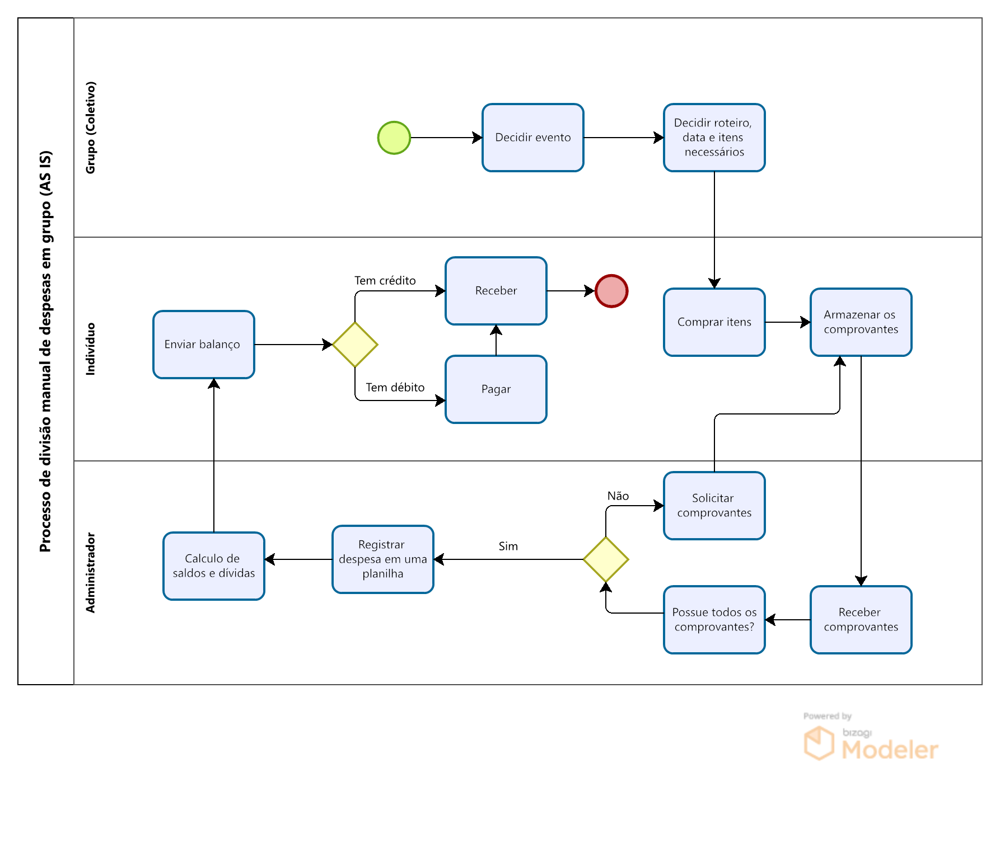
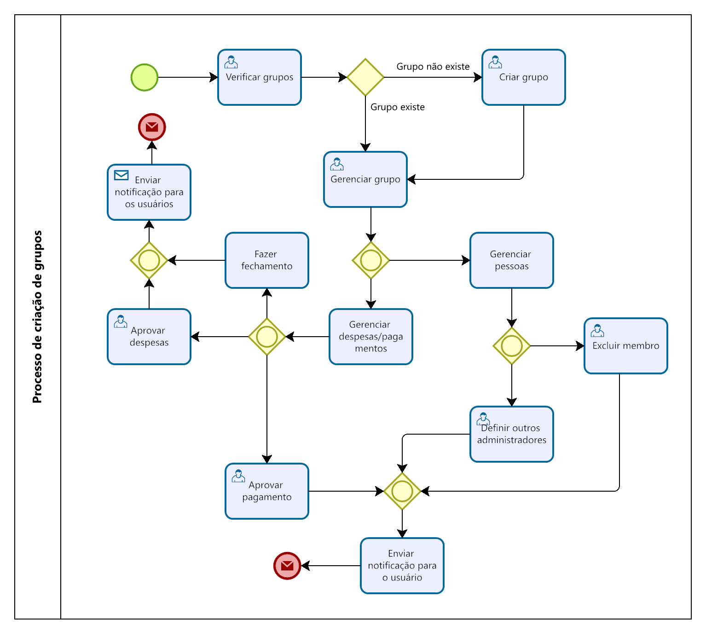
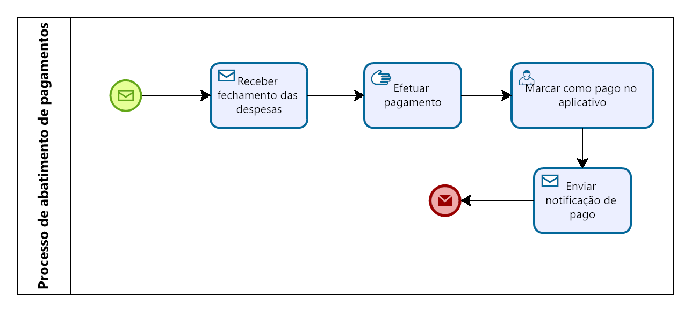

## 3. Modelagem dos Processos de Negócio

> **Links Úteis**:
> - [Modelagem de Processos AS-IS x TO-BE](https://dheka.com.br/modelagem-as-is-to-be/)
> - [20 Dicas Práticas de Modelagem de Processos](https://dheka.com.br/20-dicas-praticas-de-modelagem-de-processos/)

### 3.1. Modelagem da situação atual (Modelagem AS IS)

#### 3.1.1. Descrição Geral

O processo atual de gerenciamento de despesas coletivas em eventos ou viagens de grupo ainda é predominantemente manual. Embora existam ferramentas digitais disponíveis no mercado, como o Splitwise e o Tricount, elas ainda não estão amplamente difundidas entre o público brasileiro, especialmente em contextos informais. Os participantes organizam as compras, guardam notas fiscais e consolidam os gastos em uma planilha (normalmente no Excel ou em uma planilha compartilhada), efetuando os cálculos de forma artesanal. Essa abordagem funciona para eventos simples e com poucos participantes, mas apresenta diversas limitações quando o número de pessoas cresce ou quando há diferentes níveis de consumo.

#### 3.1.2. Etapas do Processo Atual

Planejamento do evento: o grupo decide realizar um evento ou viagem e define os itens necessários (alimentos, bebidas, transporte, hospedagem, etc.). Não há um sistema formal de registro nessa etapa; as decisões são tomadas em conversas informais (por exemplo, via WhatsApp).

Compras individuais: cada participante compra os itens de sua responsabilidade, em momentos diferentes e em estabelecimentos distintos. As notas fiscais ou comprovantes de pagamento precisam ser guardados, geralmente em papel ou em formato de foto.

Solicitação de comprovantes: após o evento, um membro do grupo (designado informalmente) pergunta se alguém comprou algo e solicita que todos enviem as notas fiscais ou os valores pagos. Esse envio ocorre por mensagens de texto ou compartilhamento de fotos.

Registro das despesas: uma pessoa assume o papel de "tesoureiro" e cria uma planilha no Excel (ou Google Sheets). Nessa planilha, ela lança manualmente cada despesa informada, registrando o nome do pagador, a descrição do item e o valor correspondente.

Soma e rateio: somam‑se todas as despesas para obter o total gasto. Divide‑se o total pelo número de participantes (ou de acordo com regras acordadas) para calcular a cota individual. Se houver participantes que consumiram menos, o responsável tenta ajustar manualmente as fórmulas para refletir essa proporcionalidade.

Cálculo de saldos: compara‑se a cota individual com o valor que cada pessoa pagou. Quem pagou mais do que a própria cota fica com crédito; quem pagou menos fica em débito. Esse cálculo é realizado por fórmulas simples ou por inspeção manual, dependendo das habilidades do responsável com o Excel.

Ajustes de pagamento: o grupo organiza as transferências para que os devedores paguem diretamente aos credores (via PIX ou outras formas). Esse processo é coordenado informalmente, e muitas vezes ocorrem múltiplas mensagens para combinar valores e formas de pagamento.

Encerramento e registro: após os acertos, a planilha pode ser salva e arquivada, mas raramente existe um histórico estruturado de eventos anteriores. Em eventuais divergências, os participantes voltam a reavaliar as notas e as fórmulas manualmente.

#### 3.1.3. Pontos Críticos e Dificuldades

Processo demorado: a coleta das notas e o lançamento manual dos valores na planilha tomam tempo e exigem dedicação de um membro do grupo, retardando o acerto final. Estudos sobre métodos manuais de registro de despesas mostram que eles são tediosos e propensos a erros
gabriel.money.

Susceptibilidade a erros: a digitação manual pode gerar erros de inserção de dados e esquecimentos. Além disso, fórmulas mal configuradas podem levar a resultados incorretos. Especialistas em gestão de despesas relatam que planilhas manuais podem resultar em dados inconsistentes, visibilidade limitada e inexactidões devido à ausência de controle de versão e à facilidade de sobrescrever fórmulas
concur.com.

Falta de transparência: como apenas uma pessoa alimenta a planilha, os demais participantes nem sempre acompanham as atualizações em tempo real. Isso gera dúvidas e desconfianças sobre o valor devido por cada pessoa.

Inconsistência de dados: planilhas enviadas por e‑mail ou mensagem podem gerar várias versões divergentes. Sem um repositório centralizado, não existe uma "fonte única de verdade", o que dificulta a auditoria e aumenta o risco de inconsistências
concur.com.

Dificuldade em ajustar proporcionalidade: quando algumas pessoas não participam de todas as atividades ou consomem menos itens, a divisão igualitária torna‑se injusta. Ajustar proporcionalidades manualmente exige habilidades em Excel e aumenta a complexidade das fórmulas.

Comunicação ineficiente: o coordenador precisa constantemente perguntar quem comprou o quê e solicitar comprovantes, gerando um grande volume de mensagens e atrasando a consolidação.

#### 3.1.4. Conclusão

O processo manual de gerenciar despesas em grupo é viável apenas para grupos pequenos e com despesas simples. À medida que o número de participantes cresce e os itens diversificam, surgem problemas de tempo, erros, transparência e justiça na divisão dos valores. Pesquisas indicam que métodos manuais são demorados, propensos a falhas e dificultam a visibilidade dos gastos. Essas limitações evidenciam a necessidade de uma solução digital que automatize o registro, calcule automaticamente o rateio e mantenha um histórico transparente, reduzindo conflitos e otimizando a experiência dos usuários.

### 3.2. Descrição geral da proposta (Modelagem TO BE)

Tendo identificado os gargalos dos modelos AS IS, apresentem uma descrição da proposta de solução, buscando maior eficiência com a introdução da tecnologia. Abordem também os limites dessa solução e o seu alinhamento com as estratégias e objetivos do contexto de negócio escolhido. 
Colem aqui os modelos da solução proposta (modelo TO BE) elaborados com o apoio da ferramenta baseada em BPMN utilizada na disciplina.
Cada processo identificado deve ter seu modelo TO-BE específico. Descrevam as oportunidades de melhoria de cada processo da solução proposta.

_Apresente aqui uma descrição da sua proposta abordando seus limites e suas ligações com as estratégias e objetivos do negócio. Apresente aqui as oportunidades de melhorias._

### 3.3. Modelagem dos processos

[PROCESSO 1 - Nome do Processo](./processos/processo-1-nome-do-processo.md "Detalhamento do Processo 1.")

[PROCESSO 2 - Nome do Processo](./processos/processo-2-nome-do-processo.md "Detalhamento do Processo 2.")
