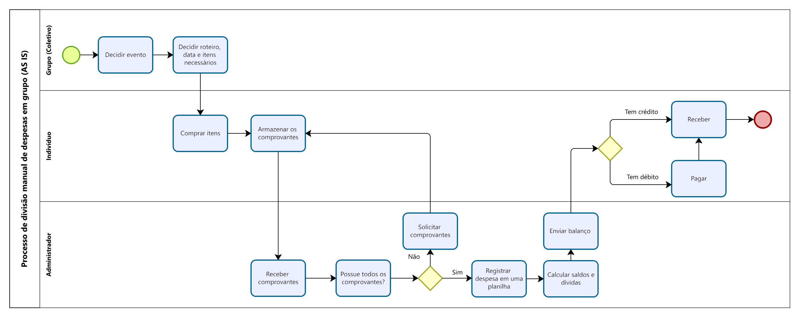
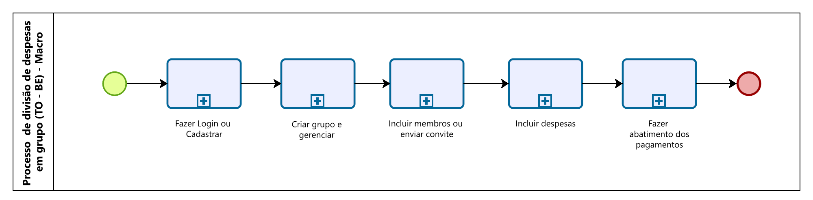

## 3. Modelagem dos Processos de Negócio

### 3.1. Modelagem da situação atual (Modelagem AS IS)

O processo atual de gerenciamento de despesas coletivas em eventos ou viagens de grupo é predominantemente manual e apresenta problemas claros:

- Dependência de registros informais: decisões são tomadas em conversas de WhatsApp sem rastreabilidade formal.
- Armazenamento descentralizado: notas fiscais guardadas em papel ou fotos, dificultando conferência posterior.
- Registro manual suscetível a erros: uso de planilhas (Excel/Google Sheets) com risco de fórmulas incorretas, dados duplicados ou versões divergentes.
- Transparência limitada: apenas o “tesoureiro” tem controle da planilha, gerando desconfiança e necessidade de conferências adicionais.
- Ineficiência na comunicação: grande volume de mensagens trocadas para solicitar comprovantes e combinar pagamentos.
- Dificuldade em ajustes proporcionais: quando participantes consomem em níveis diferentes, a divisão justa exige cálculos complexos, pouco práticos em planilhas.
- Ausência de histórico consolidado: registros raramente são arquivados de forma estruturada, impossibilitando auditorias ou consultas a eventos passados.

Esses problemas configuram gargalos operacionais típicos do modelo AS-IS, resultando em retrabalho, atrasos e potenciais conflitos entre os participantes.

### 3.2. Descrição geral da proposta (Modelagem TO BE)

O projeto Passa Régua propõe um aplicativo colaborativo que transforma esse processo fragmentado em um fluxo digital integrado (TO-BE):

- Centralização em uma plataforma: todas as despesas são registradas no aplicativo, eliminando planilhas paralelas e versões divergentes.
- Automação do cálculo de rateio: o sistema gera saldos automaticamente, com regras de proporcionalidade configuráveis.
- Transparência em tempo real: todos os membros visualizam simultaneamente as despesas, os pagamentos e os saldos.
- Histórico estruturado: cada evento ou viagem fica registrado, possibilitando consultas e auditorias futuras.
- Suporte ao registro de pagamento e validação: membros registram pagamentos; o administrador confirma e o sistema atualiza os saldos.
- Oportunidades de melhoria adicionais: envio de notificações automáticas, exportação de relatórios, gamificação para estimular o engajamento.
- Limites da solução: exige que os usuários registrem corretamente suas despesas e dependência de conexão à internet. Situações complexas (parcelamentos, multi-moedas) poderão demandar ajustes futuros.

O alinhamento estratégico está em reduzir conflitos, aumentar a confiança entre os participantes e promover eficiência no gerenciamento coletivo, consolidando a aplicação como uma ferramenta prática e confiável.

### 3.3. Modelagem dos processos

[PROCESSO 1 - Processo de cadastro e login](./processos/processo-1-cadastro-e-login.md "Detalhamento do Processo 1.")

[PROCESSO 2 - Processo de criação de grupo](./processos/processo-2-gerenciamento-de-grupos.md "Detalhamento do Processo 2.")

[PROCESSO 3 - Processo de gerênciamento de mebros](./processos/processo-3-gerenciamento-de-membros.md "Detalhamento do Processo 2.")

[PROCESSO 4 - Processo de gerênciamento de despesas](./processos/processo-4-gerenciamento-de-despesas.md "Detalhamento do Processo 2.")

[PROCESSO 5 - Processo de abatimento de pagamento](./processos/processo-5-abatimento-de-pagamento.md "Detalhamento do Processo 2.")
