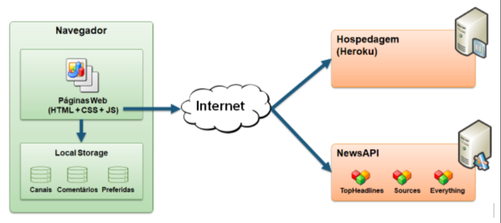
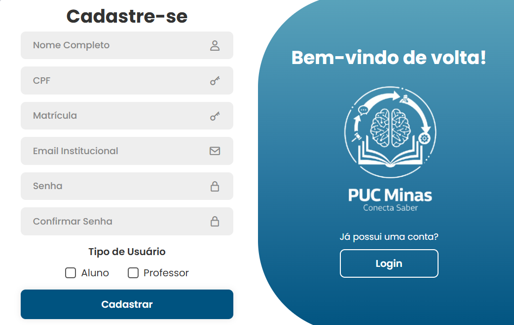
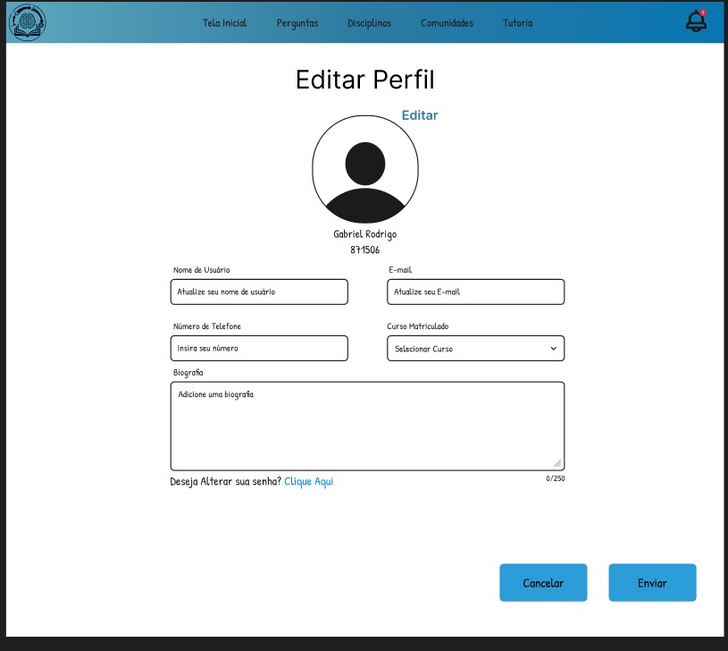
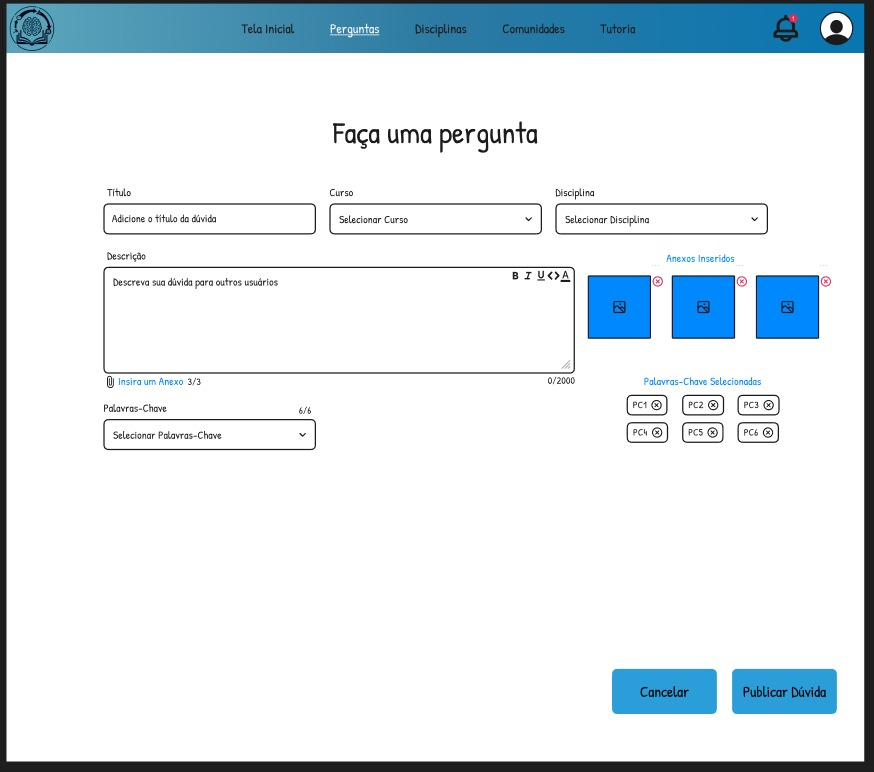
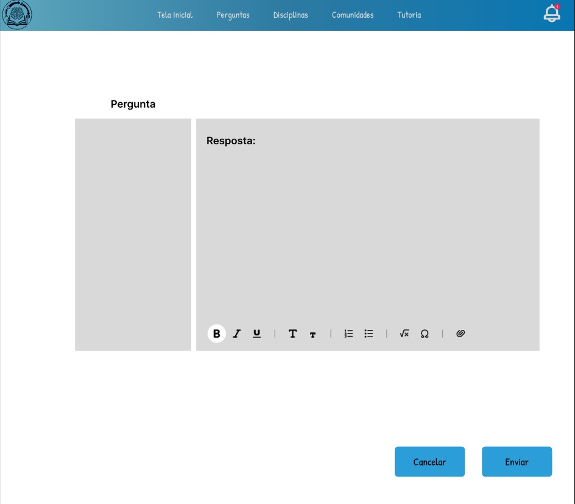
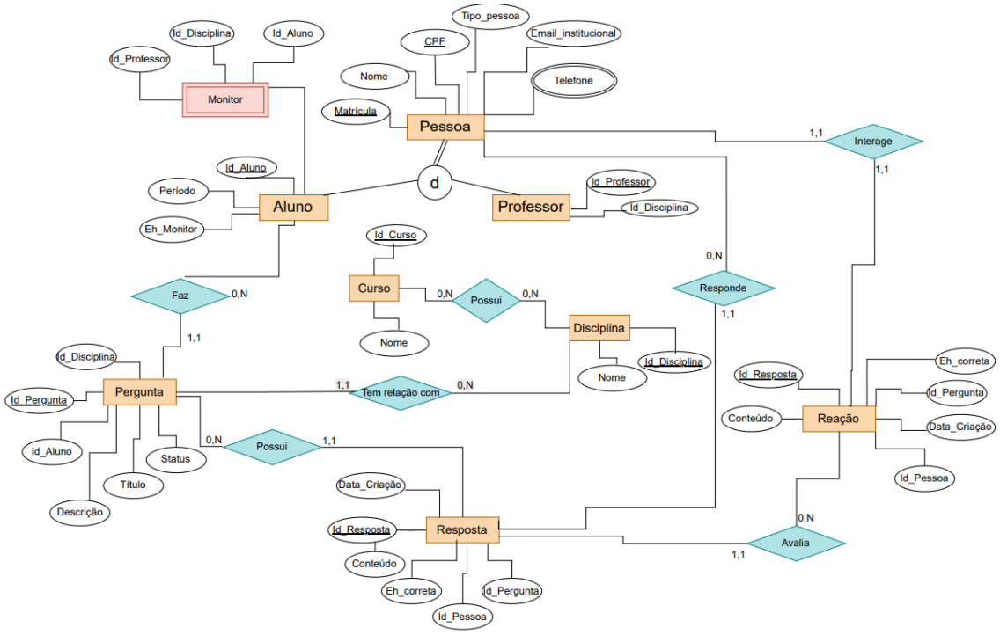
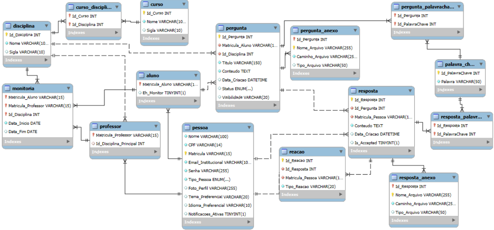
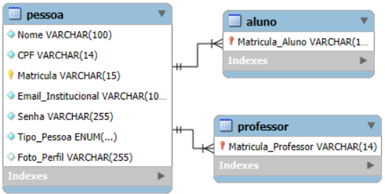

## 4. Projeto da Solução

Pré-requisitos: <a href="3-Modelagem-Processos-Negócio.md"> Modelagem do Processo de Negocio</a>

## 4.1. Arquitetura da solução

......  COLOQUE AQUI O SEU TEXTO E O DIAGRAMA DE ARQUITETURA .......

 Inclua um diagrama da solução e descreva os módulos e as tecnologias
 que fazem parte da solução. Discorra sobre o diagrama.
 
 **Exemplo do diagrama de Arquitetura**:
 

 
---

### 4.2. Protótipos de telas

#### Tela Inicial ("Homepage")

O protótipo de alta fidelidade "Homepage" (baseado no Processo 1 – Visualização e Busca de Conteúdo) serve como a porta de entrada para a plataforma PUC Integra, apresentando uma visão geral do conteúdo disponível e as principais funcionalidades de navegação e interação. O fluxo principal envolve o usuário visualizando o feed de perguntas frequentes e notícias recentes, além de ter acesso rápido à busca de conteúdo e à criação de novas perguntas.

Elementos e Seções principais:**

* **Cabeçalho Fixo:**
    * **Logo "PUC Integra"** (Identificador da marca).
    * **Botões de Ação:** "Entrar", "Cadastre-se" (para usuários não logados), e "Faça uma pergunta" (para acesso rápido à criação de conteúdo).
* **Seção "Hero" (Destaque Principal):**
    * **Frase de Efeito:** "Transforme perguntas em aprendizado" (Título principal).
    * **Descrição:** Texto explicativo sobre a proposta de valor da plataforma.
    * **Campo de Busca:** "Qual a sua dúvida?" (Caixa de texto com ícone de lupa para pesquisa de conteúdo).
* **Barra de Categorias/Filtros:**
    * **Navegação Horizontal:** "Todas", "Algoritmos em Grafos", "Redes de Computadores" (Exemplos de categorias/disciplinas para filtrar perguntas).
    * **Setas de Navegação:** Permitem ao usuário rolar as categorias horizontalmente.
* **Seção "Perguntas Mais Frequentes":**
    * **Título:** "PERGUNTAS MAIS FREQUENTES".
    * **Carrossel de Perguntas:** Exibe cards de perguntas populares com informações como autor, disciplina, título da pergunta e palavras-chave.
    * **Setas de Navegação:** Permitem ao usuário navegar entre as perguntas.
* **Seção "Eventos e Notícias Recentes":**
    * **Título:** "Eventos e notícias recentes".
    * **Carrossel de Notícias:** Exibe cards com notícias relevantes (ex: "Alunos da PUC Minas Lançam Plataforma Inovadora para Colaboração Acadêmica") e imagens.
    * **Setas de Navegação e Indicadores de Página:** Permitem ao usuário navegar entre as notícias.
* **Call-to-Action (Rodapé):**
    * **Mensagem:** "Está buscando uma resposta?".
    * **Botão:** "Faça uma pergunta" (Redireciona para a funcionalidade de criação de perguntas).

**Ações principais:**

* **Cliques nos Botões do Cabeçalho:** Navegar para login, cadastro ou criação de perguntas.
* **Digitar no Campo de Busca:** Iniciar uma pesquisa por conteúdo.
* **Cliques nas Categorias/Filtros:** Filtrar as perguntas exibidas.
* **Cliques em Perguntas ou Notícias:** Navegar para a página de detalhes da pergunta/notícia.
* **Cliques no Botão "Faça uma pergunta" (Rodapé):** Redirecionar para a funcionalidade de criação de perguntas.

#### Tela de Cadastro ("Criar Conta:")
Na tela de cadastro, o usuário que ainda não possui registro pode criar sua conta na plataforma. Os campos obrigatórios permitem que o sistema colete informações essenciais para a identificação e autenticação futura.
Campos disponíveis:
* Nome Completo (Caixa de texto – obrigatório)
* CPF (Caixa de texto – numérico, obrigatório)
* Matrícula (Caixa de texto – obrigatório)
* E-mail Institucional (Caixa de texto – obrigatório, formato válido)
* Senha (Caixa de texto – obrigatório, mínimo 8 caracteres)
* Confirmar Senha (Caixa de texto – deve coincidir com a senha)
* Tipo de Entidade (Seleção única – opções: Aluno ou Professor)
Ação principal:
* Botão "Cadastrar" → envia os dados para validação e registro no banco de dados, conforme o fluxo do processo BPMN.

---

#### Tela de Login ("Entrar")
Na tela de login, o usuário já cadastrado pode acessar a plataforma utilizando suas credenciais.
Campos disponíveis:
* E-mail Institucional (Caixa de texto – obrigatório)
* Senha (Caixa de texto – obrigatório)
  
Ações principais:
* Botão "Login" → valida as credenciais e direciona o usuário para o sistema, caso estejam corretas.
*  Link "Esqueceu a senha? Clique Aqui!" → direciona o usuário para uma tela de recuperação da senha.
* Link "Não possui uma conta? Registrar" → direciona o usuário para a tela de cadastro, caso ainda não tenha registro.

---

#### Tela de Personalização de Perfil ("Editar Perfil")
O protótipo de alta fidelidade "Editar Perfil" (baseado no Processo 3 – Personalização de Perfil) permite ao usuário atualizar suas informações pessoais e credenciais após o login. O fluxo principal envolve acessar a área de perfil, atualizar os dados desejados, e o sistema validar e salvar as alterações no banco de dados.

Campos disponíveis:
* **Foto de Perfil** (Upload de imagem - permite alteração)
* **Nome de Usuário** (Caixa de texto - permite atualização)
* **E-mail** (Caixa de texto - permite atualização)
* **Número de Telefone** (Caixa de texto - permite atualização)
* **Curso Matriculado** (Seleção única - permite atualização da afiliação acadêmica)
* **Biografia** (Área de texto - limite de 250 caracteres)
* **Link "Deseja Alterar sua senha? Clique Aqui!"** (Link - redireciona para a funcionalidade de alteração de senha)

Ações principais:
* **Botão "Enviar"** → Submete os dados para validação e persistência no banco de dados.
* **Botão "Cancelar"** → Descarta as alterações e retorna à visualização anterior.

---

#### Tela de Criação de Pergunta ("Faça uma pergunta")
Este protótipo (baseado no Fluxo Pergunta do Processo 4) é a interface para o usuário publicar dúvidas acadêmicas na plataforma. A tela garante que a pergunta seja contextualizada, associando-a a um Curso e Disciplina, e permitindo a inclusão de *Palavras-Chave* e anexos para melhor categorização e busca.

Campos disponíveis:
* **Título** (Caixa de texto - obrigatório)
* **Curso** (Seleção única - afiliação acadêmica)
* **Disciplina** (Seleção única - afiliação acadêmica)
* **Descrição** (Área de texto/Editor de texto enriquecido - Conteúdo da dúvida)
* **Inserir um Anexo** (Upload de arquivo - permite a inclusão de até 3 arquivos)
* **Palavras-Chave** (Seleção múltipla/Caixa de texto com seleção - permite categorização por tags)

Ações principais:
* **Botão "Publicar Dúvida"** → Confirma o envio da postagem para o sistema, onde será registrada no banco de dados.
* **Botão "Cancelar"** → Aborta a criação da pergunta.

---

#### Tela de Envio de Resposta
O protótipo de Envio de Resposta (baseado no Fluxo Resposta do Processo 4) é a área de interação onde um usuário pode contribuir com soluções para uma dúvida publicada.

Campos disponíveis:
* **Pergunta:** (Área de exibição - Exibe o conteúdo da pergunta que está sendo respondida).
* **Resposta:** (Área de texto/Editor de texto enriquecido - Permite inserção de texto, links, imagens e formatação).
* **Opções de formatação:** (Ícones de texto enriquecido, como negrito, itálico, listas, equações e anexos).

Ações principais:
* **Botão "Enviar"** → Submete o conteúdo da resposta ao sistema para registro e vinculação à pergunta.
* **Botão "Cancelar"** → Aborta o preenchimento da resposta.

## Diagrama de Classes

O diagrama de classes ilustra graficamente como será a estrutura do software, e como cada uma das classes da sua estrutura estarão interligadas. Essas classes servem de modelo para materializar os objetos que executarão na memória.

As referências abaixo irão auxiliá-lo na geração do artefato “Diagrama de Classes”.

> - [Diagramas de Classes - Documentação da IBM](https://www.ibm.com/docs/pt-br/rational-soft-arch/9.6.1?topic=diagrams-class)
> - [O que é um diagrama de classe UML? | Lucidchart](https://www.lucidchart.com/pages/pt/o-que-e-diagrama-de-classe-uml)

---

### 4.3. Modelo de dados

O desenvolvimento da solução proposta requer a existência de bases de dados que permitam efetuar os cadastros de dados e controles associados aos processos identificados, assim como recuperações.
Utilizando a notação do DER (Diagrama Entidade e Relacionamento), elaborem um modelo, na ferramenta visual indicada na disciplina, que contemple todas as entidades e atributos associados às atividades dos processos identificados. Deve ser gerado um único DER que suporte todos os processos escolhidos, visando, assim, uma base de dados integrada. O modelo deve contemplar, também, o controle de acesso de usuários (partes interessadas dos processos) de acordo com os papéis definidos nos modelos do processo de negócio.
_Apresente o modelo de dados por meio de um modelo relacional que contemple todos os conceitos e atributos apresentados na modelagem dos processos._

---

### 4.3.1 Modelo ER

**Diagrama de Entidade e Relacionamento**

| Nº | Relacionamento | Entidades envolvidas | Grau | Cardinalidades | Tipo | Identifying? | Participações | Observações |
|----|----------------|----------------------|------|----------------|------|---------------|----------------|--------------|
| 1 | **Faz** | Aluno — Pergunta | Binário | Aluno (0,N) — Pergunta (1,1) | 1:N | Não | Pergunta participa totalmente; Aluno parcialmente | Pergunta contém Id_Aluno (FK) — redundância explícita (atributo + relacionamento) |
| 2 | **Possui** | Pergunta — Resposta | Binário | Pergunta (0,N) — Resposta (1,1) | 1:N | Não | Resposta participa totalmente | Resposta contém Id_Pergunta (FK) — coerente com o relacionamento |
| 3 | **Possui** | Curso — Disciplina | Binário | Curso (0,N) — Disciplina (0,N) | N:N | Não | Ambos os lados opcionais | Relação totalmente opcional (many-to-many) |
| 4 | **Tem relação com** | Pergunta — Disciplina | Binário | Pergunta (1,1) — Disciplina (0,N) | 1:N | Não | — | Cada Pergunta pertence a uma Disciplina; vincula perguntas à disciplina correspondente |
| 5 | **Responde** | Pessoa — Resposta | Binário | Pessoa (0,N) — Resposta (1,1) | 1:N | Não | Resposta participa totalmente | Resposta possui Id_Pessoa (FK) |
| 6 | **Avalia** | Resposta — Reação | Binário | Resposta (1,1) — Reação (0,N) | 1:N | Não | — | Reação contém Id_Resposta (FK) |
| 7 | **Interage** | Pessoa — Reação | Binário | Pessoa (1,1) — Reação (1,1) | 1:1 | Não | — | Ligação obrigatória e um-para-um; diagrama mostra Id_Pessoa, Id_Resposta, Id_Pergunta — possível redundância |
| 8 | **Monitor** | Aluno — Professor — Disciplina | Ternário | Implícito (dependente dos três) | Entidade fraca | Sim (identificação por chaves compostas) | — | Representa relação entre Aluno, Professor e Disciplina; Aluno contém Eh_Monitor indicando a função |

**Relações Implícitas (Atributos-FK)**

| Entidade | Atributo | Associação implícita | Observação |
|-----------|-----------|----------------------|-------------|
| Professor | Id_Disciplina | Professor ⇄ Disciplina | Sugere 1:1 (não explicitado no diagrama) |
| Pergunta | Id_Disciplina, Id_Aluno | Pergunta ⇄ Disciplina e Pergunta ⇄ Aluno | FKs embutidos |
| Resposta | Id_Pergunta, Id_Pessoa | Resposta ⇄ Pergunta e Resposta ⇄ Pessoa | FKs coerentes com Possui e Responde |
| Reação | Id_Resposta, Id_Pergunta, Id_Pessoa | Reação ⇄ Resposta, Pergunta e Pessoa | Redundâncias entre atributos e relacionamentos explícitos |

**Generalização / Especialização**

| Superentidade | Subentidades | Tipo | Atributo Discriminador | Observações |
|----------------|---------------|------|------------------------|--------------|
| Pessoa | Aluno, Professor | Especialização (ISA) | Tipo_pessoa | Pessoa contém atributos comuns (CPF, Nome, Email, Telefone, Matrícula, Tipo_pessoa). CPF é chave. Discriminação representada por símbolo *d*. Pode ser disjunta ou sobreposta. |

**Resumo Geral**

| Relacionamento | Entidade A | Cardinalidade A | Entidade B | Cardinalidade B | Tipo |
|----------------|-------------|-----------------|-------------|-----------------|------|
| Faz | Aluno | (0,N) | Pergunta | (1,1) | 1:N |
| Possui | Pergunta | (0,N) | Resposta | (1,1) | 1:N |
| Possui | Curso | (0,N) | Disciplina | (0,N) | N:N |
| Tem relação com | Pergunta | (1,1) | Disciplina | (0,N) | 1:N |
| Responde | Pessoa | (0,N) | Resposta | (1,1) | 1:N |
| Avalia | Resposta | (1,1) | Reação | (0,N) | 1:N |
| Interage | Pessoa | (1,1) | Reação | (1,1) | 1:1 |
| Monitor | Aluno, Professor, Disciplina | — | — | — | Entidade fraca / ternária |

---

### 4.3.2 Esquema Relacional

O modelo de dados é a espinha dorsal da solução "PUC Integra", projetado para armazenar, organizar e relacionar todas as informações necessárias para suportar os processos de negócio definidos: **Cadastro de Usuários**, **Login**, **Personalização de Perfil** e o sistema de **Perguntas e Respostas**. A estrutura foi concebida utilizando o modelo relacional, que garante consistência, integridade e escalabilidade dos dados.

O diagrama reflete a organização das informações em entidades (tabelas) interconectadas por meio de chaves primárias (PK) e estrangeiras (FK). A seguir, uma descrição das principais áreas do modelo:

1.  **Módulo de Usuários e Perfis:**
    * A entidade central é a **`PESSOA`**, que utiliza o `CPF` como chave primária, garantindo um identificador único para cada indivíduo. Esta tabela armazena dados comuns a todos os usuários, como nome, e-mail, matrícula e credenciais de acesso.
    * A partir de `PESSOA`, ocorre uma especialização para as entidades **`ALUNO`** e **`PROFESSOR`**. Essa abordagem permite centralizar as informações genéricas em uma única tabela, enquanto os atributos específicos de cada perfil são mantidos em suas respectivas tabelas, otimizando a estrutura e evitando redundância.
    * Dados de personalização, como tema, idioma e foto de perfil, também são armazenados na entidade `PESSOA`, alinhando-se diretamente ao Processo 3 – Personalização de Perfil.

2.  **Módulo Acadêmico:**
    * As entidades **`CURSO`** e **`DISCIPLINA`** formam a base da estrutura acadêmica da plataforma. O relacionamento entre elas é do tipo N:N (muitos-para-muitos), representado pela tabela associativa **`CURSO_DISCIPLINA`**, permitindo que uma disciplina pertença a múltiplos cursos e vice-versa.

3.  **Módulo de Interação (Perguntas e Respostas):**
    * Este é o núcleo funcional da plataforma, materializado pelas entidades **`PERGUNTA`** e **`RESPOSTA`**. Uma `PERGUNTA` é obrigatoriamente vinculada a um `ALUNO` (autor) e a uma `DISCIPLINA`, garantindo o contexto acadêmico.
    * Qualquer `PESSOA` (seja aluno ou professor) pode fornecer uma `RESPOSTA`, que é ligada diretamente à pergunta correspondente.
    * Para enriquecer a interação, a entidade **`REACAO`** permite que os usuários avaliem as respostas, enquanto a entidade **`TAG`** e sua tabela associativa **`PERGUNTA_TAG`** possibilitam a categorização e a busca eficiente de conteúdo.

Em resumo, este modelo de dados integrado não apenas traduz os requisitos dos processos de negócio em uma estrutura de banco de dados lógica e coesa, mas também estabelece uma fundação robusta para o desenvolvimento e a futura expansão das funcionalidades da plataforma PUC Integra.

---

##### Modelo de Dados do Processo 1 - Cadastro de Usuário

Este modelo de dados representa a estrutura fundamental para o **Processo 1 – Cadastro de Usuários**. O design foi focado exclusivamente nas informações coletadas e armazenadas durante o registro de um novo membro na plataforma "PUC Integra", garantindo que a identidade e o perfil do usuário sejam corretamente estabelecidos desde o início.

A estrutura é composta por três tabelas principais:

1.  **`PESSOA`**: Esta é a entidade central do processo de cadastro. Ela armazena todos os dados comuns fornecidos pelo usuário no formulário, como `Nome`, `E-mail institucional`, `Matrícula` e `Senha`. O campo `Tipo_Pessoa` atua como um "discriminador", registrando se o usuário é um aluno ou professor, o que é essencial para a próxima etapa do fluxo.

2.  **`ALUNO`** e **`PROFESSOR`**: Estas tabelas representam a especialização do perfil do usuário. Após o sistema identificar o tipo de usuário, uma entrada correspondente é criada em uma dessas duas tabelas. Ambas utilizam o CPF como chave primária e estrangeira, estabelecendo um relacionamento direto e obrigatório com a tabela `PESSOA`.

Essa abordagem de generalização/especialização é altamente eficiente, pois centraliza os dados comuns em uma única tabela (`PESSOA`) e separa as especificidades de cada perfil, criando uma base de dados organizada, sem redundância e pronta para ser expandida com atributos exclusivos para alunos ou professores no futuro.

##### Modelo de Dados do Processo 2 - Login de Usuário

Este modelo de dados representa a estrutura consultada durante o **Processo 2 – Login de Usuários**. Diferente do cadastro, este processo não cria novas tabelas; em vez disso, ele **consulta** a estrutura de dados existente para autenticar o usuário.

O processo de login foca em validar as credenciais (E-mail/Matrícula e Senha) fornecidas pelo usuário. A estrutura consultada é:

1.  **`PESSOA`**: Esta é a entidade central para a autenticação. O sistema utiliza esta tabela para verificar se a `Matricula` (ou `Email_Institucional`) e a `Senha` fornecidas correspondem a um registro válido.
2.  **`ALUNO`** e **`PROFESSOR`**: Após a validação bem-sucedida na tabela `PESSOA`, o sistema consulta estas tabelas de especialização para identificar o `Tipo_Pessoa` e, assim, direcionar o usuário para a interface correta (seja de aluno ou professor), liberando o acesso ao sistema.

Como o Processo 2 (Login) apenas lê os dados criados pelo Processo 1 (Cadastro), o "Modelo Físico" (script de criação das tabelas) é o mesmo, pois as tabelas consultadas são as mesmas que foram criadas no cadastro.

---

### 4.3.3 Modelo Físico

Abaixo está o script SQL completo para a criação do banco de dados `puc_integra`, com todas as tabelas necessárias para suportar os processos de negócio definidos.

**Configuração Inicial do Banco de Dados:**

<code>
-- 1. APAGA O BANCO DE DADOS SE ELE JÁ EXISTIR (para recomeçar do zero)
DROP DATABASE IF EXISTS puc_integra;

-- 2. CRIA O BANCO DE DADOS
CREATE DATABASE puc_integra CHARACTER SET utf8mb4 COLLATE utf8mb4_unicode_ci;

-- 3. SELECIONA O BANCO DE DADOS para usar
USE puc_integra;
</code>

**Tabela PESSOA:**

<code>
-- Tabela PESSOA (Baseado no Processo 1 e 3)
CREATE TABLE PESSOA (
    Nome VARCHAR(100) NOT NULL,
    CPF VARCHAR(14) NOT NULL UNIQUE,
    Matricula VARCHAR(15) PRIMARY KEY, -- Esta é a PK
    Email_Institucional VARCHAR(100) NOT NULL UNIQUE,
    Senha VARCHAR(255) NOT NULL,
    Tipo_Pessoa ENUM('Aluno', 'Professor') NOT NULL,
    Foto_Perfil VARCHAR(255),
    Tema_Preferencial VARCHAR(20),
    Idioma_Preferencial VARCHAR(10),
    Notificacoes_Ativas BOOLEAN DEFAULT TRUE
);
</code>

**Tabela CURSO:**

<code>
-- Tabela CURSO
CREATE TABLE CURSO (
    Id_Curso INT PRIMARY KEY AUTO_INCREMENT,
    Nome VARCHAR(100) NOT NULL,
    Sigla VARCHAR(10) UNIQUE
);
</code>

**Tabela DISCIPLINA:**

<code>
-- Tabela DISCIPLINA
CREATE TABLE DISCIPLINA (
    Id_Disciplina INT PRIMARY KEY AUTO_INCREMENT,
    Nome VARCHAR(100) NOT NULL,
    Sigla VARCHAR(10) UNIQUE
);
</code>

**Tabela ALUNO:**

<code>
-- Tabela ALUNO (Especialização de PESSOA)
CREATE TABLE ALUNO (
    Matricula_Aluno VARCHAR(15) PRIMARY KEY,
    Eh_Monitor BOOLEAN DEFAULT FALSE,
    FOREIGN KEY (Matricula_Aluno) REFERENCES PESSOA(Matricula)
);
</code>

**Tabela PROFESSOR:**

<code>
-- Tabela PROFESSOR (Especialização de PESSOA)
CREATE TABLE PROFESSOR (
    Matricula_Professor VARCHAR(15) PRIMARY KEY,
    Id_Disciplina_Principal INT,
    FOREIGN KEY (Matricula_Professor) REFERENCES PESSOA(Matricula),
    FOREIGN KEY (Id_Disciplina_Principal) REFERENCES DISCIPLina(Id_Disciplina)
);
</code>

**Tabela PERGUNTA:**

<code>
-- Tabela PERGUNTA (Baseado no Processo 4)
CREATE TABLE PERGUNTA (
    Id_Pergunta INT PRIMARY KEY AUTO_INCREMENT,
    Matricula_Aluno VARCHAR(15) NOT NULL,
    Id_Disciplina INT NOT NULL,
    Titulo VARCHAR(150) NOT NULL,
    Conteudo TEXT NOT NULL,
    Data_Criacao DATETIME DEFAULT CURRENT_TIMESTAMP,
    Status ENUM('Aberta', 'Fechada', 'Moderacao') DEFAULT 'Aberta',
    Visibilidade VARCHAR(20),
    FOREIGN KEY (Matricula_Aluno) REFERENCES ALUNO(Matricula_Aluno),
    FOREIGN KEY (Id_Disciplina) REFERENCES DISCIPLINA(Id_Disciplina)
);
</code>

**Tabela RESPOSTA:**

<code>
-- Tabela RESPOSTA (Baseado no Processo 4)
CREATE TABLE RESPOSTA (
    Id_Resposta INT PRIMARY KEY AUTO_INCREMENT,
    Id_Pergunta INT NOT NULL,
    Matricula_Pessoa VARCHAR(15) NOT NULL,
    Conteudo TEXT NOT NULL,
    Data_Criacao DATETIME DEFAULT CURRENT_TIMESTAMP,
    Is_Accepted BOOLEAN DEFAULT FALSE,
    FOREIGN KEY (Id_Pergunta) REFERENCES PERGUNTA(Id_Pergunta),
    FOREIGN KEY (Matricula_Pessoa) REFERENCES PESSOA(Matricula)
);
</code>

**Tabela REACAO:**

<code>
-- Tabela REACAO (Baseado no Processo 4)
CREATE TABLE REACAO (
    Id_Reacao INT PRIMARY KEY AUTO_INCREMENT,
    Id_Resposta INT NOT NULL,
    Matricula_Pessoa VARCHAR(15) NOT NULL,
    Tipo_Reacao VARCHAR(20) NOT NULL,
    UNIQUE KEY (Id_Resposta, Matricula_Pessoa),
    FOREIGN KEY (Id_Resposta) REFERENCES RESPOSTA(Id_Resposta),
    FOREIGN KEY (Matricula_Pessoa) REFERENCES PESSOA(Matricula)
);
</code>

**Tabela CURSO_DISCIPLINA:**

<code>
-- Tabela CURSO_DISCIPLINA (Relacionamento N:N)
CREATE TABLE CURSO_DISCIPLINA (
    Id_Curso INT NOT NULL,
    Id_Disciplina INT NOT NULL,
    PRIMARY KEY (Id_Curso, Id_Disciplina),
    FOREIGN KEY (Id_Curso) REFERENCES CURSO(Id_Curso),
    FOREIGN KEY (Id_Disciplina) REFERENCES DISCIPLINA(Id_Disciplina)
);
</code>

**Tabela MONITORIA:**

<code>
-- Tabela MONITORIA
CREATE TABLE MONITORIA (
    Matricula_Aluno VARCHAR(15) NOT NULL,
    Matricula_Professor VARCHAR(15) NOT NULL,
    Id_Disciplina INT NOT NULL,
    Data_Inicio DATE NOT NULL,
    Data_Fim DATE,
    PRIMARY KEY (Matricula_Aluno, Matricula_Professor, Id_Disciplina),
    FOREIGN KEY (Matricula_Aluno) REFERENCES ALUNO(Matricula_Aluno),
    FOREIGN KEY (Matricula_Professor) REFERENCES PROFESSOR(Matricula_Professor),
    FOREIGN KEY (Id_Disciplina) REFERENCES DISCIPLINA(Id_Disciplina)
);
</code>

**Tabela PALAVRA_CHAVE:**

<code>
-- 1. Tabela PALAVRA_CHAVE (Armazena as palavras-chave únicas)
CREATE TABLE PALAVRA_CHAVE (
    Id_PalavraChave INT PRIMARY KEY AUTO_INCREMENT,
    Palavra VARCHAR(50) UNIQUE NOT NULL
);
</code>

**Tabela PERGUNTA_PALAVRACHAVE:**

<code>
-- 2. Tabela PERGUNTA_PALAVRACHAVE (Liga palavras-chave às Perguntas)
CREATE TABLE PERGUNTA_PALAVRACHAVE (
    Id_Pergunta INT NOT NULL,
    Id_PalavraChave INT NOT NULL,
    PRIMARY KEY (Id_Pergunta, Id_PalavraChave),
    FOREIGN KEY (Id_Pergunta) REFERENCES PERGUNTA(Id_Pergunta),
    FOREIGN KEY (Id_PalavraChave) REFERENCES PALAVRA_CHAVE(Id_PalavraChave)
);
</code>

**Tabela RESPOSTA_PALAVRACHAVE:**

<code>
-- 3. Tabela RESPOSTA_PALAVRACHAVE (Liga palavras-chave às Respostas)
CREATE TABLE RESPOSTA_PALAVRACHAVE (
    Id_Resposta INT NOT NULL,
    Id_PalavraChave INT NOT NULL,
    PRIMARY KEY (Id_Resposta, Id_PalavraChave),
    FOREIGN KEY (Id_Resposta) REFERENCES RESPOSTA(Id_Resposta),
    FOREIGN KEY (Id_PalavraChave) REFERENCES PALAVRA_CHAVE(Id_PalavraChave)
);
</code>

**Tabela PERGUNTA_ANEXO:**

<code>
-- TABELAS DE ANEXOS (Baseado no Processo 4)
CREATE TABLE PERGUNTA_ANEXO (
    Id_Pergunta INT NOT NULL,
    Nome_Arquivo VARCHAR(255) NOT NULL,
    Caminho_Arquivo VARCHAR(255) NOT NULL,
    Tipo_Arquivo VARCHAR(50),
    PRIMARY KEY (Id_Pergunta, Nome_Arquivo),
    FOREIGN KEY (Id_Pergunta) REFERENCES PERGUNTA(Id_Pergunta)
);
</code>

**Tabela RESPOSTA_ANEXO:**

<code>
CREATE TABLE RESPOSTA_ANEXO (
    Id_Resposta INT NOT NULL,
    Nome_Arquivo VARCHAR(255) NOT NULL,
    Caminho_Arquivo VARCHAR(255) NOT NULL,
    Tipo_Arquivo VARCHAR(50),
    PRIMARY KEY (Id_Resposta, Nome_Arquivo),
    FOREIGN KEY (Id_Resposta) REFERENCES RESPOSTA(Id_Resposta)
);
</code>

---

### 4.4. Tecnologias

_Descreva qual(is) tecnologias você vai usar para resolver o seu problema, ou seja, implementar a sua solução. Liste todas as tecnologias envolvidas, linguagens a serem utilizadas, serviços web, frameworks, bibliotecas, IDEs de desenvolvimento, e ferramentas._

Apresente também uma figura explicando como as tecnologias estão relacionadas ou como uma interação do usuário com o sistema vai ser conduzida, por onde ela passa até retornar uma resposta ao usuário.

| **Dimensão**   | **Tecnologia**  |
| ---            | ---             |
| SGBD           | MySQL           |
| Front end      | HTML+CSS+JS     |
| Back end       | Java SpringBoot |
| Deploy         | Github Pages    |

