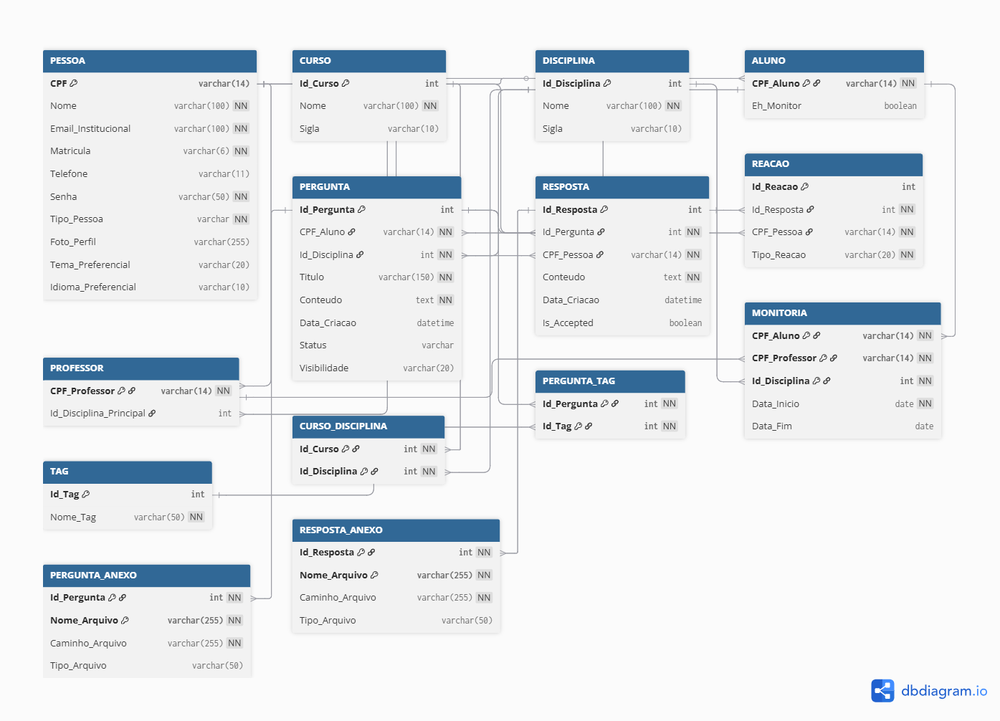
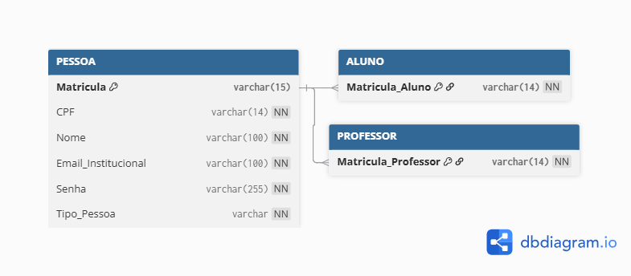

## 4. Projeto da Solução

<span style="color:red">Pré-requisitos: <a href="3-Modelagem-Processos-Negócio.md"> Modelagem do Processo de Negocio</a></span>

## 4.1. Arquitetura da solução

A arquitetura proposta para o sistema de controle de despesas para MEIs e profissionais autônomos é baseada em um **modelo cliente-servidor**, com uma abordagem moderna que visa escalabilidade, desempenho e facilidade de manutenção. Conforme o diagrama abaixo, a solução será dividida em três camadas principais: **Frontend**, **Backend** e **Banco de Dados**, com o deploy do Frontend sendo realizado via **GitHub Pages** e o Backend em uma plataforma de hospedagem, interagindo com um serviço de **API**.

### Descrição dos Módulos e Tecnologias

- **Frontend (Navegador)**  
  - Acesso via navegador web, utilizando **HTML, CSS e JavaScript**.  
  - Responsável pela interação visual e coleta de dados do usuário.  
  - Utiliza **Local Storage** para armazenar dados temporários ou preferências do usuário, otimizando a experiência e reduzindo requisições desnecessárias ao servidor.  
  - Deploy realizado via **GitHub Pages**, garantindo acessibilidade e facilidade de atualização.
 Inclua um diagrama da solução e descreva os módulos e as tecnologias
 que fazem parte da solução. Discorra sobre o diagrama.
 
 **Exemplo do diagrama de Arquitetura**:
 

 
---

- **Backend (Hospedagem – Java SpringBoot)**  
  - Lógica de negócio principal do sistema.  
  - Hospedado em plataforma como **Heroku**.  
  - Desenvolvido com **Java SpringBoot**, framework robusto para criação de aplicações corporativas e APIs RESTful.  
  - Responsável por processar requisições do frontend, gerenciar autenticação e autorização, aplicar regras de negócio (registro, categorização, cálculo de saldos, etc.) e interagir com o banco de dados.

- **Banco de Dados (MySQL)**  
  - Persistência dos dados do sistema.  
  - **MySQL** garante robustez, escalabilidade e compatibilidade com SpringBoot.  
  - Segurança e integridade das informações financeiras dos usuários.

- **APIs Externas (Exemplo NewsAPI)**  
  - Possível integração futura com APIs de bancos para importação automática de extratos ou serviços de pagamento para conciliação de transações.  
  - Atualmente, foco principal é o controle interno de despesas.

Esta arquitetura permite uma **clara separação de responsabilidades**, facilitando o desenvolvimento paralelo das equipes de frontend e backend, além de proporcionar flexibilidade para futuras expansões e integrações.

### Diagrama de Arquitetura


### 4.2. Protótipos de Telas

A interface visual do sistema está sendo elaborada com foco na **simplicidade e usabilidade**, atendendo aos requisitos funcionais e não funcionais de acessibilidade e intuitividade para MEIs e profissionais autônomos. Os wireframes são essenciais para visualizar a estrutura e o fluxo de interação do usuário, garantindo que as funcionalidades planejadas sejam apresentadas de forma clara e eficiente.

#### Principais Interfaces e sua Elaboração

- **Tela de Login/Cadastro:**  
  Essencial para o controle de acesso, garantindo a segurança das informações financeiras. Será simples e direta, solicitando apenas os dados necessários para registro e autenticação.

- **Dashboard Principal:**  
  Visão geral do fluxo de caixa, com gráficos e resumos das receitas e despesas. Esta tela será o ponto central para acompanhamento financeiro, com acesso rápido às principais funcionalidades.

- **Registro de Transação (Receita/Despesa):**  
  Formulário intuitivo para inserção de novas transações, com campos para valor, data, descrição e categoria. A categorização será um ponto chave para a organização financeira.

- **Gerenciamento de Categorias:**  
  Interface para que o usuário possa criar, editar ou excluir categorias personalizadas de receitas e despesas.

- **Relatórios:**  
  Telas dedicadas à geração de relatórios por período, categoria ou tipo de transação, com opções de visualização em tabelas e gráficos.

- **Definição de Metas:**  
  Interface para que o usuário possa estabelecer metas financeiras (ex: economia mensal, orçamento por categoria) e acompanhar seu progresso.

- **Alertas e Notificações:**  
  Configurações para que o usuário receba alertas sobre despesas excessivas, pagamentos a vencer ou metas atingidas.

Os wireframes estão sendo desenvolvidos para refletir as **histórias de usuário** levantadas na fase de especificação, garantindo que cada tela atenda a uma necessidade específica do empreendedor. A prototipagem interativa permitirá **validar a experiência do usuário** antes da implementação completa.

#### Exemplo de Wireframe


**Tela de Cadastro ("Criar Conta:")**
Na tela de cadastro, o usuário que ainda não possui registro pode criar sua conta na plataforma. Os campos obrigatórios permitem que o sistema colete informações essenciais para a identificação e autenticação futura.
Campos disponíveis:
* Nome Completo (Caixa de texto – obrigatório)
* CPF (Caixa de texto – numérico, obrigatório)
* Matrícula (Caixa de texto – obrigatório)
* E-mail Institucional (Caixa de texto – obrigatório, formato válido)
* Senha (Caixa de texto – obrigatório, mínimo 8 caracteres)
* Confirmar Senha (Caixa de texto – deve coincidir com a senha)
* Tipo de Entidade (Seleção única – opções: Aluno ou Professor)
Ação principal:
* Botão "Cadastrar" → envia os dados para validação e registro no banco de dados, conforme o fluxo do processo BPMN.


---

**Tela de Login ("Entrar")**
Na tela de login, o usuário já cadastrado pode acessar a plataforma utilizando suas credenciais.
Campos disponíveis:
* E-mail Institucional (Caixa de texto – obrigatório)
* Senha (Caixa de texto – obrigatório)
  
Ações principais:
* Botão "Login" → valida as credenciais e direciona o usuário para o sistema, caso estejam corretas.
*  Link "Esqueceu a senha? Clique Aqui!" → direciona o usuário para uma tela de recuperação da senha.
* Link "Não possui uma conta? Registrar" → direciona o usuário para a tela de cadastro, caso ainda não tenha registro.


---

## Diagrama de Classes

O diagrama de classes ilustra graficamente como será a estrutura do software, e como cada uma das classes da sua estrutura estarão interligadas. Essas classes servem de modelo para materializar os objetos que executarão na memória.

As referências abaixo irão auxiliá-lo na geração do artefato “Diagrama de Classes”.

> - [Diagramas de Classes - Documentação da IBM](https://www.ibm.com/docs/pt-br/rational-soft-arch/9.6.1?topic=diagrams-class)
> - [O que é um diagrama de classe UML? | Lucidchart](https://www.lucidchart.com/pages/pt/o-que-e-diagrama-de-classe-uml)

## Modelo ER

O Modelo ER representa através de um diagrama como as entidades (coisas, objetos) se relacionam entre si na aplicação interativa.]

As referências abaixo irão auxiliá-lo na geração do artefato “Modelo ER”.

> - [Como fazer um diagrama entidade relacionamento | Lucidchart](https://www.lucidchart.com/pages/pt/como-fazer-um-diagrama-entidade-relacionamento)
---

### 4.3. Modelo de dados
O desenvolvimento da solução requer uma base de dados robusta para o armazenamento e controle de todas as informações financeiras e de usuário. Utilizaremos um modelo de dados relacional, representado por um Diagrama Entidade-Relacionamento (DER), que contemplará todas as entidades e atributos associados aos processos de controle de despesas, além do controle de acesso de usuários. 


---

O **Diagrama Entidade-Relacionamento (DER)** representará graficamente as entidades do sistema e seus relacionamentos. As principais entidades incluirão:

- **Usuário:**  
  Informações do MEI/Autônomo, como nome, e-mail, senha, entre outros dados de cadastro.

- **ContaFinanceira:**  
  Representa as contas bancárias ou carteiras digitais do usuário, onde as transações são registradas.

- **Transacao:**  
  Detalhes de cada receita ou despesa, incluindo valor, data, descrição, tipo e categoria.

- **Categoria:**  
  Classificação das transações, como alimentação, transporte, vendas, serviços, etc.

- **MetaFinanceira:**  
  Objetivos financeiros definidos pelo usuário, como valor, período e tipo da meta.

- **Alerta:**  
  Configurações e histórico de alertas gerados pelo sistema.

O DER será elaborado para garantir a **integridade dos dados** e otimizar as consultas, suportando os **relatórios** e funcionalidades de **busca** necessárias para a gestão financeira do usuário.

#### Exemplo de DER


### 4.3.1 Modelo ER


**Diagrama de Entidade e Relacionamento**

| Nº | Relacionamento | Entidades envolvidas | Grau | Cardinalidades | Tipo | Identifying? | Participações | Observações |
|----|----------------|----------------------|------|----------------|------|---------------|----------------|--------------|
| 1 | **Faz** | Aluno — Pergunta | Binário | Aluno (0,N) — Pergunta (1,1) | 1:N | Não | Pergunta participa totalmente; Aluno parcialmente | Pergunta contém Id_Aluno (FK) — redundância explícita (atributo + relacionamento) |
| 2 | **Possui** | Pergunta — Resposta | Binário | Pergunta (0,N) — Resposta (1,1) | 1:N | Não | Resposta participa totalmente | Resposta contém Id_Pergunta (FK) — coerente com o relacionamento |
| 3 | **Possui** | Curso — Disciplina | Binário | Curso (0,N) — Disciplina (0,N) | N:N | Não | Ambos os lados opcionais | Relação totalmente opcional (many-to-many) |
| 4 | **Tem relação com** | Pergunta — Disciplina | Binário | Pergunta (1,1) — Disciplina (0,N) | 1:N | Não | — | Cada Pergunta pertence a uma Disciplina; vincula perguntas à disciplina correspondente |
| 5 | **Responde** | Pessoa — Resposta | Binário | Pessoa (0,N) — Resposta (1,1) | 1:N | Não | Resposta participa totalmente | Resposta possui Id_Pessoa (FK) |
| 6 | **Avalia** | Resposta — Reação | Binário | Resposta (1,1) — Reação (0,N) | 1:N | Não | — | Reação contém Id_Resposta (FK) |
| 7 | **Interage** | Pessoa — Reação | Binário | Pessoa (1,1) — Reação (1,1) | 1:1 | Não | — | Ligação obrigatória e um-para-um; diagrama mostra Id_Pessoa, Id_Resposta, Id_Pergunta — possível redundância |
| 8 | **Monitor** | Aluno — Professor — Disciplina | Ternário | Implícito (dependente dos três) | Entidade fraca | Sim (identificação por chaves compostas) | — | Representa relação entre Aluno, Professor e Disciplina; Aluno contém Eh_Monitor indicando a função |

O **Esquema Relacional** corresponde à representação das **tabelas no banco de dados**, incluindo a definição de **chaves primárias**, **chaves estrangeiras** e **restrições de integridade**.  

Este esquema detalhará:  
- A **estrutura de cada tabela**.  
- Os **tipos de dados** de cada atributo.  
- Os **relacionamentos** entre as tabelas.  

O objetivo é garantir a **normalização**, a **eficiência** do banco de dados e a **integridade** das informações.

#### Exemplo de Esquema Relacional


> Este esquema servirá como base para a implementação do banco de dados relacional que suportará todos os processos do sistema de controle de despesas.
**Relações Implícitas (Atributos-FK)**

| Entidade | Atributo | Associação implícita | Observação |
|-----------|-----------|----------------------|-------------|
| Professor | Id_Disciplina | Professor ⇄ Disciplina | Sugere 1:1 (não explicitado no diagrama) |
| Pergunta | Id_Disciplina, Id_Aluno | Pergunta ⇄ Disciplina e Pergunta ⇄ Aluno | FKs embutidos |
| Resposta | Id_Pergunta, Id_Pessoa | Resposta ⇄ Pergunta e Resposta ⇄ Pessoa | FKs coerentes com Possui e Responde |
| Reação | Id_Resposta, Id_Pergunta, Id_Pessoa | Reação ⇄ Resposta, Pergunta e Pessoa | Redundâncias entre atributos e relacionamentos explícitos |

**Generalização / Especialização**

| Superentidade | Subentidades | Tipo | Atributo Discriminador | Observações |
|----------------|---------------|------|------------------------|--------------|
| Pessoa | Aluno, Professor | Especialização (ISA) | Tipo_pessoa | Pessoa contém atributos comuns (CPF, Nome, Email, Telefone, Matrícula, Tipo_pessoa). CPF é chave. Discriminação representada por símbolo *d*. Pode ser disjunta ou sobreposta. |

**Resumo Geral**

| Relacionamento | Entidade A | Cardinalidade A | Entidade B | Cardinalidade B | Tipo |
|----------------|-------------|-----------------|-------------|-----------------|------|
| Faz | Aluno | (0,N) | Pergunta | (1,1) | 1:N |
| Possui | Pergunta | (0,N) | Resposta | (1,1) | 1:N |
| Possui | Curso | (0,N) | Disciplina | (0,N) | N:N |
| Tem relação com | Pergunta | (1,1) | Disciplina | (0,N) | 1:N |
| Responde | Pessoa | (0,N) | Resposta | (1,1) | 1:N |
| Avalia | Resposta | (1,1) | Reação | (0,N) | 1:N |
| Interage | Pessoa | (1,1) | Reação | (1,1) | 1:1 |
| Monitor | Aluno, Professor, Disciplina | — | — | — | Entidade fraca / ternária |

---

### 4.3.2 Esquema Relacional

O modelo de dados é a espinha dorsal da solução "PUC Integra", projetado para armazenar, organizar e relacionar todas as informações necessárias para suportar os processos de negócio definidos: **Cadastro de Usuários**, **Login**, **Personalização de Perfil** e o sistema de **Perguntas e Respostas**. A estrutura foi concebida utilizando o modelo relacional, que garante consistência, integridade e escalabilidade dos dados.

O diagrama reflete a organização das informações em entidades (tabelas) interconectadas por meio de chaves primárias (PK) e estrangeiras (FK). A seguir, uma descrição das principais áreas do modelo:

1.  **Módulo de Usuários e Perfis:**
    * A entidade central é a **`PESSOA`**, que utiliza o `CPF` como chave primária, garantindo um identificador único para cada indivíduo. Esta tabela armazena dados comuns a todos os usuários, como nome, e-mail, matrícula e credenciais de acesso.
    * A partir de `PESSOA`, ocorre uma especialização para as entidades **`ALUNO`** e **`PROFESSOR`**. Essa abordagem permite centralizar as informações genéricas em uma única tabela, enquanto os atributos específicos de cada perfil são mantidos em suas respectivas tabelas, otimizando a estrutura e evitando redundância.
    * Dados de personalização, como tema, idioma e foto de perfil, também são armazenados na entidade `PESSOA`, alinhando-se diretamente ao Processo 3 – Personalização de Perfil.

O **Modelo Físico** consiste no **script SQL** para a criação das tabelas no **MySQL**.  

O script incluirá:  
- Instruções **CREATE TABLE** com a definição das colunas e seus **tipos de dados**.  
- **Chaves primárias** e **chaves estrangeiras**.  
- Outras **restrições** necessárias para implementar o esquema relacional.  
2.  **Módulo Acadêmico:**
    * As entidades **`CURSO`** e **`DISCIPLINA`** formam a base da estrutura acadêmica da plataforma. O relacionamento entre elas é do tipo N:N (muitos-para-muitos), representado pela tabela associativa **`CURSO_DISCIPLINA`**, permitindo que uma disciplina pertença a múltiplos cursos e vice-versa.

3.  **Módulo de Interação (Perguntas e Respostas):**
    * Este é o núcleo funcional da plataforma, materializado pelas entidades **`PERGUNTA`** e **`RESPOSTA`**. Uma `PERGUNTA` é obrigatoriamente vinculada a um `ALUNO` (autor) e a uma `DISCIPLINA`, garantindo o contexto acadêmico.
    * Qualquer `PESSOA` (seja aluno ou professor) pode fornecer uma `RESPOSTA`, que é ligada diretamente à pergunta correspondente.
    * Para enriquecer a interação, a entidade **`REACAO`** permite que os usuários avaliem as respostas, enquanto a entidade **`TAG`** e sua tabela associativa **`PERGUNTA_TAG`** possibilitam a categorização e a busca eficiente de conteúdo.

Em resumo, este modelo de dados integrado não apenas traduz os requisitos dos processos de negócio em uma estrutura de banco de dados lógica e coesa, mas também estabelece uma fundação robusta para o desenvolvimento e a futura expansão das funcionalidades da plataforma PUC Integra.



---

##### Modelo de Dados (Processo 1 - Cadastro de Usuário)

Este modelo de dados representa a estrutura fundamental para o **Processo 1 – Cadastro de Usuários**. O design foi focado exclusivamente nas informações coletadas e armazenadas durante o registro de um novo membro na plataforma "PUC Integra", garantindo que a identidade e o perfil do usuário sejam corretamente estabelecidos desde o início.

A estrutura é composta por três tabelas principais:

1.  **`PESSOA`**: Esta é a entidade central do processo de cadastro. Ela armazena todos os dados comuns fornecidos pelo usuário no formulário, como `Nome`, `E-mail institucional`, `Matrícula` e `Senha`. O campo `Tipo_Pessoa` atua como um "discriminador", registrando se o usuário é um aluno ou professor, o que é essencial para a próxima etapa do fluxo.

2.  **`ALUNO`** e **`PROFESSOR`**: Estas tabelas representam a especialização do perfil do usuário. Após o sistema identificar o tipo de usuário, uma entrada correspondente é criada em uma dessas duas tabelas. Ambas utilizam o CPF como chave primária e estrangeira, estabelecendo um relacionamento direto e obrigatório com a tabela `PESSOA`.

Essa abordagem de generalização/especialização é altamente eficiente, pois centraliza os dados comuns em uma única tabela (`PESSOA`) e separa as especificidades de cada perfil, criando uma base de dados organizada, sem redundância e pronta para ser expandida com atributos exclusivos para alunos ou professores no futuro.



---

### 4.3.3 Modelo Físico

**Tabela Pessoa:**

O script será versionado no repositório do projeto, na pasta `src/bd`.

#### Exemplo de Script SQL

```sql
-- Criação da tabela Usuario
CREATE TABLE Usuario (
    UsuarioID INT PRIMARY KEY AUTO_INCREMENT,
    Nome VARCHAR(100) NOT NULL,
    Email VARCHAR(100) UNIQUE NOT NULL,
    Senha VARCHAR(255) NOT NULL
);

-- Criação da tabela ContaFinanceira
CREATE TABLE ContaFinanceira (
    ContaID INT PRIMARY KEY AUTO_INCREMENT,
    UsuarioID INT,
    NomeConta VARCHAR(100),
    Saldo DECIMAL(10,2),
    FOREIGN KEY (UsuarioID) REFERENCES Usuario(UsuarioID)
);

-- Criação da tabela Categoria
CREATE TABLE Categoria (
    CategoriaID INT PRIMARY KEY AUTO_INCREMENT,
    UsuarioID INT,
    NomeCategoria VARCHAR(100),
    Tipo ENUM('Receita','Despesa'),
    FOREIGN KEY (UsuarioID) REFERENCES Usuario(UsuarioID)
);

-- Criação da tabela Transacao
CREATE TABLE Transacao (
    TransacaoID INT PRIMARY KEY AUTO_INCREMENT,
    ContaID INT,
    CategoriaID INT,
    Valor DECIMAL(10,2),
    Data DATE,
    Descricao VARCHAR(255),
    Tipo ENUM('Receita','Despesa'),
    FOREIGN KEY (ContaID) REFERENCES ContaFinanceira(ContaID),
    FOREIGN KEY (CategoriaID) REFERENCES Categoria(CategoriaID)
);

-- Criação da tabela MetaFinanceira
CREATE TABLE MetaFinanceira (
    MetaID INT PRIMARY KEY AUTO_INCREMENT,
    UsuarioID INT,
    Valor DECIMAL(10,2),
    Periodo VARCHAR(50),
    Tipo ENUM('Economia','Orcamento'),
    FOREIGN KEY (UsuarioID) REFERENCES Usuario(UsuarioID)
);

-- Criação da tabela Alerta
CREATE TABLE Alerta (
    AlertaID INT PRIMARY KEY AUTO_INCREMENT,
    UsuarioID INT,
    Mensagem VARCHAR(255),
    Data DATE,
    FOREIGN KEY (UsuarioID) REFERENCES Usuario(UsuarioID)
);

```
### 4.4. Tecnologias

As tecnologias selecionadas para o desenvolvimento do sistema foram escolhidas com base na sua **robustez, popularidade, suporte da comunidade** e **adequação aos requisitos do projeto**, conforme a tabela a seguir:

</code>

Este script deverá ser incluído em um arquivo .sql na pasta src\bd.

---

| **Dimensão**   | **Tecnologia**  |
| -------------- | --------------- |
| SGBD           | MySQL           |
| Frontend       | HTML + CSS + JS |
| Backend        | Java SpringBoot |
| Deploy         | GitHub Pages    |

#### Como as Tecnologias se Relacionam (Fluxo de Interação)

1. O usuário acessa o sistema através de um **navegador web**, que carrega as páginas web (HTML, CSS, JS) hospedadas no **GitHub Pages**.  
2. A interface do usuário envia **requisições** (ex: registrar despesa, consultar extrato) para o **backend**, implementado em **Java SpringBoot**.  
3. O backend processa a requisição, aplica a **lógica de negócio** e interage com o **MySQL (SGBD)** para armazenar ou recuperar os dados financeiros.  
4. O **MySQL retorna** os dados ao backend.  
5. O backend envia a **resposta** (ex: confirmação de registro, lista de transações) de volta para o frontend.  
6. O frontend atualiza a **interface do usuário**, exibindo as informações solicitadas ou confirmando a operação.  

> Esta combinação de tecnologias oferece uma **solução completa e escalável**, desde a interface do usuário até a persistência dos dados, garantindo um **desenvolvimento eficiente** e um produto final de alta qualidade para MEIs e profissionais autônomos.

#### Diagrama de Tecnologias


