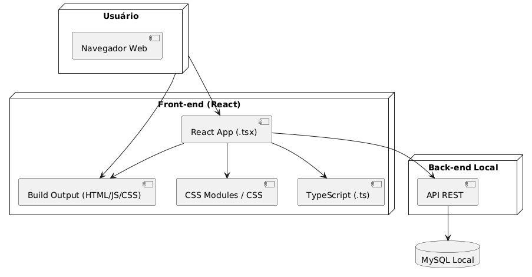
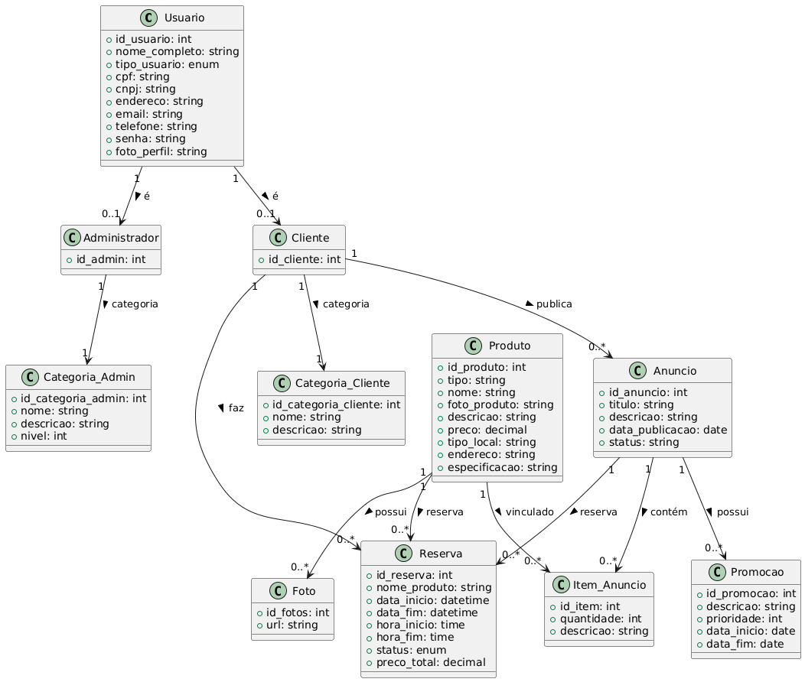
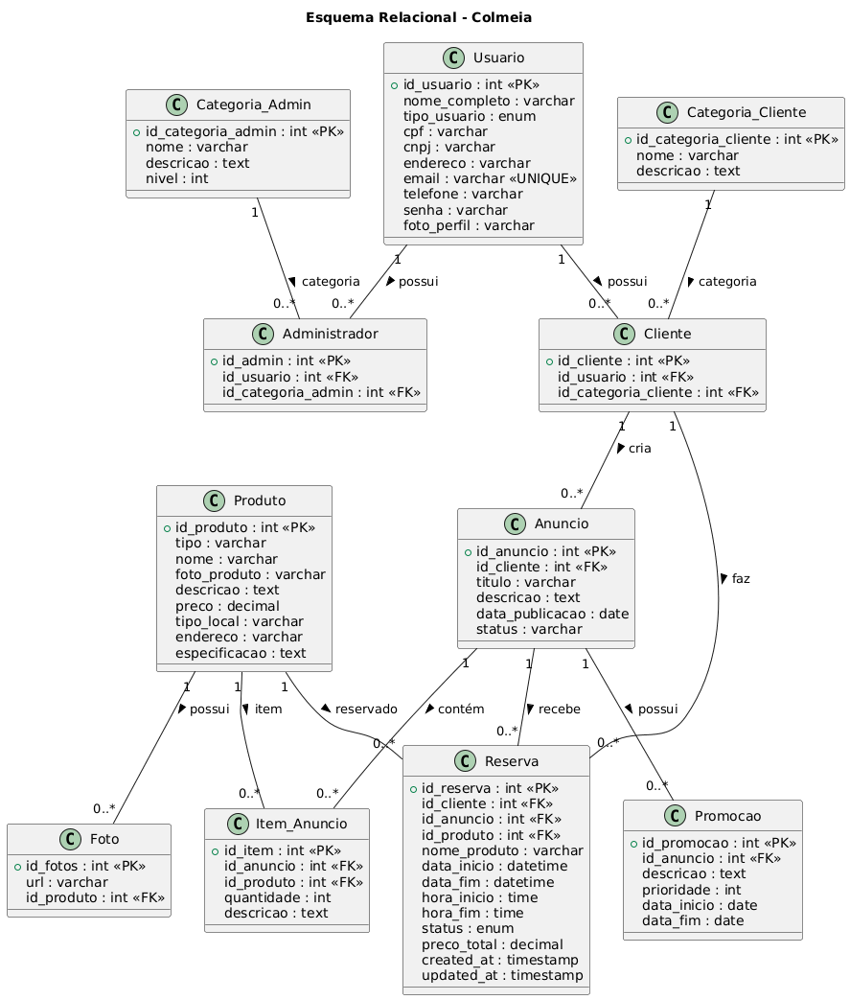

## 4. Projeto da Solução

## 4.1. Arquitetura da solução

A solução é composta por três módulos principais: o front-end em React, responsável pela interface do usuário e construído com arquivos TSX, TS e CSS gerados em HTML/JS/CSS no build; a API REST local, que recebe as requisições do front-end; e o banco de dados MySQL, onde todas as informações do sistema são armazenadas. No fluxo geral, o usuário acessa a aplicação no navegador, o React envia requisições para a API conforme as ações realizadas, e a API consulta ou atualiza o MySQL, retornando os resultados para o front-end.
 
 **Diagrama de Arquitetura**:
 
 
 

### 4.2. Protótipos de telas

#### Wireframe — Processo 1: Cadastro de Usuário
.jpg "Wireframe de baixa fidelidade")

#### Wireframe — Processo 2: Cadastro do Local (1/3)

#### Wireframe — Processo 2: Cadastro do Local (2/3)

#### Wireframe — Processo 2: Cadastro do Local (3/3)

#### Wireframe — Processo 3: Busca e Filtros Avançados

#### Wireframe — Processo 4: Reserva e Confirmação

#### Wireframe — Processo 5: Dashboard para Locadores

#### Wireframe — Processo 6: Avaliação e Reputação

## Diagrama de Classes

 **Diagrama de Classes**:
  

## Modelo ER

O Modelo ER representa através de um diagrama como as entidades (coisas, objetos) se relacionam entre si na aplicação interativa.]

As referências abaixo irão auxiliá-lo na geração do artefato “Modelo ER”.

> - [Como fazer um diagrama entidade relacionamento | Lucidchart](https://www.lucidchart.com/pages/pt/como-fazer-um-diagrama-entidade-relacionamento)

### 4.3. Modelo de dados

#### 4.3.1 Modelo ER

O Modelo ER representa através de um diagrama como as entidades (coisas, objetos) se relacionam entre si na aplicação interativa.]

As referências abaixo irão auxiliá-lo na geração do artefato “Modelo ER”.

> - [Como fazer um diagrama entidade relacionamento | Lucidchart](https://www.lucidchart.com/pages/pt/como-fazer-um-diagrama-entidade-relacionamento)

#### 4.3.2 Esquema Relacional

#### 4.3.3 Modelo Físico

<code>
CREATE DATABASE colmeia;
USE colmeia;
-- Usuario
CREATE TABLE Usuario (
 id_usuario INT AUTO_INCREMENT PRIMARY KEY,
 nome_completo VARCHAR(150) NOT NULL,
 tipo_usuario ENUM('locatário','locador','administrador') NOT NULL,
 cpf VARCHAR(14),
 cnpj VARCHAR(18),
 endereco VARCHAR(255),
 email VARCHAR(120) UNIQUE NOT NULL,
 telefone VARCHAR(20),
 senha VARCHAR(100) NOT NULL,
 foto_perfil VARCHAR(200)
);
-- Categoria_Admin
CREATE TABLE Categoria_Admin (
   id_categoria_admin INT PRIMARY KEY,
   nome VARCHAR(50),
   descricao TEXT,
   nivel INT
);
-- Categoria_Cliente
CREATE TABLE Categoria_Cliente (
   id_categoria_cliente INT PRIMARY KEY,
   nome VARCHAR(50),
   descricao TEXT
);
-- Administrador
CREATE TABLE Administrador (
   id_admin INT PRIMARY KEY,
   id_usuario INT,
   id_categoria_admin INT,
   FOREIGN KEY (id_categoria_admin) REFERENCES Categoria_Admin(id_categoria_admin)
);
-- Cliente
CREATE TABLE Cliente (
   id_cliente INT PRIMARY KEY,
   id_usuario INT,
   id_categoria_cliente INT,
   FOREIGN KEY (id_categoria_cliente) REFERENCES Categoria_Cliente(id_categoria_cliente)
);
-- Produto
CREATE TABLE Produto (
   id_produto INT PRIMARY KEY,
   tipo VARCHAR(50) NOT NULL,
   nome VARCHAR(255) NOT NULL,
   foto_produto VARCHAR(255),
   descricao TEXT,
   preco DECIMAL(10,2),
   tipo_local VARCHAR(100),
   endereco VARCHAR(255),
   especificacao TEXT
);
-- Anuncio
CREATE TABLE Anuncio (
   id_anuncio INT PRIMARY KEY,
   id_cliente INT NOT NULL,
   titulo VARCHAR(255) NOT NULL,
   descricao TEXT,
   data_publicacao DATE,
   status VARCHAR(50) DEFAULT 'disponível',
   FOREIGN KEY (id_cliente) REFERENCES Cliente(id_cliente)
);
-- Item_Anuncio
CREATE TABLE Item_Anuncio (
   id_item INT PRIMARY KEY,
   id_anuncio INT NOT NULL,
   id_produto INT NOT NULL,
   quantidade INT NOT NULL,
   descricao TEXT,
   FOREIGN KEY (id_anuncio) REFERENCES Anuncio(id_anuncio),
   FOREIGN KEY (id_produto) REFERENCES Produto(id_produto)
);
-- Promocao
CREATE TABLE Promocao (
   id_promocao INT PRIMARY KEY,
   id_anuncio INT NOT NULL,
   descricao TEXT,
   prioridade INT,
   data_inicio DATE,
   data_fim DATE,
   FOREIGN KEY (id_anuncio) REFERENCES Anuncio(id_anuncio)
);
-- Foto
CREATE TABLE Foto (
   id_fotos INT PRIMARY KEY,
   url VARCHAR(255) NOT NULL,
   id_produto INT NOT NULL,
   FOREIGN KEY (id_produto) REFERENCES Anuncio(id_anuncio)
);
-- Reserva
CREATE TABLE Reserva (
    id_reserva INT AUTO_INCREMENT PRIMARY KEY,
    id_cliente INT NOT NULL,
    id_anuncio INT NOT NULL,
    id_produto INT NOT NULL,
    nome_produto VARCHAR(255) NOT NULL,
    data_inicio DATETIME NOT NULL,
    data_fim DATETIME NOT NULL,
    hora_inicio TIME NOT NULL,
    hora_fim TIME NOT NULL,
    status ENUM('pendente','confirmada','cancelada') NOT NULL DEFAULT 'pendente',
    preco_total DECIMAL(10,2) NOT NULL,
    created_at TIMESTAMP DEFAULT CURRENT_TIMESTAMP,
    updated_at TIMESTAMP DEFAULT CURRENT_TIMESTAMP ON UPDATE CURRENT_TIMESTAMP,
    FOREIGN KEY (id_cliente) REFERENCES Cliente(id_cliente),
    FOREIGN KEY (id_anuncio) REFERENCES Anuncio(id_anuncio),
    FOREIGN KEY (id_produto) REFERENCES Produto(id_produto)
);

</code>

### 4.4. Tecnologias

A solução utiliza React + TypeScript + CSS no front-end. O back-end será feito em Node.js, responsável por toda a lógica da aplicação e comunicação com o banco. A persistência dos dados será feita em um banco MySQL, onde ficam armazenadas as informações de usuários, locais, reservas e outros. O deploy será realizado localmente.

| **Dimensão** | **Tecnologia**    |
|--------------|--------------------|
| SGBD         | MySQL              |
| Front end    | React + TS + CSS   |
| Back end     | Node.js            |
| Deploy       | Local              |

