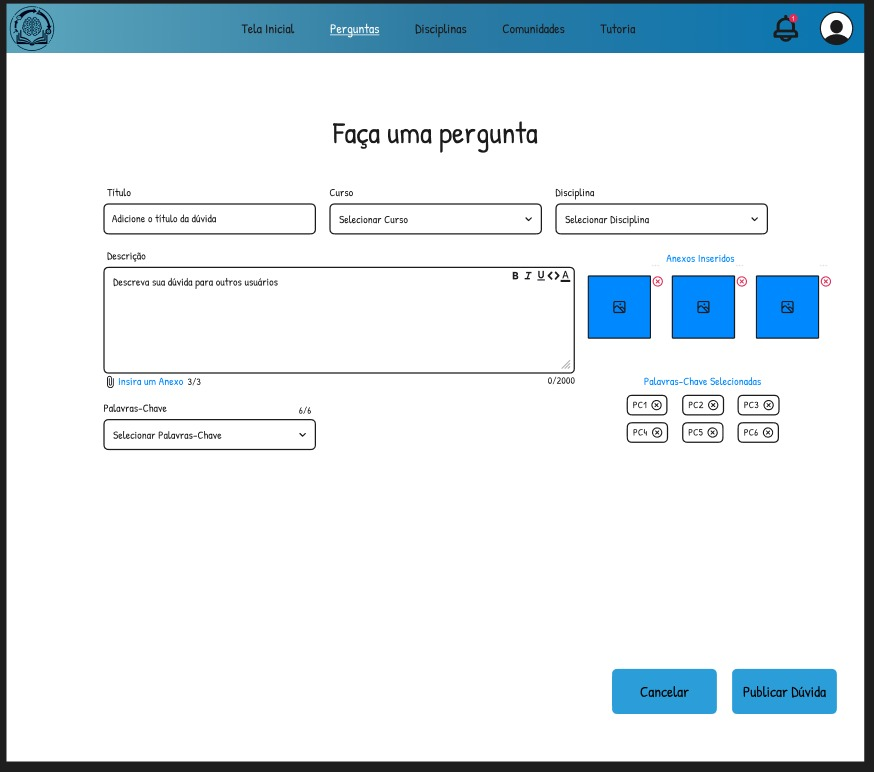

# 6. Interface do Sistema

Pré-requisitos: <a href="4-Projeto-Solucao.md"> Projeto da Solução</a>

## 6.1. Tela Principal (Feed de Interação)

A tela principal atua como o **Feed de Interação**, centralizando o acesso às funcionalidades da plataforma. Nela, o usuário visualiza as últimas dúvidas postadas, organizadas cronologicamente ou por relevância. A interface oferece uma barra de pesquisa global, filtros por curso ou disciplina e acesso rápido ao menu de navegação (Perfil, Nova Pergunta, Configurações). É o ponto de partida para o **Processo 4 (Envio de Perguntas e Respostas)**.

---

## 6.2. Processo 1 - Tela de Cadastro ("Criar Conta")

O processo de cadastro tem como objetivo permitir que novos usuários sejam registrados na plataforma PUC Integra. A interface foi projetada para coletar dados essenciais e validar o vínculo com a instituição.

* **Campos de Entrada:** Nome Completo, CPF, Matrícula, E-mail Institucional, Senha e Tipo de Entidade (Aluno ou Professor).
* **Comportamento:** Ao clicar em "Cadastrar", o sistema valida se o e-mail possui o domínio institucional e define o perfil de acesso inicial.

---

## 6.3. Processo 2 - Tela de Login ("Entrar")

A tela de login é a porta de entrada para usuários já registrados. Sua interface é minimalista para garantir foco na autenticação rápida.

* **Campos de Entrada:** E-mail Institucional e Senha.
* **Funcionalidades:** Botão de login, link para recuperação de senha ("Esqueceu a senha?") e atalho para a tela de cadastro caso o usuário ainda não possua conta.
* **Feedback:** O sistema exibe mensagens claras caso as credenciais estejam incorretas.

---

## 6.4. Processo 3 - Tela de Personalização de Perfil

Esta interface permite que o aluno ou professor gerencie sua identidade digital na plataforma, promovendo o engajamento e o senso de comunidade.

* **Funcionalidades:**
    * **Edição de Dados:** Permite alterar nome de usuário, telefone, e-mail e biografia (limite de 250 caracteres).
    * **Foto de Perfil:** Upload de imagem para identificação visual.
    * **Curso/Afiliação:** Atualização do curso matriculado para direcionar o conteúdo do feed.
    * **Segurança:** Link direto para alteração de senha.
* **Ações:** Botões para "Enviar" (salvar alterações) e "Cancelar".

---

## 6.5. Processo 4 - Tela de Criação de Pergunta ("Faça uma pergunta")

Interface dedicada à publicação de novas dúvidas acadêmicas. O foco é garantir que a pergunta seja bem contextualizada para facilitar respostas precisas.

* **Estrutura:**
    * **Título:** Resumo da dúvida.
    * **Contexto:** Seletores para Curso e Disciplina.
    * **Descrição Detalhada:** Editor de texto rico para explicar o problema.
    * **Anexos:** Área para upload de arquivos (imagens, PDFs) que ilustrem a dúvida.
    * **Tags:** Inserção de palavras-chave para indexação.

---

## 6.6. Processo 4 - Tela de Visualização e Resposta

Esta tela exibe o detalhe de uma dúvida e permite a interação da comunidade. É onde ocorre a troca de conhecimento efetiva.

* **Exibição:** Mostra a pergunta completa, autor, data e anexos.
* **Área de Resposta:** Campo de texto enriquecido (com formatação e suporte a links/imagens) para que outros usuários enviem soluções.
* **Lista de Respostas:** Abaixo da pergunta, são listadas as contribuições de outros usuários.
* **Validação:** Botões de "Like/Dislike" e, para professores/monitores, a opção de validar a resposta como correta/confiável.

