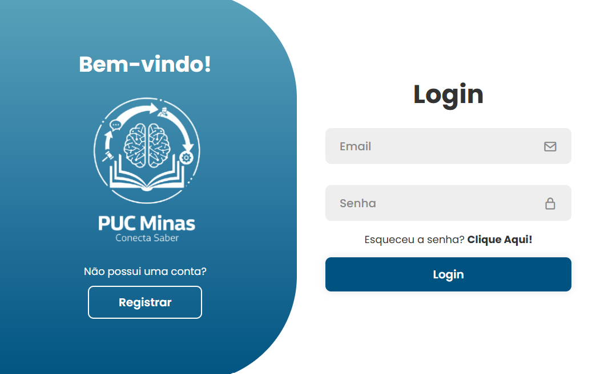

# 6. Interface do Sistema

Pré-requisitos: <a href="4-Projeto-Solucao.md"> Projeto da Solução</a>

_Visão geral da interação do usuário por meio das telas do sistema. Apresente as principais interfaces da plataforma._

## 6.1. Tela principal do sistema

_Descrição da tela principal do sistema._

## 6.2. Processo 1 - Tela de Cadastro

O processo de cadastro tem como objetivo permitir que novos usuários sejam registrados na plataforma PUC Integra.
Durante o cadastro, o usuário informa seus dados pessoais (nome, e-mail institucional, senha, matrícula e curso).
Após o preenchimento, o sistema valida as informações e identifica automaticamente o tipo de usuário: aluno ou professor.

## 6.3. Processo 2 - Tela de Login

O processo de login garante que apenas usuários cadastrados possam acessar a plataforma PUC Integra.
Para isso, o usuário deve inserir seu e-mail institucional e senha previamente cadastrada.
O sistema valida as credenciais e, em caso de sucesso, libera o acesso ao ambiente da plataforma.

## 6.4. Processo 3 - Tela de Personalização do perfil

O processo de personalização de perfil permite que o usuário configure e edite suas informações pessoais e acadêmicas após o login.
Essa etapa é importante para adaptar a experiência de uso às necessidades de cada membro da comunidade acadêmica, permitindo atualizações
de dados, inserção de foto, definição de preferências e atualização de informações institucionais.

## 6.5. Processo 4 - Tela de Perguntas e respostas

O Processo 4 descreve o fluxo pelo qual um usuário publica uma pergunta ou envia uma resposta na plataforma acadêmica (feed de interação). 
O objetivo é permitir a criação de dúvidas ligadas às disciplinas institucionais e respostas colaborativas

