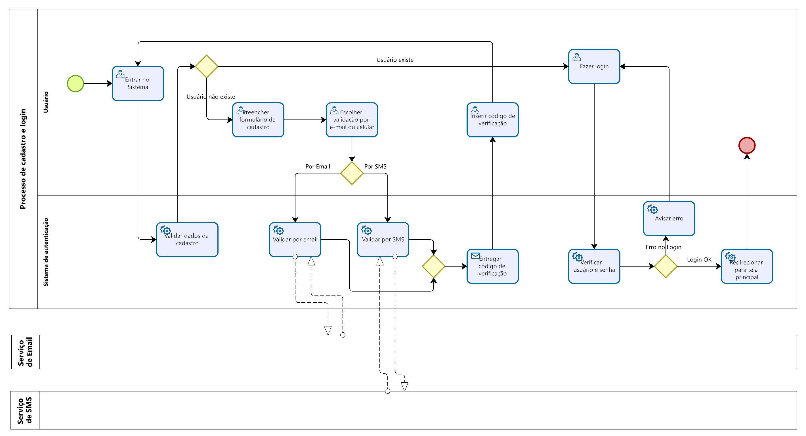

### 3.3.1 Processo 1 – Cadastro e Login

O processo modelado chama-se **"Cadastro e Login com Validação de E-mail ou Celular"**, e sua principal função é permitir que novos usuários criem uma conta de forma segura e acessem o sistema após uma verificação de identidade. Entre as **oportunidades de melhoria**, destacam-se: a possibilidade de integrar um sistema de **autenticação multifator (MFA)** para reforçar a segurança; **automatizar o envio e validação do código** para reduzir falhas manuais; e **otimizar o tempo de resposta do serviço de envio (e-mail/SMS)** para melhorar a experiência do usuário. O modelo do processo 1 foi descrito segundo o **padrão BPMN**, utilizando **pools e swimlanes** para representar os participantes (Usuário, Sistema de Autenticação e Serviço de E-mail/SMS) e detalhar o fluxo de atividades com **tarefas, eventos e fluxos de sequência**.

#### Detalhamento das atividades

**Nome da atividade 1** Login

| **Campo**       | **Tipo**         | **Restrições** | **Valor default** |
| ---             | ---              | ---            | ---               |
| [Nome do campo] | [tipo de dados]  |                |                   |
| ***Exemplo:***  |                  |                |                   |
| login           | Caixa de Texto   | formato de e-mail |                |
| senha           | Caixa de Texto   | mínimo de 8 caracteres |           |

| **Comandos**         |  **Destino**                   | **Tipo** |
| ---                  | ---                            | ---               |
| ***Exemplo:***       |                                |                   |
| Entrar               | Fim do Processo 1              | default           |

**Nome da atividade 2** Cadastro

| **Campo**       | **Tipo**         | **Restrições** | **Valor default** |
| ---             | ---              | ---            | ---               |
| login           | Caixa de Texto   | formato de e-mail |                |
| senha           | Caixa de Texto   | mínimo de 8 caracteres |           |
| Nome            | Caixa de Texto   | mínimo de 5 caracteres |           |
| Idade           | Número           | mínimo de 5 caracteres |           |
| Genero          | Seleção múltipla |                |                   |

| **Comandos**         |  **Destino**                   | **Tipo**          |
| ---                  | ---                            | ---               |
| Cadastrar            | Início do proceso de cadastro  |                   |
