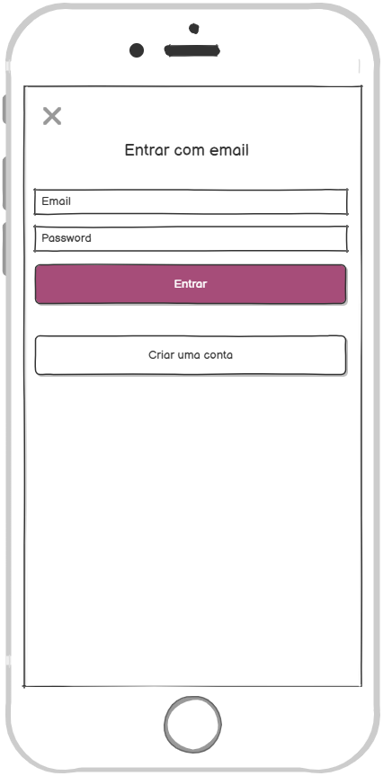
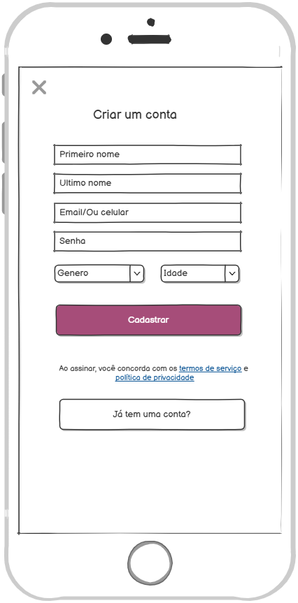
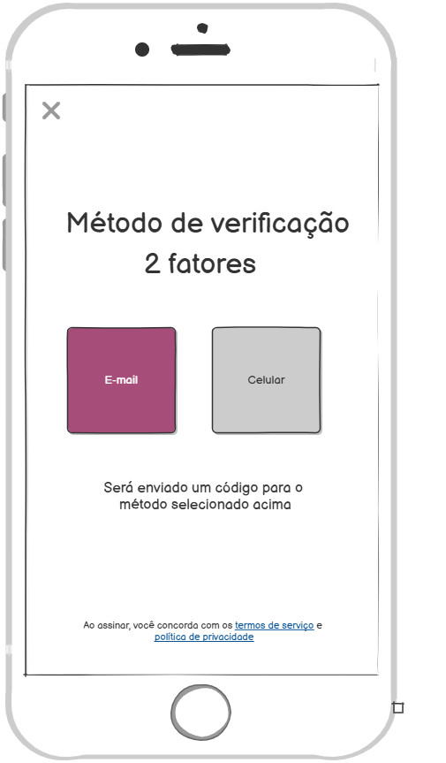
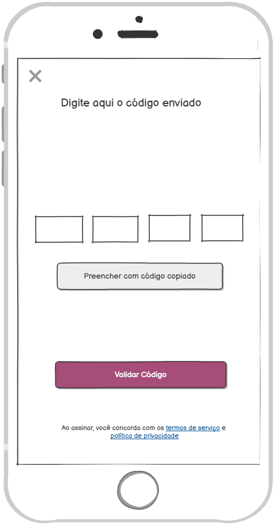
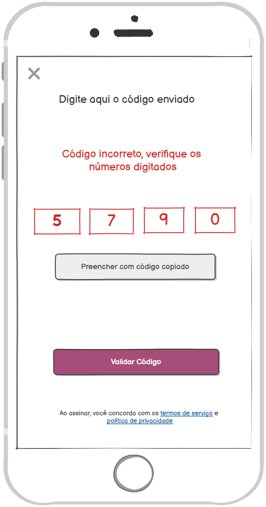

### 3.3.1 Processo 1 – Cadastro e Login

#### Descrição
O processo de **Entrada no Sistema** inicia quando o usuário acessa o browser de sua preferência e insere a URL da aplicação. Em seguida, o sistema apresenta a tela inicial, onde o usuário deve **escolher entre realizar login ou efetuar um novo cadastro**.  

- Caso opte por **Login**, o usuário insere suas credenciais (e-mail e senha) e acessa o sistema.  
- Caso opte por **Cadastro**, o sistema apresenta o formulário de criação de conta. Após preenchimento dos dados, o sistema envia um **código de verificação** (via e-mail ou SMS). Com a validação do código, o cadastro é finalizado, e o usuário é direcionado à tela de login para acessar sua conta.  

---

#### Modelagem

---

#### Detalhamento das Atividades

**Atividade 1. Acessar o sistema**

| **Campo** | **Tipo** | **Restrições** | **Valor default** |
|-----------|----------|----------------|-------------------|
| URL       | Texto    | Endereço válido | - |

| **Comando** | **Destino** | **Tipo** |
|-------------|-------------|----------|
| Entrar na aplicação | Tela inicial (Escolher Login ou Cadastro) | default |

---

**Atividade 2. Escolher Login ou Cadastro**

| **Campo** | **Tipo** | **Restrições** | **Valor default** |
|-----------|----------|----------------|-------------------|
| Opção     | Seleção  | Login ou Cadastro | - |

| **Comando**   | **Destino**           | **Tipo** |
|---------------|----------------------|----------|
| Fazer Login   | Tela de Login        | default  |
| Criar Conta   | Tela de Cadastro     | default  |

---

**Atividade 3. Fazer Login**

| **Campo** | **Tipo** | **Restrições** | **Valor default** |
|-----------|----------|----------------|-------------------|
| e-mail    | Texto    | Formato válido | - |
| senha     | Texto    | Mín. 8 caracteres | - |

| **Comando** | **Destino** | **Tipo** |
|-------------|-------------|----------|
| Entrar      | Fim do Processo 1 | default |
| Criar Conta | Tela de Cadastro | default |

---

**Atividade 4. Preencher Formulário de Cadastro**

| **Campo** | **Tipo** | **Restrições** | **Valor default** |
|-----------|----------|----------------|-------------------|
| login     | Texto    | Formato e-mail | - |
| senha     | Texto    | Mín. 8 caracteres | - |
| nome      | Texto    | Mín. 5 caracteres | - |
| idade     | Número   | ≥ 0 | - |
| gênero    | Seleção  | Masculino/Feminino/Outro | - |

| **Comando**          | **Destino**              | **Tipo** |
|----------------------|--------------------------|----------|
| Cadastrar            | Enviar código de validação | default |
| Já tenho uma conta   | Tela de Login            | default |

---

**Atividade 5. Enviar Código de Validação**

| **Campo** | **Tipo** | **Restrições** | **Valor default** |
|-----------|----------|----------------|-------------------|
| Método    | Seleção  | E-mail ou SMS  | E-mail |

| **Comando** | **Destino** | **Tipo** |
|-------------|-------------|----------|
| Enviar      | Inserir Código de Validação | default |

---

**Atividade 6. Inserir Código de Validação**

| **Campo** | **Tipo** | **Restrições** | **Valor default** |
|-----------|----------|----------------|-------------------|
| código    | Texto    | Mín. 6 dígitos | - |

| **Comando**             | **Destino**    | **Tipo** |
|--------------------------|----------------|----------|
| Validar código           | Fazer Login    | default |
| Preencher com código copiado | -          | opcional |

---

#### Wireframes

A seguir, apresentamos a descrição de como os wireframes apresentados atendem aos requisitos funcionais e não funcionais do sistema.

##### 1. Autenticação e Cadastro

  
  

##### Requisitos Atendidos:
- **RF-001**: As telas de login e cadastro, junto à tela de validação, demonstram o fluxo completo de autenticação, incluindo validação por e-mail ou celular.
- **RNF-005**: O fluxo de validação confirma que o sistema está preparado para autenticação via e-mail ou celular, atendendo à segurança esperada.
- **RNF-004**: O processo de login e validação presume boas práticas de segurança, como criptografia e controle de acesso.
- **RNF-008**: A interface é simples e direta, voltada a usuários não técnicos.

---

## 2. Validação de Conta

  
  
  

### Requisitos Atendidos:
- **RF-001**: Confirma a existência de um processo seguro de validação de conta após o cadastro.
- **RNF-005**: Reforça o suporte à autenticação com validação por e-mail ou celular.
- **RNF-006**: O design dessas telas favorece uma comunicação clara de mensagens de erro em caso de código inválido.

---
