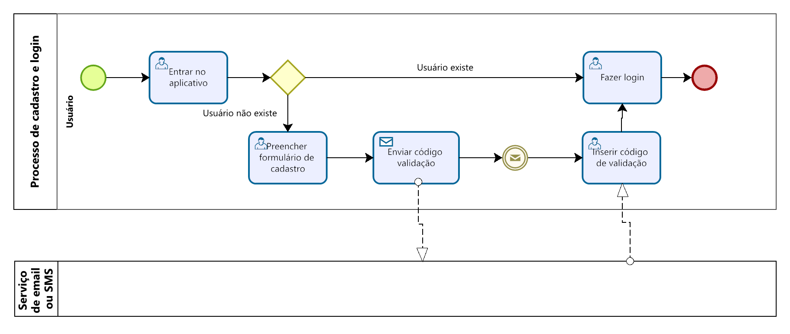

### 3.3.1 Processo 1 – Cadastro e Login

O processo de **Entrada no Sistema** começa quando o usuário vai até o browser de sua preferência e insere a url da aplicação. O browser então exibe a tela onde é possível inserir e-mail e senha;  Já para **Preencher formulário de cadastrar** a tela de preenchimento de um formulário é apresentada onde o usuário adiciona seus dados como login, senha, nome, idade e genero; o sistema, então, envia um link de verificação para o e-mail ou sms, e, após a sua confirmação,  finaliza o registro ao ter o código validado.

#### Detalhamento das atividades

**Nome da atividade 1** Entrar no Sistema

| **Campo**       | **Tipo**         | **Restrições** | **Valor default** |
| ---             | ---              | ---            | ---               |
| [Nome do campo] | [tipo de dados]  |                |                   |
| ***Exemplo:***  |                  |                |                   |
| login           | Caixa de Texto   | formato de e-mail |                |
| senha           | Caixa de Texto   | mínimo de 8 caracteres |           |

| **Comandos**         |  **Destino**                   | **Tipo** |
| ---                  | ---                            | ---               |
| ***Exemplo:***       |                                |                   |
| Entrar               | Fim do Processo 1              | default           |

**Nome da atividade 2** Preencher formulário de cadastrar

| **Campo**       | **Tipo**         | **Restrições** | **Valor default** |
| ---             | ---              | ---            | ---               |
| login           | Caixa de Texto   | formato de e-mail |                |
| senha           | Caixa de Texto   | mínimo de 8 caracteres |           |
| Nome            | Caixa de Texto   | mínimo de 5 caracteres |           |
| Idade           | Número           |                |           |
| Genero          | Seleção múltipla |                |                   |

| **Comandos**         |  **Destino**                   | **Tipo**          |
| ---                  | ---                            | ---               |
| Cadastrar            | Início do proceso de cadastro  |                   |

**Nome da atividade 3** Escolher validação

| **Campo**       | **Tipo**         | **Restrições** | **Valor default** |
| ---             | ---              | ---            | ---               |
| Método           | Seleção múltipla   |  | Email               |

| **Comandos**         |  **Destino**                   | **Tipo**          |
| ---                  | ---                            | ---               |
| Enviar            | Início do proceso de validação  |                   |

**Nome da atividade 4** Inserir código de validação

| **Campo**       | **Tipo**         | **Restrições** | **Valor default** |
| ---             | ---              | ---            | ---               |
| codigo           | Caixa de Texto   | mínimo de 8 caracteres |                |

| **Comandos**         |  **Destino**                   | **Tipo**          |
| ---                  | ---                            | ---               |
| Validar código       | Tela de entrada do sistema  |                   |
