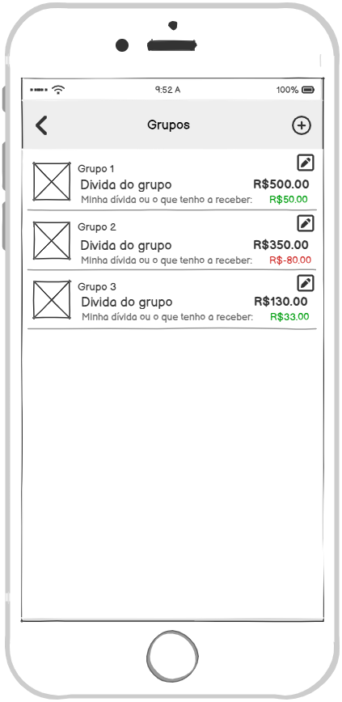

### 3.3.1 Processo 1 – Cadastro e Login

O processo de **Entrada no Sistema** começa quando o usuário vai até o browser de sua preferência e insere a url da aplicação. O browser então exibe a tela onde é possível inserir e-mail e senha;  Já para **Preencher formulário de cadastrar** a tela de preenchimento de um formulário é apresentada onde o usuário adiciona seus dados como login, senha, nome, idade e genero; o sistema, então, envia um link de verificação para o e-mail ou sms, e, após a sua confirmação,  finaliza o registro ao ter o código validado.

# Mapeamento dos Wireframes com os Requisitos

A seguir, apresentamos a descrição de como os wireframes apresentados atendem aos requisitos funcionais e não funcionais do sistema.

---

## 1. Autenticação e Cadastro

  
  

### Requisitos Atendidos:
- **RF-001**: As telas de login e cadastro, junto à tela de validação, demonstram o fluxo completo de autenticação, incluindo validação por e-mail ou celular.
- **RNF-005**: O fluxo de validação confirma que o sistema está preparado para autenticação via e-mail ou celular, atendendo à segurança esperada.
- **RNF-004**: O processo de login e validação presume boas práticas de segurança, como criptografia e controle de acesso.
- **RNF-008**: A interface é simples e direta, voltada a usuários não técnicos.

---

## 2. Validação de Conta

  
  
  

### Requisitos Atendidos:
- **RF-001**: Confirma a existência de um processo seguro de validação de conta após o cadastro.
- **RNF-005**: Reforça o suporte à autenticação com validação por e-mail ou celular.
- **RNF-006**: O design dessas telas favorece uma comunicação clara de mensagens de erro em caso de código inválido.

---

## 3. Visualização e Gerenciamento de Grupos

### Requisitos Atendidos:
- **RF-002**: A tela mostra os grupos existentes e oferece opção de criar novos, sugerindo suporte a múltiplos grupos e ao gerenciamento por administradores.
- **RF-010**: Exibe claramente os saldos de grupos, atendendo ao requisito de visualização da carteira coletiva e individual.
- **RNF-001** e **RNF-002**: A interface foi projetada para responsividade e multiplataforma, conforme requisitos de usabilidade e compatibilidade.
- **RNF-008**: A navegação clara e simples garante usabilidade mesmo para usuários leigos.

---

#### Detalhamento das atividades

**Fazer Login** 

| **Campo**       | **Tipo**         | **Restrições**         | **Valor default** |
| ---             | ---              | ---                    | ---               |
| [Nome do campo] | [tipo de dados]  |                        |                   |
| login           | Caixa de Texto   | formato de e-mail      |                   |
| senha           | Caixa de Texto   | mínimo de 8 caracteres |                   |

| **Comandos**         |  **Destino**                   | **Tipo**          |
| ---                  | ---                            | ---               |
| Entrar               | Fim do Processo 1              | default           |

**Preencher formulário de cadastro** 

| **Campo**       | **Tipo**         | **Restrições**         | **Valor default** |
| ---             | ---              | ---                    | ---               |
| login           | Caixa de Texto   | formato de e-mail      |                   |
| senha           | Caixa de Texto   | mínimo de 8 caracteres |                   |
| Nome            | Caixa de Texto   | mínimo de 5 caracteres |                   |
| Idade           | Número           |                        |                   |
| Genero          | Seleção múltipla |                        |                   |

| **Comandos**         |  **Destino**                   | **Tipo**          |
| ---                  | ---                            | ---               |
| Cadastrar            | Enviar código de validação     |                   |

**Enviar código de validação** 
 
| **Campo**       | **Tipo**           | **Restrições** | **Valor default** |
| ---             | ---                | ---            | ---               |
| Método          | Seleção múltipla   |                | Email             |

| **Comandos**      |  **Destino**                   | **Tipo**          |
| ---               | ---                            | ---               |
| Enviar            | Inserir código de validação    |                   |

**Inserir código de validação** 

| **Campo**       | **Tipo**         | **Restrições**         | **Valor default** |
| ---             | ---              | ---                    | ---               |
| codigo          | Caixa de Texto   | mínimo de 8 caracteres |                |

| **Comandos**         |  **Destino**                   | **Tipo**          |
| ---                  | ---                            | ---               |
| Validar código       | Fazer Login                    |                   |
