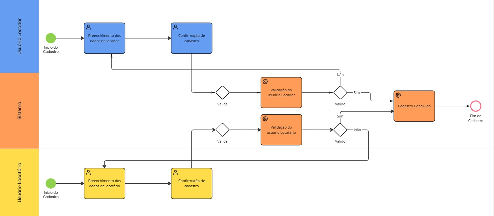
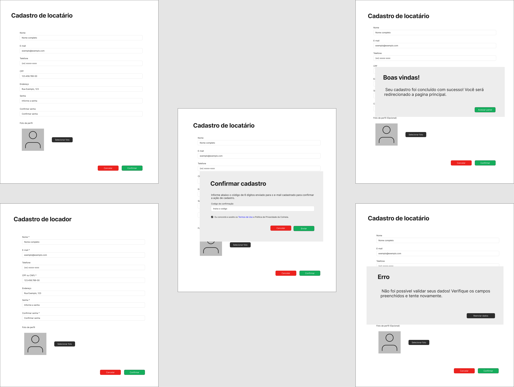

### 3.3.1 Processo 1 – Cadastro de Usuário

#### Detalhamento das atividades

1. [Preenchimento dos dados do Locador](#atividade-1---preenchimento-dos-dados-do-locador)
   - Captura informações do cadastro do proprietário do espaço. (nome, e-mail, CPF/CNPJ, endereço, etc.)  
   - Inclui criação e confirmação de senha e opção de foto de perfil.
     
3. [Preenchimento dos dados do Locatário](#atividade-2---preenchimento-dos-dados-do-locatário)
   - Coleta dados pessoais do cliente interessado em alugar um espaço. (nome, e-mail, CPF/CNPJ, endereço, etc.)   
   - Estrutura semelhante à do locador, mas focada em pessoa física.
     
4. [Confirmação de Cadastro](#atividade-3---confirmação-de-cadastro)
   - Envio de código de verificação por e-mail.  
   - Exige aceite dos termos de uso antes da validação.
     
6. [Validação do Usuário (Locador / Locatário)](#atividade-4---validação-do-usuário-locador--locatário)
   - Verificação das informações preenchidas.  
     
8. [Cadastro Concluído](#atividade-5---cadastro-concluído)   
   - Exibe mensagem de boas-vindas ao usuário.  
   - Encaminha o usuário ao painel principal do sistema.

  
### Atividade 1 - Preenchimento dos dados do Locador

| Campo            | Tipo           | Restrições                                                     | Valor default   |
|------------------|----------------|----------------------------------------------------------------|-----------------|
| Nome completo    | Caixa de texto | obrigatório, mínimo 3 caracteres                               | -               |
| E-mail           | Caixa de texto | formato de e-mail válido, obrigatório                          | -               |
| Telefone         | Caixa de texto | formato (xx) xxxxx-xxxx, obrigatório                           | -               |
| CPF/CNPJ         | Caixa de texto | obrigatório, verificação de duplicidade                        | -               |
| Endereço         | Área de texto  | obrigatório                                                    | -               |
| Senha            | Caixa de texto | mínimo 8 caracteres, incluir letra maiúscula, número e símbolo | -               |
| Confirmar senha  | Caixa de texto | deve coincidir com senha                                       | -               |
| Foto de perfil   | Imagem         | opcional, até 2MB                                              | imagem padrão   |

**Comandos**  
| Nome do botão/link | Destino                    | Tipo    |
|--------------------|----------------------------|---------|
| Cancelar           | Fim do processo            | cancel  |
| Confirmar cadastro | Confirmação de cadastro    | default |

### Atividade 2 - Preenchimento dos dados do Locatário

| Campo            | Tipo           | Restrições                                                     | Valor default   |
|------------------|----------------|----------------------------------------------------------------|-----------------|
| Nome completo    | Caixa de texto | obrigatório, mínimo 3 caracteres                               | -               |
| E-mail           | Caixa de texto | formato de e-mail válido, obrigatório                          | -               |
| Telefone         | Caixa de texto | formato (xx) xxxxx-xxxx, obrigatório                           | -               |
| CPF              | Caixa de texto | obrigatório, verificação de duplicidade                        | -               |
| Endereço         | Área de texto  | obrigatório                                                    | -               |
| Senha            | Caixa de texto | mínimo 8 caracteres, incluir letra maiúscula, número e símbolo | -               |
| Confirmar senha  | Caixa de texto | deve coincidir com senha                                       | -               |
| Foto de perfil   | Imagem         | opcional, até 2MB                                              | imagem padrão   |

**Comandos**  
| Nome do botão/link | Destino                    | Tipo    |
|--------------------|----------------------------|---------|
| Cancelar           | Fim do processo            | cancel  |
| Confirmar cadastro | Confirmação de cadastro    | default |

### Atividade 3 - Confirmação de Cadastro
| Campo                    | Tipo                     | Restrições                                      | Valor default |
|--------------------------|--------------------------|-------------------------------------------------|---------------|
| Código de verificação    | Número                   | enviado por e-mail ou SMS, obrigatório          | -             |
| Aceite dos termos de uso | Seleção única (checkbox) | obrigatório                                     | desmarcado    |

**Comandos**  
| Nome do botão/link | Destino                                | Tipo    |
|--------------------|----------------------------------------|---------|
| Voltar             | Preenchimento dos dados                | cancel  |
| Confirmar          | Validação do usuário Locador/Locatário | default |

### Atividade 4 - Validação do Usuário (Locador / Locatário)
| Campo              | Tipo             | Restrições                                         | Valor default |
|--------------------|------------------|----------------------------------------------------|---------------|
| Status da validação | Seleção única   | valores possíveis: aprovado / pendente / rejeitado | pendente      |
| Documentos enviados | Arquivo         | formatos aceitos: PDF, JPG, PNG                    | -             |

**Comandos**  
| Nome do botão/link  | Destino                   | Tipo    |
|---------------------|---------------------------|---------|
| Reenviar dados      | Preenchimento dos dados   | cancel  |
| Aprovar cadastro    | Cadastro concluído        | default |

### Atividade 5 - Cadastro Concluído
| Campo                   | Tipo          | Restrições            | Valor default       |
|-------------------------|---------------|-----------------------|---------------------|
| Mensagem de boas-vindas | Área de texto | apenas leitura        | -                   |

**Comandos**  
| Nome do botão/link  | Destino              | Tipo    |
|---------------------|----------------------|---------|
| Acessar painel      | Início do sistema    | default |

## Wireframe

