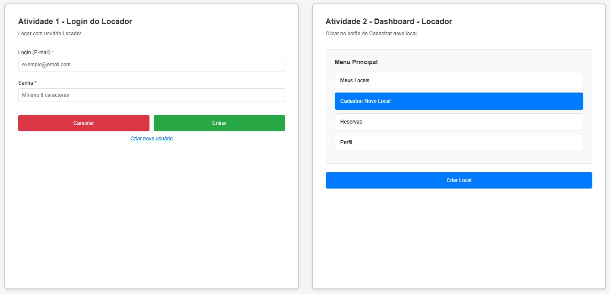
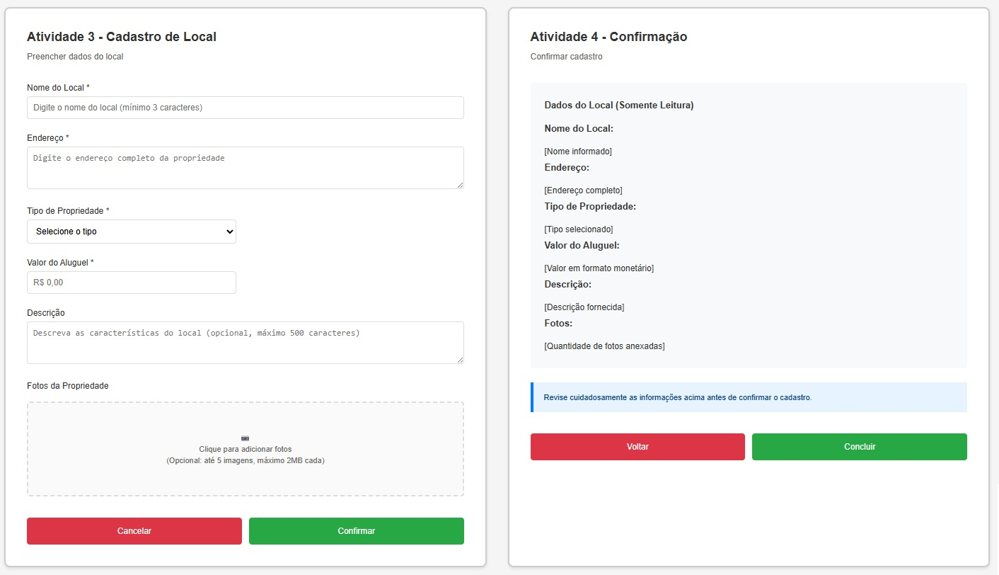
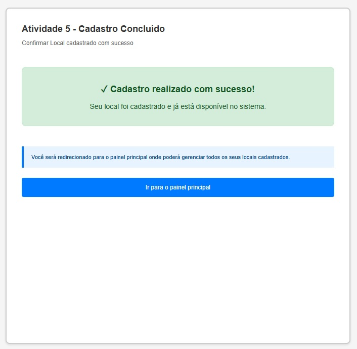

### 3.3.2 Processo 2 – Cadastro do Local

O processo de cadastro do local se inicia com a autenticação do usuário locador, onde esse irá acessar a área de dashboard do locador. Em seguida, o usuário irá clicar em criar um novo local, o que o levará a tela de cadastro de local onde irá preencher o formulario correspondente ao cadastro do local com as informações solicitadas referente ao imovel, tais como nome do local, endereço, tipo de propiedade, valor do aluguel, descrição e fotos da propriedade. Após preencher as informações, o usuário irá confirmar a ação e se todos os dados estiverem válidos, o processo será encerrado com o cadastro sendo bem sucedido no sistema. 

.png "Cadastro de Local")

#### Detalhamento das atividades

1. [Logar com usuário Locador](#atividade-1---logar-com-usuário-locador)

   - O usuário deve logar com um usuario e senha de uma conta tipo locador.

2. [Clicar no botão de Cadastrar novo local](#atividade-2---clicar-no-botão-de-cadastrar-novo-local)

   - O usuário irá preencher informações detalhadas da propriedade a ser alugada (endereço, características, valor, fotos da propriedade e etc.).

3. [Preencher dados do local](#atividade-3---preencher-dados-do-local)
   - O usuário irá preencher informações detalhadas da propriedade a ser alugada (endereço, características, valor, fotos da propriedade e etc.).
    
4. [Confirmar cadastro](#atividade-4---confirmar-cadastro)
   - O usuário deverá clicar em confirmar cadastro.

5. [Confirmar Local cadastrado com sucesso](#atividade-5---confirmar-local-cadastrado-com-sucesso)
   - Exibe uma mensagem de sucesso, confirmando que o local foi cadastrado com êxito.
   - O usuário deverá clicar em Ir para o painel
### Atividade 1 - Logar com usuário Locador

| **Campo** | **Tipo** | **Restrições** | **Valor default** |
| :--- | :--- | :--- | :--- |
| login | Caixa de texto | obrigatório, formato de e-mail | - |
| senha | Caixa de texto | obrigatório, mínimo 8 caracteres | - |

| **Comandos** | **Destino** | **Tipo** |
| :--- | :--- | :--- |
| Cancelar | Fim do processo | cancel |
| Entrar | Tela inicial | default |
| Criar novo usuário | Tela de cadastro de usuário | default |

### Atividade 2 - Clicar no botão de Cadastrar novo local

| **Comandos** | **Destino** | **Tipo** |
| :--- | :--- | :--- |
| Dashboard |  Listagem de locais | default |
| Criar novo local | Tela de cadastro de local | default |

### Atividade 3 - Preencher dados do local

| **Campo** | **Tipo** | **Restrições** | **Valor default** |
| :--- | :--- | :--- | :--- |
| Nome do Local | Caixa de texto | obrigatório, mínimo 3 caracteres | - |
| Endereço | Área de texto | obrigatório | - |
| Tipo de propriedade | Seleção única | obrigatório | - |
| Valor do Aluguel | Número | obrigatório, formato monetário | - |
| Descrição | Área de texto | opcional, máximo de 500 caracteres | - |
| Fotos da propriedade | Imagem | opcional, até 5 imagens, máx. 2MB cada | - |

| **Comandos** | **Destino** | **Tipo** |
| :--- | :--- | :--- |
| Cancelar | Fim do processo | cancel |
| Confirmar | Confirmação dos dados | default |

### Atividade 4 - Confirmar cadastro

| **Campo** | **Tipo** | **Restrições** | **Valor default** |
| :--- | :--- | :--- | :--- |
| Dados do local | Varia de acordo | Somente leitura | - |

| **Comandos** | **Destino** | **Tipo** |
| :--- | :--- | :--- |
| Voltar | Preenchimento dos dados do Local | cancel |
| Concluir | Cadastro Concluído | default |

### Atividade 5 - Confirmar Local cadastrado com sucesso

| **Campo** | **Tipo** | **Restrições** | **Valor default** |
| :--- | :--- | :--- | :--- |
| Mensagem de sucesso | Caixa de texto | Somente leitura | "Cadastro realizado com sucesso!" |

| **Comandos** | **Destino** | **Tipo** |
| :--- | :--- | :--- |
| Ir para o painel principal | Fim do Cadastro | default |

## Wireframe

