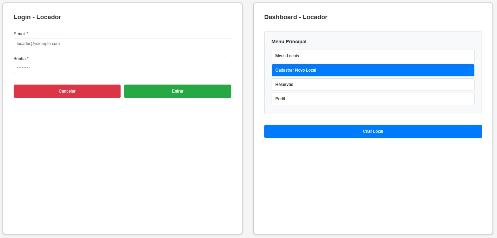
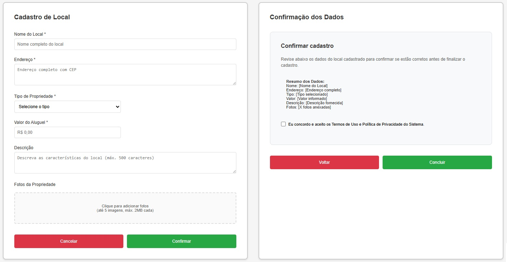
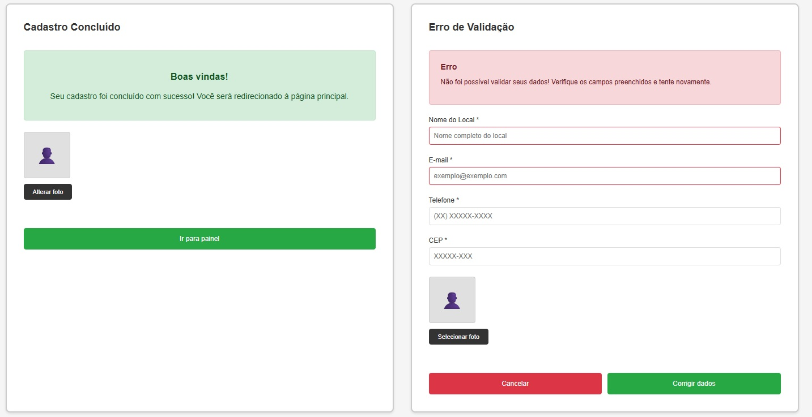

### 3.3.2 Processo 2 – Cadastro do Local

#### Detalhamento das atividades

1. [Logar com usuário Locador](#atividade-1---logar-com-usuário-locador)

   - Permite que o usuário insira suas credenciais (login e senha) para acessar a área de cadastro de local.
   - Verifica a validade das credenciais no sistema.

2. [Preenchimento dos dados do Local](#atividade-2---preenchimento-dos-dados-do-local)

   - Captura informações detalhadas da propriedade a ser alugada (endereço, características, valor, etc.).
   - Inclui a opção de fazer upload de fotos da propriedade para visualização.

3. [Confirmação dos dados](#atividade-3---confirmação-dos-dados)

   - Exibe um resumo de todas as informações da propriedade preenchidas.
   - Permite ao usuário revisar e validar os dados antes de prosseguir.
    
4. [Cadastro Concluído](#atividade-4---cadastro-concluído)

   - Exibe uma mensagem de sucesso, confirmando que o local foi cadastrado com êxito.
   - Redireciona o usuário para a página de gerenciamento de propriedades, onde o novo local estará listado.

   

### Atividade 1 - Logar com usuário Locador

| **Campo** | **Tipo** | **Restrições** | **Valor default** |
| :--- | :--- | :--- | :--- |
| login | Caixa de texto | obrigatório, formato de e-mail | - |
| senha | Caixa de texto | obrigatório, mínimo 8 caracteres | - |

| **Comandos** | **Destino** | **Tipo** |
| :--- | :--- | :--- |
| Cancelar | Fim do processo | cancel |
| Entrar | Tela inicial | default |

### Atividade 2 - Dashboard 

| **Comandos** | **Destino** | **Tipo** |
| :--- | :--- | :--- |
|  Dashboard |  Listagem de locais | default |
| Criar local | Preenchimento do dados do local |

### Atividade 3 - Preenchimento dos dados do Local

| **Campo** | **Tipo** | **Restrições** | **Valor default** |
| :--- | :--- | :--- | :--- |
| Nome do Local | Caixa de texto | obrigatório, mínimo 3 caracteres | - |
| Endereço | Área de texto | obrigatório | - |
| Tipo de propriedade | Seleção única | obrigatório | - |
| Valor do Aluguel | Número | obrigatório, formato monetário | - |
| Descrição | Área de texto | opcional, máximo de 500 caracteres | - |
| Fotos da propriedade | Imagem | opcional, até 5 imagens, máx. 2MB cada | - |

| **Comandos** | **Destino** | **Tipo** |
| :--- | :--- | :--- |
| Cancelar | Fim do processo | cancel |
| Confirmar | Confirmação dos dados | default |

### Atividade 4 - Confirmação dos dados

| **Campo** | **Tipo** | **Restrições** | **Valor default** |
| :--- | :--- | :--- | :--- |
| **Dados do local** | **Varia de acordo** | **Somente leitura** | **Valores preenchidos na atividade anterior** |

| **Comandos** | **Destino** | **Tipo** |
| :--- | :--- | :--- |
| Voltar | Preenchimento dos dados do Local | cancel |
| Concluir | Cadastro Concluído | default |

### Atividade 5 - Cadastro Concluído

| **Campo** | **Tipo** | **Restrições** | **Valor default** |
| :--- | :--- | :--- | :--- |
| Mensagem de sucesso | Caixa de texto | Somente leitura | "Cadastro realizado com sucesso!" |

| **Comandos** | **Destino** | **Tipo** |
| :--- | :--- | :--- |
| Ir para o painel principal | Fim do Cadastro | default |

## Wireframe

