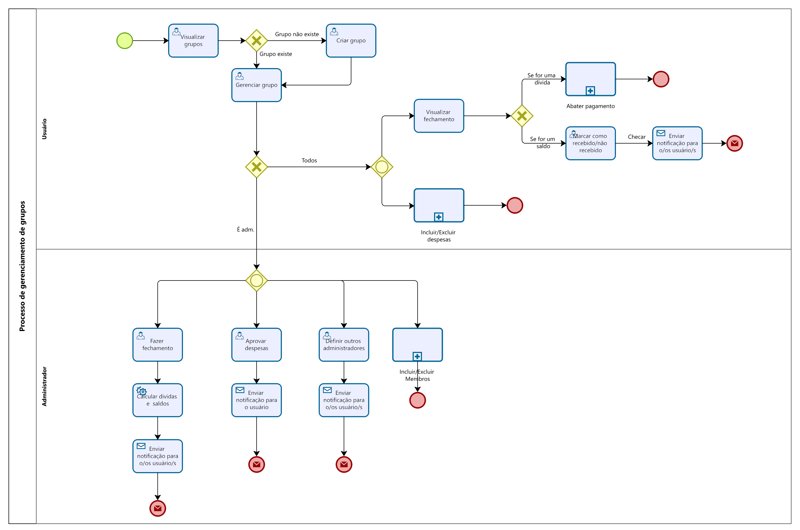

### 3.3.2 Processo 2 – Gerênciamento de grupos

_Apresente aqui o nome e as oportunidades de melhoria para o processo 2. 
Em seguida, apresente o modelo do processo 2, descrito no padrão BPMN._

#### Detalhamento das atividades

**Visualizar grupos**

| **Campo**       | **Tipo**        | **Restrições**                                 | **Valor default** |
| ---             | ---             | ---                                            | ---               |
| termo_pesquisa  | Caixa de texto  | até 100 caracteres                              |                   |
| ordenar_por     | Seleção única   | {“nome”, “criado_em”, “atualizado_em”}         | “atualizado_em”   |
| grupos  | Tabela  |                          |  grupos do usuário                 |

| **Comandos**  | **Destino**        | **Tipo**   |
| ---           | ---                | ---        |
| pesquisar     | Visualizar grupos   | default    |
| abrir_grupo   | Gerenciar grupo    |            |
| criar_grupo   | Criar grupo        |            |
| cancelar      | Fim do processo    | cancel     |

---

**Criar grupo**

| **Campo**       | **Tipo**        | **Restrições**                                  | **Valor default** |
| ---             | ---             | ---                                             | ---               |
| nome_grupo      | Caixa de texto  | obrigatório; 3–60 caracteres                    |                   |
| descricao       | Área de texto   | até 500 caracteres                              |                   |
| imagem_capa     | Imagem          | opcional; até 5 MB                              |                   |

| **Comandos**  | **Destino**     | **Tipo** |
| ---           | ---             | ---      |
| salvar        | Gerenciar grupo | default  |
| cancelar      | Visualizar grupos| cancel   |

---

**Gerenciar grupo**

| **Campo**       | **Tipo**        | **Restrições**                            | **Valor default** |
| ---             | ---             | ---                                       | ---               |
| nome_grupo      | Caixa de texto  | obrigatório                               |                   |
| descricao       | Área de texto   | até 500 caracteres                        |                   |
| admins          | Tabela          | id, nome, e-mail                          |                   |

| **Comandos**       | **Destino**                   | **Tipo** |
| ---                | ---                           | ---      |
| incluir_despesa    | Incluir despesas (processo 4)             |          |
| gerenciar_pessoas  | Gerenciar pessoas             |          |
| gerenciar_despesas | Gerenciar despesas/fechamentos|          |
| visualizar_fechamento     | Ver Fechamento               |          |
| salvar             | Gerenciar grupo               | default  |
| voltar             | Visualizar grupos              | cancel   |

---

**Visualizar fechamento**

| **Campo**       | **Tipo**        | **Restrições**                                 | **Valor default** |
| ---             | ---             | ---                                            | ---               |
| fechamento  | Tabela  |                          |  despesas que o usuário tem a receber ou pagar                |

| **Comandos**             | **Destino**        | **Tipo**   |
| ---                     | ---                | ---        |
| marcar_como_pago        | Marcar como pago    |            |
| marcar_como_recebido   | Nenhum        |            |
| cancelar               | Visualizar grupos  | cancel     |

---

**Marcar como pago**

| **Campo**       | **Tipo**       | **Restrições**                  | **Valor default** |
| ---             | ---            | ---                             | ---               |
| pagamento_id    | Número         | somente leitura                 |                   |
| confirmar_valor | Seleção única  | {“conferido”, “divergente”}     | “conferido”       |
| observacao      | Área de texto  | até 300 caracteres              |                   |
| anexo     | Imagem          | opcional; até 10 MB                              |                   |

| **Comandos**   | **Destino**                | **Tipo** |
| ---            | ---                        | ---      |
| Enviar        | Enviar notificação         | default  |    |
| voltar         | Visualizar fechamento | cancel |

---

**Aprovar despesas**

| **Campo**     | **Tipo**        | **Restrições**                        | **Valor default** |
| ---           | ---             | ---                                   | ---               |
| despesa_id    | Número          | somente leitura                       |                   |
| parecer       | Área de texto   | até 300 caracteres                    |                   |

| **Comandos** | **Destino**                | **Tipo** |
| ---          | ---                        | ---      |
| aprovar      | Gerenciar despesas/fechamentos | default |
| reprovar     | Enviar notificação         |          |
| voltar       | Gerenciar despesas/fechamentos | cancel |

---

**Gerenciar pessoas**

| **Comandos**       | **Destino**                   | **Tipo** |
| ---                | ---                           | ---      |
| incluir_membros    | Incluir membros               |          |
| definir_admins     | Definir outros administradores|          |
| tentar_excluir     | Excluir membro         |          |
| voltar             | Gerenciar grupo               | cancel   |

---

**Definir outros administradores**

| **Campo**        | **Tipo**        | **Restrições**              | **Valor default** |
| ---              | ---             | ---                         | ---               |
| selecionar_membros | Seleção múltipla | somente membros ativos     |                   |

| **Comandos** | **Destino**       | **Tipo** |
| ---          | ---               | ---      |
| confirmar    | Enviar notificação| default  |
| cancelar     | Gerenciar pessoas | cancel   |

---

**Excluir membro**

| **Comandos** | **Destino**             | **Tipo** |
| ---          | ---                     | ---      |
| validar      | Gateway de verificação  | default  |
| cancelar     | Gerenciar pessoas       | cancel   |

---

**Gerenciar despesas/fechamentos**

| **Campo**      | **Tipo**        | **Restrições**                  | **Valor default** |
| ---            | ---             | ---                             | ---               |
| filtro_status  | Seleção única   | {“pendente”, “aprovada”, “paga”}| “pendente”        |
| periodo        | Data e Hora     | intervalo                       | mês atual         |
| lista_itens    | Tabela          | despesas e pagamentos           |                   |

| **Comandos**      | **Destino**             | **Tipo** |
| ---               | ---                     | ---      |
| aprovar_despesa   | Aprovar despesas        |          |
| aprovar_pagamento | Aprovar pagamento       |          |
| fazer_fechamento  | Fazer fechamento        |          |
| voltar            | Gerenciar grupo         | cancel   |

---

**Fazer fechamento**

| **Comandos**     | **Destino**       | **Tipo** |
| ---              | ---               | ---      |
| calcular_fechamentos   | Enviar notificação| default  |
| cancelar         | Gerenciar despesas/fechamentos | cancel |