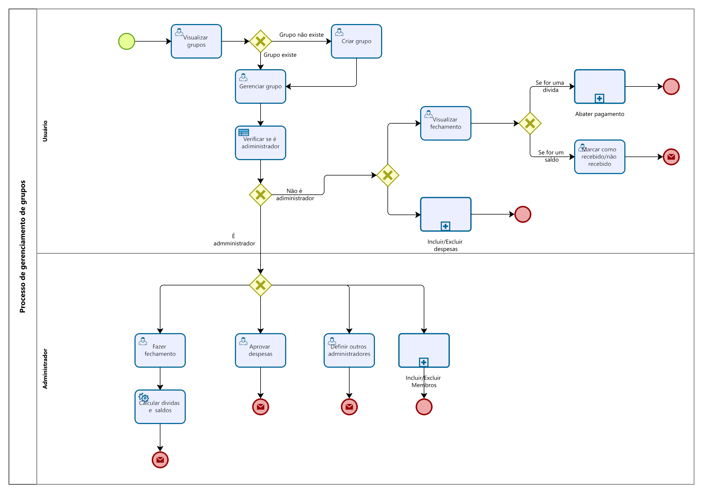
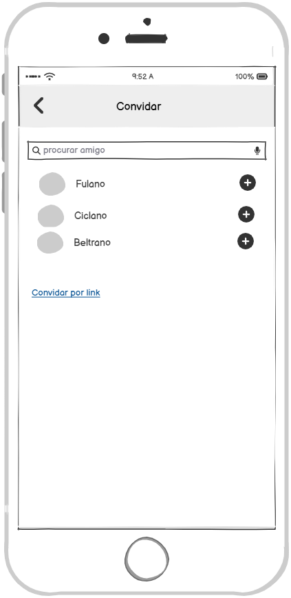

### 3.3.2 Processo 2 – Gerênciamento de grupos
O processo de gerenciamento de grupos tem início assim que o usuário faz login ou acessa diretamente a URL no navegador. Em seguida, o sistema exibe a tela de gerenciamento de grupos, onde é possível visualizar todos os grupos associados ao usuário logado. Caso não haja nenhum grupo ou o usuário deseje criar um novo, essa opção também estará disponível.

Após visualizar os grupos, o usuário pode abrir um deles para acessar informações detalhadas. Dentro do grupo, é possível consultar o fechamento das contas — que representa o saldo resultante da diferença entre o valor pago pelo usuário e o valor pago pelos demais membros do grupo. O usuário pode realizar abatimentos em pagamentos e marcar saldos positivos como quitados, ação que gera o envio automático de um e-mail ao recebedor, informando sobre o abatimento.

Além disso, o usuário pode visualizar todas as despesas do grupo e registrar novas despesas, se desejar.

Caso o usuário seja administrador do grupo, ele terá acesso a funcionalidades adicionais, como: aprovar despesas, realizar o fechamento de contas, adicionar ou remover integrantes, e atribuir permissões de administrador a outros membros. Todas essas ações também geram notificações por e-mail para os demais participantes do grupo.

# Mapeamento dos Wireframes com os Requisitos

# Descrição dos Wireframes vs Requisitos Funcionais e Não Funcionais

A seguir, apresentamos a descrição de como os wireframes apresentados atendem aos requisitos funcionais e não funcionais do sistema.

---
## 2. Criação de um novo grupo

A tela de criação de um novo grupo possibilita que o administrador do grupo insira os dados de identificação do grupo, como:
- Nome
- Descrição
- Imagem de capa
- Convidar Participantes
  

### Requisitos Funcionais Atendidos

| Requisito | Descrição                                                                                         | Prioridade |
|-----------|---------------------------------------------------------------------------------------------------|------------|
| RF-002    | O sistema deve permitir a criação de grupos de despesas e o gerenciamento por administradores.    | ALTA       |
| RF-003    | O sistema deve permitir enviar convites para inclusão de membros no grupo, com aceite ou recusa.  | MÉDIA      |
| RF-004    | O sistema deve permitir a inclusão de participantes não cadastrados, com opção de substituição futura. | MÉDIA      |

### Requisitos Não Funcionais Atendidos

| Requisito | Descrição                                                                                               | Prioridade |
|-----------|---------------------------------------------------------------------------------------------------------|------------|
| RNF-001   | Sistema responsivo, adaptado para diferentes tamanhos de tela (incluindo dispositivos móveis).          | ALTA       |
| RNF-002   | Suporte multiplataforma (navegadores modernos como Chrome, Firefox, Edge, Safari).                      | ALTA       |
| RNF-003   | As requisições do usuário devem ser processadas em no máximo 3 segundos, em condições normais de uso.   | ALTA       |
| RNF-006   | Interface clara, com mensagens e fluxos que evitam perda de dados em caso de erro.                      | MÉDIA      |
| RNF-008   | Interface intuitiva, de fácil navegação, adequada a usuários não técnicos.                              | ALTA       |

## 3. Envio de Convites para Participantes

A tela Convidar permite ao usuário adicionar participantes a um grupo por meio de duas opções principais:

- Busca por amigos já cadastrados: utilizando o campo de pesquisa, com suporte à digitação e entrada por voz.
- Convite por link: opção apresentada como link no final da tela, permitindo convidar usuários ainda não cadastrados.

Cada amigo listado possui um botão com o ícone **"+"**, representando a ação de convidar ou adicionar ao grupo.

### Requisitos Funcionais Atendidos

| Requisito | Descrição                                                                                         | Prioridade |
|-----------|---------------------------------------------------------------------------------------------------|------------|
| RF-003    | Permitir envio de convites para inclusão de membros no grupo, com aceite ou recusa.              | ALTA       |
| RF-004    | Permitir inclusão de participantes não cadastrados, com opção de substituição futura.            | MÉDIA      |

---

### Requisitos Não Funcionais Atendidos

| Requisito | Descrição                                                                                               | Prioridade |
|-----------|---------------------------------------------------------------------------------------------------------|------------|
| RNF-001   | Sistema responsivo, adaptado para diferentes tamanhos de tela (incluindo dispositivos móveis).          | ALTA       |
| RNF-002   | Suporte multiplataforma (navegadores modernos como Chrome, Firefox, Edge, Safari).                      | ALTA       |
| RNF-006   | Interface clara, com mensagens e fluxos que evitam perda de dados em caso de erro.                      | MÉDIA      |
| RNF-008   | Interface intuitiva, de fácil navegação, adequada a usuários não técnicos.                              | ALTA       |

---

## 3. Gerenciamento e Visualização do Grupo

A interface principal do grupo atende a múltiplos requisitos. A tela mostra claramente a lista de membros e seus respectivos saldos devedores ou credores, resolvendo a necessidade de cálculo automático (RF-007) e visualização da carteira (RF-010).

A imagem também exemplifica como o gerenciamento de grupo (RF-002) pode ser feito. O menu que aparece ao lado de cada membro, oferece opções como "Excluir (adm)" e "Definir como adm. (adm)", indicando que essas ações são restritas aos administradores do grupo.

A adição de novas despesas é facilitada pelo botão "+" ao lado do título "Despesas", atendendo ao requisito de registro de despesas (RF-005). Além disso, a visualização das despesas já registradas, como "Desp 1" e "Desp 2", junto com os valores e a interação de "like", demonstra como o sistema exibe e gerencia os itens de forma clara.

A responsividade (RNF-001) e a multiplataforma (RNF-002) são implícitas no design, que é visualmente otimizado para uma tela de celular, com botões de fácil acesso e uma disposição vertical que se adaptaria bem a outros formatos de tela, como tablets ou desktops.

#### Detalhamento das atividades

**Visualizar grupos**

| **Campo**         | **Tipo**        | **Restrições**     | **Valor default**  |
| ---               | ---             | ---                | ---                |
| grupos            | Tabela          |                    |  grupos do usuário | 

| **Comandos**  | **Destino**        | **Tipo**   |
| ---           | ---                | ---        |
| abrir_grupo   | Gerenciar grupo    |            |
| criar_grupo   | Criar grupo        |            |

---

**Criar grupo**

| **Campo**       | **Tipo**        | **Restrições**                                  | **Valor default** |
| ---             | ---             | ---                                             | ---               |
| nome_grupo      | Caixa de texto  | obrigatório; 3–60 caracteres                    |                   |
| descricao       | Área de texto   | até 500 caracteres                              |                   |
| imagem_capa     | Imagem          | opcional; até 5 MB                              |                   |

| **Comandos**  | **Destino**     | **Tipo** |
| ---           | ---             | ---      |
| salvar        | Gerenciar grupo | default  |
| cancelar      | Visualizar grupos| cancel   |

---

**Gerenciar grupo**

| **Campo**       | **Tipo**        | **Restrições**                            | **Valor default** |
| ---             | ---             | ---                                       | ---               |
| nome_grupo      | Caixa de texto  | obrigatório                               |                   |
| descricao       | Área de texto   | até 500 caracteres                        |                   |                  
| imagem_capa     | Imagem          | opcional; até 5 MB                        |                   | 

| **Comandos**          | **Destino**                   | **Tipo** |
| ---                   | ---                           | ---      |
| incluir_despesa       | Incluir despesas (processo 4) |          |
| excluir_despesa       | Excluir despesas (processo 4) |          |
| aprovar_despesas      | Aprovar despesas              |          |
| incluir_membro (adm)  | Incluir membros (processo 3)  |          |
| excluir_membro (adm)  | Excluir membro (processo 3)   |          |
| definir_adm (adm)     | Nenhum                        |          |
| visualizar_fechamento | Visualizar fechamento         |          |
| fazer_fechamento (adm)| Visualizar fechamento         |          |
| salvar                | Gerenciar grupo               | default  |
| voltar                | Visualizar grupos             | cancel   |

---

**Visualizar fechamento**

| **Campo**       | **Tipo**        | **Restrições**       | **Valor default**                             |
| ---             | ---             | ---                  | ---                                           |
| fechamento      | Tabela          |                      |  despesas que o usuário tem a receber ou pagar|

| **Comandos**             | **Destino**                   | **Tipo**   |
| ---                      | ---                           | ---        |
| abater_pagamento         | Abater pagamento (processo 5) |            |
| marcar_como_recebido     | Nenhum                        |            |
| cancelar                 | Visualizar grupos             | cancel     |

---

**Aprovar despesas**

| **Campo**           | **Tipo**        | **Restrições**      | **Valor default** |
| ---                 | ---             | ---                 | ---               |
| selecionar_despesas | Seleção múltipla|                     |                   |

| **Comandos** | **Destino**                | **Tipo** |
| ---          | ---                        | ---      |
| aprovar      | Gerenciar despesas/fechamentos | default |
| reprovar     | Enviar notificação         |          |
| voltar       | Gerenciar despesas/fechamentos | cancel |

---

**Definir outros administradores**

| **Campo**          | **Tipo**         | **Restrições**          | **Valor default** |
| ---                | ---              | ---                     | ---               |
| selecionar_membros | Seleção múltipla | somente membros ativos  |                   |

| **Comandos** | **Destino**       | **Tipo** |
| ---          | ---               | ---      |
| confirmar    | Enviar notificação| default  |
| cancelar     | Gerenciar pessoas | cancel   |

---

**Fazer fechamento**

| **Campo**          | **Tipo**         | **Restrições**    | **Valor default** |
| ---                | ---              | ---               | ---               |
|                    |                  |                   |                   |

| **Comandos**           | **Destino**                    | **Tipo** |
| ---                    | ---                            | ---      |
| calcular_fechamentos   | Enviar notificação             | default  |

---

**Marcar como recebido ou não recebido**

| **Campo**          | **Tipo**         | **Restrições**    | **Valor default** |
| ---                | ---              | ---               | ---               |
|                    |                  |                   |                   |

| **Comandos**               | **Destino**                    | **Tipo** |
| ---                        | ---                            | ---      |
| marcar_como_recebido_ou_nao| nenhum                         |          |

---

## 3.3.2 Wireframe da Inclusão de Despesas

A seguir é apresentado o wireframe da funcionalidade **Incluir Despesa**, que faz parte do processo de Gerenciamento de Despesas.  
Esse wireframe ilustra a interface que o usuário utiliza para registrar uma nova despesa dentro de um grupo.

---

### Wireframe

### Descrição da Interface

- **Campo de Descrição**: Permite que o usuário informe o motivo ou detalhe da despesa (ex.: “Almoço em Itaparica”, “Passeio de Balsa”).  
- **Campo de Valor**: Entrada numérica para o valor da despesa.  
- **Botão Anexar**: Possibilita o envio de comprovantes de pagamento (ex.: nota fiscal, recibo).  
- **Botão Tirar Foto**: Permite capturar comprovante diretamente pela câmera do dispositivo.  
- **Botão Incluir**: Confirma a inserção da despesa no sistema.

### Relação com Requisitos

| Tipo de Requisito | Código | Descrição | Como o wireframe atende |
|-------------------|--------|-----------|--------------------------|
| Funcional | RF-01 | O sistema deve permitir que o usuário registre uma despesa vinculada ao grupo. | Os campos **descrição** e **valor**, junto com a ação **Incluir**, tornam o registro possível. |
| Funcional | RF-02 | O sistema deve permitir anexar comprovantes de despesas. | Os botões **Anexar** e **Tirar Foto** possibilitam a inclusão de comprovantes. |
| Não Funcional | RNF-01 | O sistema deve ser de fácil uso e intuitivo. | Layout simples, com poucos campos e botões bem identificados. |
| Não Funcional | RNF-02 | O sistema deve validar dados obrigatórios. | Os campos **descrição** e **valor** são destacados como obrigatórios no fluxo de negócio. |

---
