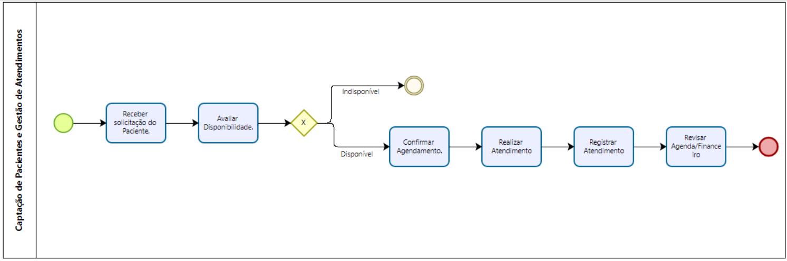

### 3.3.2 Processo 2 – Captação de Pacientes e Gestão de Atendimentos (Perspectiva do Profissional):

_Apresente aqui o nome e as oportunidades de melhoria para o processo 2. 
_Oportunidades de Melhoria

Centralização da comunicação – criação de uma plataforma digital para reunir contatos de pacientes em um único canal.

Agenda digital inteligente – automatizar agendamentos, encaixes e rotas, integrando calendário e geolocalização.

Automatização administrativa – reduzir tempo gasto com relatórios, finanças e logística através de ferramentas de gestão.

Visibilidade ampliada – usar marketing digital para atrair novos pacientes além do boca a boca.

Integração multidisciplinar – manter histórico centralizado e compartilhável entre diferentes profissionais de saúde.

Em seguida, apresente o modelo do processo 2, descrito no padrão BPMN._

#### Detalhamento das atividades

#### 1. Receber Solicitação de Paciente

Caixa de texto → Nome do paciente

Número → Telefone/contato

Área de texto → Descrição da necessidade

Data e Hora → Data/hora do contato

#### 2. Avaliar Disponibilidade

Data e Hora → Agenda disponível

Número → Distância (km ou tempo de deslocamento)

Caixa de texto → Local do atendimento

#### 3. Confirmar Agendamento

Caixa de texto → Nome do paciente

Data e Hora → Data/hora marcada

Número → Valor da consulta

#### 4. Realizar Atendimento

Área de texto → Observações sobre o paciente

Imagem → Foto ou documento do atendimento (opcional)

Data e Hora → Início e término do atendimento

#### 5. Registrar Atendimento

Caixa de texto → Código ou ID do paciente

Área de texto → Relatório clínico

Número → Valores a receber/pagos

#### 6. Revisar Agenda/Financeiro

Número → Total de consultas no período

Data → Fechamento semanal/mensal

Área de texto → Observações administrativas

**Nome da atividade 1**

| **Campo**       | **Tipo**         | **Restrições** | **Valor default** |
| ---             | ---              | ---            | ---               |
| [Nome do campo] | [tipo de dados]  |                |                   |
| ***Exemplo:***  |                  |                |                   |
| login           | Caixa de Texto   | formato de e-mail |                |
| senha           | Caixa de Texto   | mínimo de 8 caracteres |           |

| **Comandos**         |  **Destino**                   | **Tipo** |
| ---                  | ---                            | ---               |
| [Nome do botão/link] | Atividade/processo de destino  | (default/cancel/  ) |
| ***Exemplo:***       |                                |                   |
| entrar               | Fim do Processo 1              | default           |
| cadastrar            | Início do proceso de cadastro  |                   |

### Nome da atividade 2: Receber Solicitação de Paciente

| Campo         | Tipo           | Restrições               | Valor default |
|---------------|----------------|--------------------------|---------------|
| nomePaciente  | Caixa de Texto | obrigatório              |               |
| contato       | Número         | telefone (apenas dígitos)|               |
| descricao     | Área de Texto  | mínimo 10 caracteres     |               |
| dataSolicitacao | Data e Hora  | formato dd-mm-aaaa hh:mm | data/hora atual |

#### Comandos

| Nome do botão/link | Destino                  | Tipo    |
|--------------------|--------------------------|---------|
| salvar             | Avaliar Disponibilidade  | default |
| cancelar           | Fim do Processo          | cancel  |
