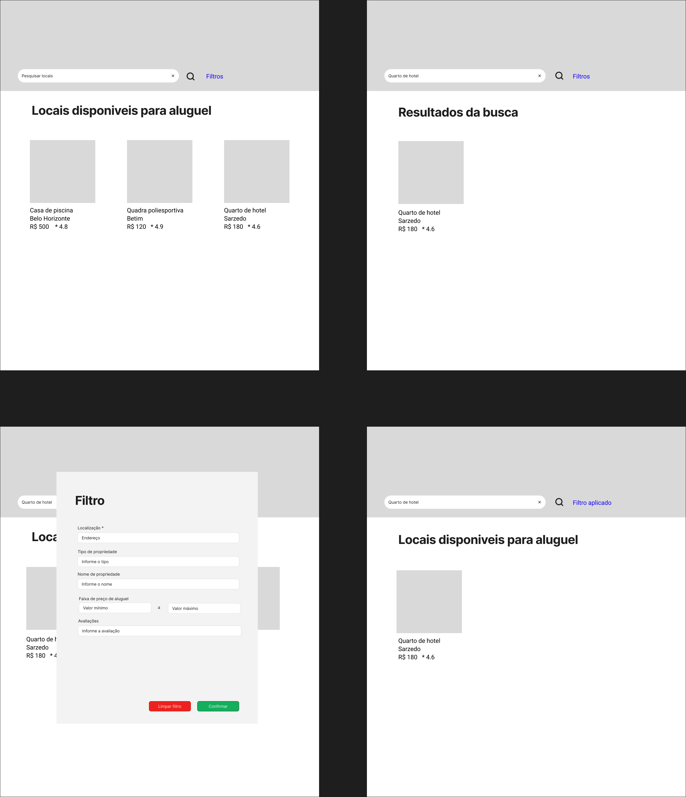

### 3.3.3 Processo 3 – Busca e filtros avançados

O processo de busca de locais se inicia com a autenticação do usuário do tipo locatário, onde esse irá acessar a área de listagem dos locais. Em seguida, o usuário irá preencher os campos do filtro para buscas, após isso irá clicar no botão de Pesquisar. O processo se encerra quando o sistema retorna os resultados da pesquisa do usuário.

.png "Busca e filtros avançados")

#### Detalhamento das atividades

1. [Logar com usuário Locatário](#atividade-1---logar-com-usuário-locatário)
   - O usuário deve logar com um usuario e senha de uma conta tipo locador.

2. [Filtrar por buscas avançadas](#atividade-2---filtrar-por-buscas-avançadas)
   - Permite que o usuário selecione e insira filtros como valor do alugel, tipo de propiedade, nome da propriedade, localização, locador e classificação por avaliações.
   - Após isso ele deve confirmar os filtros feitos.

3. [Pesquisar por locais](#atividade-1---pesquisar-por-locais)
   - Usuário clica no botão de Pesquisar.

*Exibe a lista de propriedades relacionadas com o dados inseridos nos filtros na área de propriedades.

### Atividade 1 - Logar com usuário Locatário

| **Campo** | **Tipo** | **Restrições** | **Valor default** |
| :--- | :--- | :--- | :--- |
| login | Caixa de texto | obrigatório, formato de e-mail | - |
| senha | Caixa de texto | obrigatório, mínimo 8 caracteres | - |

| **Comandos** | **Destino** | **Tipo** |
| :--- | :--- | :--- |
| Cancelar | Fim do processo | cancel |
| Entrar | Tela inicial | default |
| Criar novo usuário | Tela de cadastro de usuário | default |

### Atividade 2 - Filtrar por buscas avançadas

| **Campo** | **Tipo** | **Restrições** | **Valor default** |
| :--- | :--- | :--- | :--- |
| Valor do alugel | Número | maior ou igual a 0, formato monetário | 0 |
| Tipo de propiedade | Seleção de opções | - | - |
| Nome da propriedade | Texto | - | - |
| Endereço | Texto | - | - |
| Locador | Texto | - | - |
| Avaliação | Númerico | entre 0 e 10 | 5 |

| **Comandos** | **Destino** | **Tipo** |
| :--- | :--- | :--- |
| Exibir resultados |  Listagem de locais | default |
| Limpar filtros |  Fim do processo | cancel |

### Atividade 3 - Pesquisar por locais

| **Campo** | **Tipo** | **Restrições** | **Valor default** |
| :--- | :--- | :--- | :--- |
| Localização | Caixa de texto | obrigatório, mínimo 3 caracteres | - |

| **Comandos** | **Destino** | **Tipo** |
| :--- | :--- | :--- |
| Pesquisar | Listagem de locais | default |

## Wireframe
.

