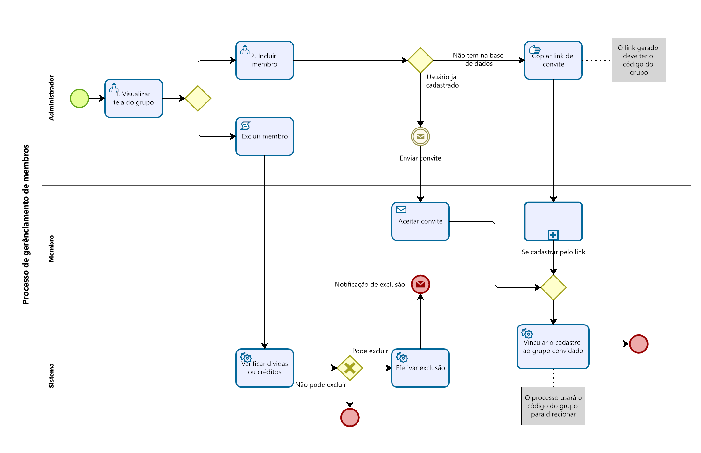
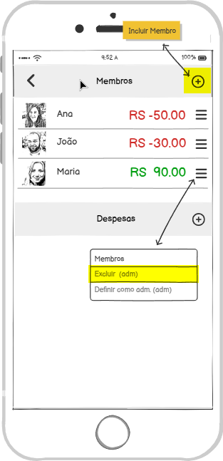
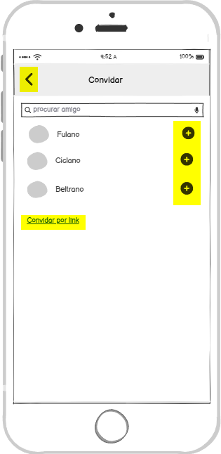

### 3.3.3 Processo 3 – Gerênciamento de membros

#### Descrição
O processo de **Gerenciamento de Membros** tem como objetivo permitir que o administrador de um grupo consiga **incluir** ou **excluir participantes** de forma prática e organizada, garantindo que apenas pessoas autorizadas permaneçam no grupo.  

- O processo possui três raias (Administrador, Membro e Sistema).

- Duas atividades principais de usuário (Incluir e Excluir) membros.

- O restantes das atividades são de mensageria ou automáticas da aplicação.

---

#### Modelagem

---

#### Detalhamento das Atividades

**Atividade 1. Visualizar tela do grupo**

| **Comandos**     | **Destino**         | **Tipo**                          |
| ---              | ---                 | ---                               |
| Excluir          | Excluir membro      | ---                               |
| Incluir          | Incluir membro      | ---                               |

---
**Atividade 2. Incluir membro**

| **Campo**       | **Tipo**        | **Restrições**              | **Valor default** |
| ---             | ---             | ---                         | ---               |
| Procurar amigo  | Caixa de Texto  | mínimo 3 caracteres         | ---               |

| **Comandos**      | **Destino**               | **Tipo**   |
| ---               | ---                       | ---        |
| Convidar          | Enviar convite            | ---        |
| Convidar por link | Gera link de convite      | ---        |
| Voltar            | Tela anterior             | cancel     |

---

#### Wireframes
  

  
  

