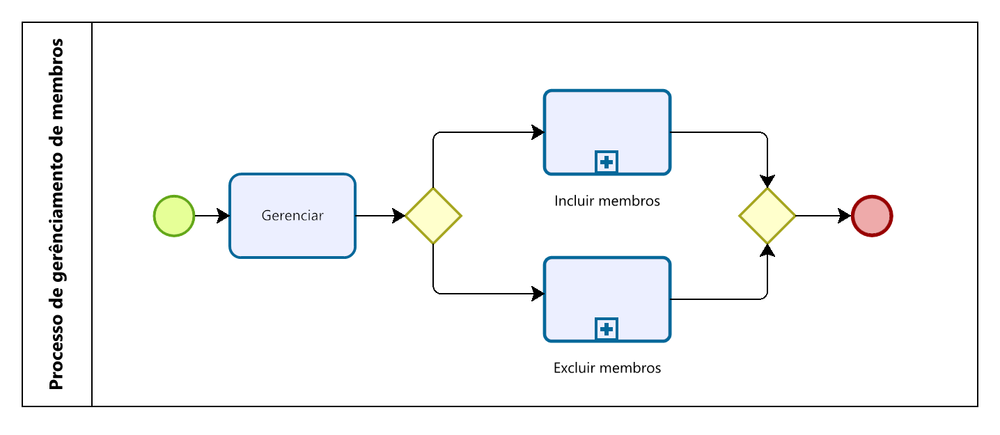
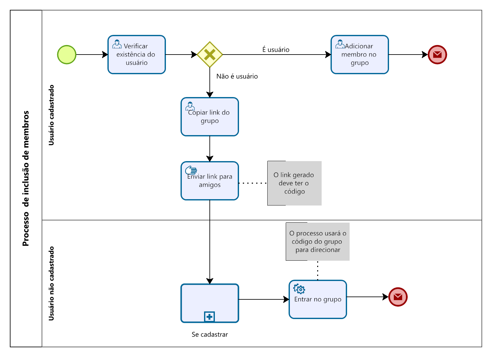
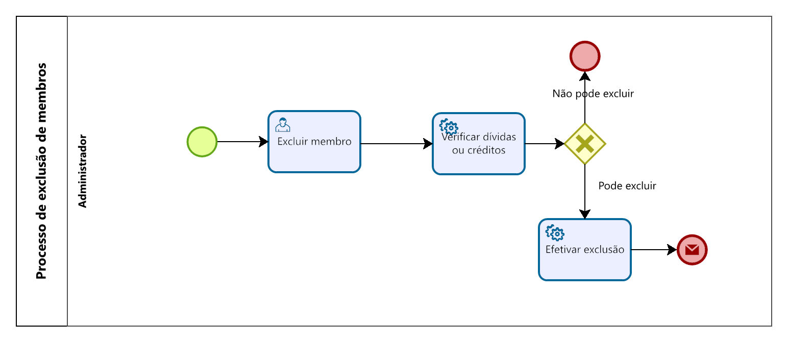
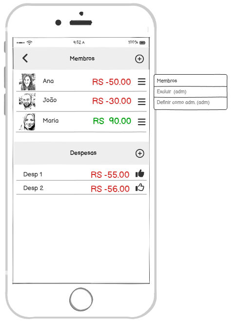
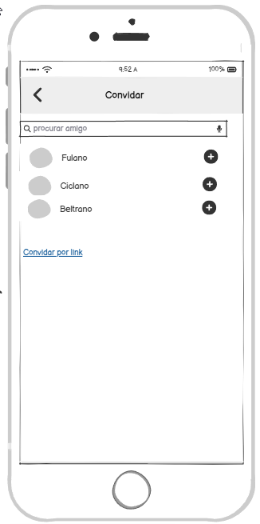

### 3.3.3 Processo 3 – Gerênciamento de membros

_Apresente aqui o nome e as oportunidades de melhoria para o processo 2. 
Em seguida, apresente o modelo do processo 2, descrito no padrão BPMN._

O processo de **Gerenciamento de Membros** tem como objetivo permitir que o administrador de um grupo consiga **incluir** ou **excluir participantes** de forma prática e organizada, garantindo que apenas pessoas autorizadas permaneçam no grupo.  

Esse processo envolve três etapas principais:  
1. **Gerenciar membros**  
2. **Incluir membros**  
3. **Excluir membros**

---

#### 3.3.3.1 Gerenciar membros

| **Campo**        | **Tipo**        | **Restrições**             | **Valor default** |
| ---              | ---             | ---                        | ---               |
| lista de membros | Lista           | ---                        | ---               |

| **Comandos**     | **Destino**         | **Tipo**                          |
| ---              | ---                 | ---                               |
| excluir          | Exclusão de membros | ---                               |
| adicionar        | Inclusão de membros | ---                               |
| cancelar         | Voltar              | cancel     

- O administrador acessa a tela do grupo e visualiza a lista de participantes já cadastrados.  
- A partir dessa tela, ele pode escolher entre **adicionar novos membros** ou **remover membros existentes**.  

**Wireframe relacionado:**  
Tela de **Membros do grupo**, onde aparecem os participantes (ex.: Ana, João, Maria) e o menu de ações (`Excluir`, `Definir como admin`).  

---

#### 3.3.3.2 Inclusão de membros

| **Campo**       | **Tipo**        | **Restrições**              | **Valor default** |
| ---             | ---             | ---                         | ---               |
| procurar amigo  | Caixa de Texto  | mínimo 3 caracteres         | ---               |
| lista de amigos | Lista           | exibe nome e avatar         | ---               |

| **Comandos**      | **Destino**               | **Tipo**   |
| ---               | ---                       | ---        |
| + (adicionar)     | Inclusão de membros       | ---        |
| convidar por link | Gera link de convite      | ---        |
| voltar            | Tela anterior             | cancel     |

- O administrador pode convidar amigos para o grupo através da tela de convite.  
- É possível buscar usuários na lista ou enviar convites por link.  
- Após aceitação, o usuário é adicionado ao grupo automaticamente.  

 **Wireframe relacionado:**  
Tela de **Convidar** (com campo de busca e lista de amigos para seleção).  
(Wireframe: tela "Convidar" com nomes Fulan, Ciclano, Beltrano e opção de "Convidar por link") 

---

#### 3.3.3.3 Exclusão de membros

| **Campo**        | **Tipo**        | **Restrições**             | **Valor default** |
| ---              | ---             | ---                        | ---               |
| lista de membros | Lista           | nome, avatar, saldo em R$  | —                 |
| opções do membro | Submenu (⋮)     | visível apenas a admins    | —                 |

| **Comandos**     | **Destino**       | **Tipo**                          |
| ---              | ---               | ---                               |
| excluir          | Efetivar exclusão | default (habilitado se sem pendências) |

- O administrador seleciona o participante a ser removido.  
- O sistema verifica se o usuário possui dívidas ou créditos pendentes.  
- Caso possua, a exclusão não é permitida.  
- Caso não possua, o administrador confirma a remoção e o membro é excluído.  

**Wireframe relacionado:**  
Tela de **Membros** com ação de exclusão.  
(Wireframe: ação “Excluir usuário Ana Vellor” a partir do menu de opções do membro)  

#### Conclusão
O **Gerenciamento de Membros** garante controle total do administrador sobre quem participa do grupo. Os wireframes apresentados representam de forma clara cada etapa:  
- **Visualização geral dos membros**  
- **Inclusão de novos participantes**  
- **Exclusão de participantes existentes**  

Esse fluxo assegura que o grupo permaneça organizado e que apenas usuários regulares participem das interações financeiras e sociais.  
