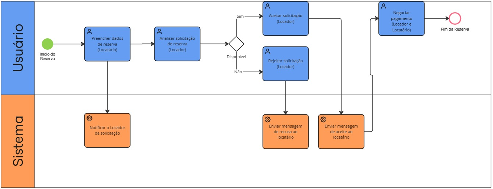

### 3.3.3 Processo 3 – Busca e filtros avançados

O processo de busca de locais se inicia com a autenticação do usuário do tipo locatário, onde esse irá acessar a área de listagem dos locais. Em seguida, o usuário irá preencher os campos do filtro para buscas, após isso irá clicar no botão de Pesquisar. O processo se encerra quando o sistema retorna os resultados da pesquisa do usuário.

#### Detalhamento das atividades

1. [Solicitar reserva]
   - O locatário preenche os detalhes da data e hora da locação e o número de convidados para gerar a pré-reserva.
   - O envio da solicitação ao locador muda o status da reserva para "Em negociação".
     
2. [Responder solicitação (Locador)]
   - O locador acessa o painel de reservas, analisa o pedido e verifica a disponibilidade final.
   - Ele decide se aceita (e segue para pagamento) ou rejeita a reserva.
  

### Atividade 1 - Solicitar reserva

| Campo | Tipo | Restrições | Valor default |
| :--- | :--- | :--- | :--- |
| Data de início | Data | obrigatório, formato DD/MM/AAAA | - |
| Hora de início | Hora | obrigatório, formato HH:MM | - |
| Data de fim | Data | obrigatório, formato DD/MM/AAAA | - |
| Hora de fim | Hora | obrigatório, formato HH:MM | - |
| Número de Convidados | Numérico | maior ou igual a 1 | 1 |
| **Telefone para Contato (WhatsApp) | Telefone | obrigatório, formato celular com DDD | - |

| Comandos | Destino | Tipo |
| :--- | :--- | :--- |
| Enviar Solicitação | Tela de Confirmação/Notificação ao Locador | default |
| Cancelar | Listagem de locais | cancel |

### Atividade 2 - Responder solicitação (Locador)

| Campo | Tipo | Restrições | Valor default |
| :--- | :--- | :--- | :--- |
| Telefone para Contato (WhatsApp) do Locatário | Telefone | leitura (já fornecido) | - |

| Comandos | Destino | Tipo |
| :--- | :--- | :--- |
| Aceitar Reserva | Módulo de Pagamento (Locatário) | default |
| Rejeitar Reserva | Tela de Notificação de Rejeição (Locatário) | default |

