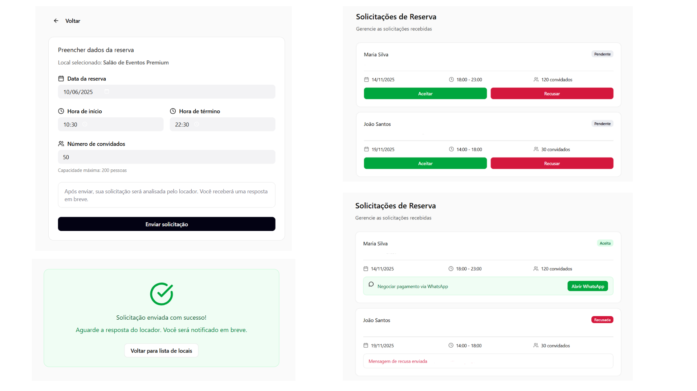

### 3.3.4 Processo 4 – Reserva e fluxo de confirmação

O processo de reserva se inicia quando o usuário do tipo locatário seleciona o local desejado e preenche os dados da solicitação, informando data, horário e demais informações. Após o envio, o sistema notifica o locador sobre a nova solicitação, que poderá analisá-la e decidir se aceita ou recusa. Caso o locador aceite, o sistema envia uma mensagem de confirmação ao locatário, e ambos prosseguem com a negociação e o pagamento por meio do WhatsApp. O processo se encerra quando a negociação entre as partes é concluída.

#### Detalhamento das atividades

1. [Solicitar reserva](#atividade-1---solicitar-reserva)
   - O locatário preenche os detalhes da data e hora da locação e o número de convidados para gerar a pré-reserva.
   - O envio da solicitação ao locador muda o status da reserva para "Em negociação".
     
2. [Responder solicitação (Locador)](#atividade-2---responder-solicitação-locador)
   - O locador acessa o painel de reservas, analisa o pedido e verifica a disponibilidade final.
   - Ele decide se aceita (e segue para pagamento) ou rejeita a reserva.
  

### Atividade 1 - Solicitar reserva

| Campo | Tipo | Restrições | Valor default |
| :--- | :--- | :--- | :--- |
| Data de início | Data | obrigatório, formato DD/MM/AAAA | - |
| Hora de início | Hora | obrigatório, formato HH:MM | - |
| Data de fim | Data | obrigatório, formato DD/MM/AAAA | - |
| Hora de fim | Hora | obrigatório, formato HH:MM | - |
| Número de Convidados | Numérico | maior ou igual a 1 | 1 |
| **Telefone para Contato (WhatsApp) | Telefone | obrigatório, formato celular com DDD | - |

| Comandos | Destino | Tipo |
| :--- | :--- | :--- |
| Enviar Solicitação | Tela de Confirmação/Notificação ao Locador | default |
| Cancelar | Listagem de locais | cancel |

### Atividade 2 - Responder solicitação (Locador)

| Campo | Tipo | Restrições | Valor default |
| :--- | :--- | :--- | :--- |
| Telefone para Contato (WhatsApp) do Locatário | Telefone | leitura (já fornecido) | - |

| Comandos | Destino | Tipo |
| :--- | :--- | :--- |
| Aceitar Reserva | Módulo de Pagamento (Locatário) | default |
| Rejeitar Reserva | Tela de Notificação de Rejeição (Locatário) | default |

## Wireframe
.
