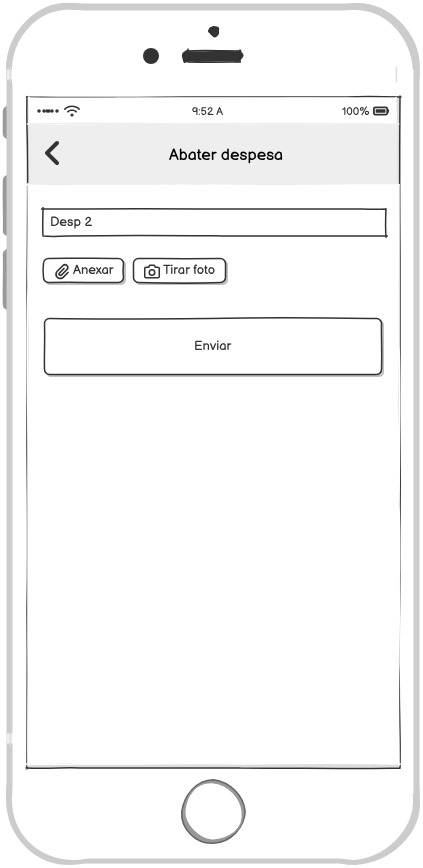

### 3.3.5 Processo 5 – Abatimento de pagamento

_Apresente aqui o nome e as oportunidades de melhoria para o processo 2. 
Em seguida, apresente o modelo do processo 2, descrito no padrão BPMN._

### Mapeamento dos Wireframes com os Requisitos
A seguir, apresentamos a descrição de como os wireframes apresentados atendem aos requisitos funcionais e não funcionais do sistema.

5. Abatimento de Despesas

#### Detalhamento das Atividades

A seguir, descrevemos as propriedades das atividades do processo 5, relacionando-as aos campos de dados do wireframe.

1. **Receber fechamento das despesas**  
   - **Descrição:** O sistema recebe as informações consolidadas de despesas do grupo.  
   - **Campos utilizados:**  
     - *Número* → valor total das despesas.  
     - *Imagem* → comprovante anexado (ex.: nota fiscal).  

2. **Efetuar pagamento**  
   - **Descrição:** O usuário realiza o registro de um pagamento ou abatimento.  
   - **Campos utilizados:**  
     - *Caixa de texto* → identificação da despesa (“Desp 2”).  
     - *Número* → valor pago.  
     - *Imagem* → anexar ou tirar foto do comprovante.  
     - *Data e Hora* → momento em que o pagamento foi efetuado.  

3. **Marcar como pago no aplicativo**  
   - **Descrição:** O sistema atualiza o status da despesa para “paga” após a confirmação do usuário.  
   - **Campos utilizados:**  
     - *Seleção única* → marcar opção “Pago” (radio button ou checkbox).  

4. **Enviar notificação de pagamento**  
   - **Descrição:** O sistema dispara notificação automática aos membros do grupo sobre o pagamento realizado.  
   - **Campos utilizados:**  
     - *Caixa de texto* → mensagem de notificação enviada.  
     - *Data e Hora* → registro do envio da notificação.  

**Nome da atividade 1**

| **Campo**       | **Tipo**         | **Restrições** | **Valor default** |
| ---             | ---              | ---            | ---               |
| [Nome do campo] | [tipo de dados]  |                |                   |
| ***Exemplo:***  |                  |                |                   |
| login           | Caixa de Texto   | formato de e-mail |                |
| senha           | Caixa de Texto   | mínimo de 8 caracteres |           |

| **Comandos**         |  **Destino**                   | **Tipo** |
| ---                  | ---                            | ---               |
| [Nome do botão/link] | Atividade/processo de destino  | (default/cancel/  ) |
| ***Exemplo:***       |                                |                   |
| entrar               | Fim do Processo 1              | default           |
| cadastrar            | Início do proceso de cadastro  |                   |

**Nome da atividade 2**

| **Campo**       | **Tipo**         | **Restrições** | **Valor default** |
| ---             | ---              | ---            | ---               |
| [Nome do campo] | [tipo de dados]  |                |                   |
|                 |                  |                |                   |

| **Comandos**         |  **Destino**                   | **Tipo**          |
| ---                  | ---                            | ---               |
| [Nome do botão/link] | Atividade/processo de destino  | (default/cancel/  ) |
|                      |                                |                   |
