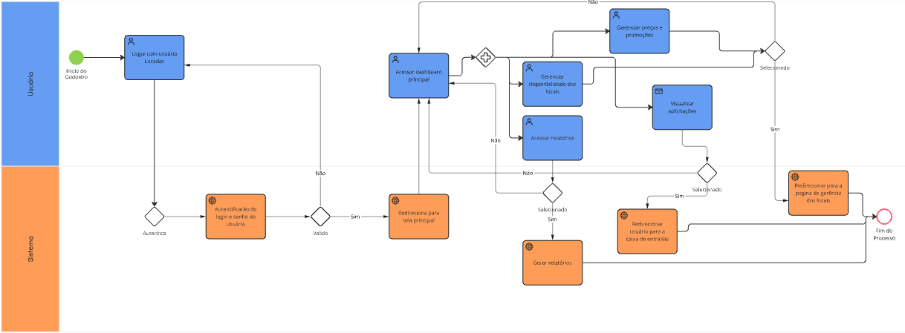
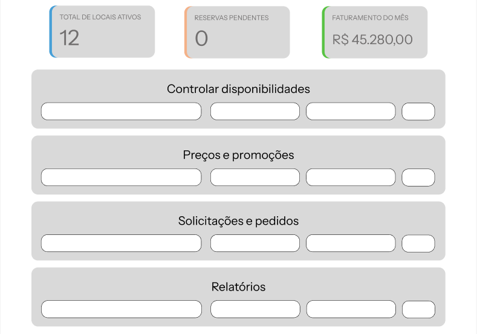

### 3.3.5 Processo 5 – Dashboard para Locadores

O processo de acesso ao dashboard para locadores inicia com a autenticação do usuário locador no sistema. Após o login bem-sucedido, o locador é direcionado à tela principal, onde encontrará o dashboard. A partir do dashboard, o locador terá acesso a uma visão geral de seu total de lugares ativos, reservas pendentes e faturamentos do mês, e também poderá controlar a disponibilidade de seus locais cadastrados, gerenciar preços e promoções, aceitar ou recusar pedidos, e visualizar relatórios de ocupação e faturamento. 

#### Detalhamento das atividades

1. [Logar com usuário Locador](#atividade-1---logar-com-usuário-locador)
   - O usuário deverá logar com um usuario e senha de uma conta tipo locador.
  
2. [Acessar Dashboard Principal](#atividade-2---acessar-dashboard-principal)
   - O usuário irá visualizar o painel principal com um dashboard para controlar disponibilidade de seus locais cadastrados, gerenciar preços e promoções, aceitar ou recusar pedidos, e visualizar relatórios de ocupação e faturamento.

3. [Controlar disponibilidades](#atividade-3---controlar-disponibilidades)
   - O usuário poderá gerenciar o calendário de disponibilidade dos locais cadastrados.

4. [Gerenciar preços e promoções](#atividade-4---gerenciar-preços-e-promoções)
   - O usuário poderá gerenciar valores de aluguel dos locais e configurar promoções.

5. [Aceitar ou recusar pedidos](#atividade-5---aceitar-ou-recusar-pedidos)
   - O usuário poderá visualizar solicitações de reserva e aceitar ou recusar cada pedido.

6. [Acessar relatórios](#atividade-6---acessar-relatórios)
   - O locador poderá consultar relatórios de ocupação e faturamento dos locais.

### Atividade 1 - Logar com usuário Locador

| **Campo** | **Tipo** | **Restrições** | **Valor default** |
| :--- | :--- | :--- | :--- |
| login | Caixa de texto | obrigatório, formato de e-mail | - |
| senha | Caixa de texto | obrigatório, mínimo 8 caracteres | - |

**Comandos**

| **Nome do botão/link** | **Destino** | **Tipo** |
| :--- | :--- | :--- |
| Cancelar | Fim do processo | cancel |
| Entrar | Tela inicial | default |
| Dashboard | Tela do dashboard | default |

### Atividade 2 - Acessar Dashboard Principal

| **Campo** | **Tipo** | **Restrições** | **Valor default** |
| :--- | :--- | :--- | :--- |
| Total de locais ativos | Número | somente leitura | - |
| Reservas pendentes | Número | somente leitura | - |
| Faturamento do mês | Número | somente leitura, formato monetário | - |

**Comandos**

| **Nome do botão/link** | **Destino** | **Tipo** |
| :--- | :--- | :--- |
| Controlar Disponibilidade | Atividade 3 | default |
| Gerenciar Preços | Atividade 4 | default |
| Ver Pedidos | Atividade 5 | default |
| Relatórios | Atividade 6 | default |

### Atividade 3 - Controlar disponibilidades

| **Campo** | **Tipo** | **Restrições** | **Valor default** |
| :--- | :--- | :--- | :--- |
| Seleção de local | Lista suspensa | obrigatório | - |
| Data inicial | Seletor de data | obrigatório para bloqueio | - |
| Data final | Seletor de data | obrigatório para bloqueio | - |

**Comandos**

| **Nome do botão/link** | **Destino** | **Tipo** |
| :--- | :--- | :--- |
| Bloquear período | Atualização do calendário | default |
| Desbloquear período | Atualização do calendário | default |
| Salvar | Confirmação de alterações, redirecionar para página do local | default |

### Atividade 4 - Gerenciar preços e promoções

| **Campo** | **Tipo** | **Restrições** | **Valor default** |
| :--- | :--- | :--- | :--- |
| Seleção de local | Lista suspensa | obrigatório | - |
| Valor base do aluguel | Número | obrigatório, formato monetário | valor atual |
| Período da promoção | Seletor de data | opcional | - |
| Desconto | Número | opcional, percentual ou valor fixo | - |

**Comandos**

| **Nome do botão/link** | **Destino** | **Tipo** |
| :--- | :--- | :--- |
| Salvar alterações | Confirmação de atualização | default |
| Editar local | Redirecionar para página do local | default | 

### Atividade 5 - Aceitar ou recusar pedidos

| **Campo** | **Tipo** | **Restrições** | **Valor default** |
| :--- | :--- | :--- | :--- |
| Pedidos não lidos | Tabela | somente leitura | - |
| Detalhes do pedido | Área de texto | somente leitura | - |

**Comandos**

| **Nome do botão/link** | **Destino** | **Tipo** |
| :--- | :--- | :--- |
| Visualizar caixa de entrada | Redirecionar caixa de entrada | default | 
| Aceitar | Confirmação de reserva | default |
| Recusar | Confirmação de recusa | cancel |

### Atividade 6 - Acessar relatórios

| **Campo** | **Tipo** | **Restrições** | **Valor default** |
| :--- | :--- | :--- | :--- |
| Período | Seletor de data | obrigatório | mês atual |
| Tipo de relatório | Seleção única | ocupação/faturamento | ocupação |

**Comandos**

| **Nome do botão/link** | **Destino** | **Tipo** |
| :--- | :--- | :--- |
| Gerar relatório | Atualização de dados | default |
| Exportar | Download de arquivo | default |

## Wireframe

