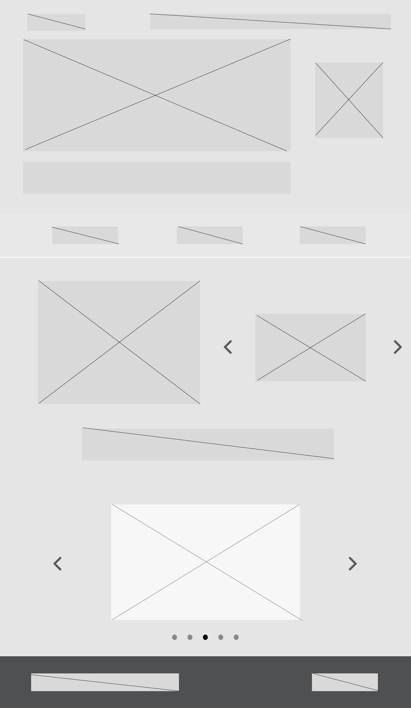

### 3.3.1 Processo 1 – Cadastro de Usuários

O processo de cadastro tem como objetivo permitir que novos usuários sejam registrados na plataforma PUC Integra.  
Durante o cadastro, o usuário informa seus dados pessoais (nome, e-mail institucional, senha, matrícula e curso).  
Após o preenchimento, o sistema valida as informações e identifica automaticamente o tipo de usuário: **aluno** ou **professor**.  

Essa identificação é essencial para garantir que o perfil inicial seja atribuído corretamente, permitindo que cada usuário utilize a plataforma de acordo com suas responsabilidades acadêmicas.  

**Oportunidades de melhoria:**  
- Automatizar a identificação do perfil com base na matrícula e e-mail;  
- Implementar mensagens claras de erro para facilitar a experiência do usuário;  
- Garantir segurança no armazenamento dos dados (criptografia de senha e validação de entrada). 

---

## Detalhamento das atividades  

### Atividade 1 – Acessar tela principal

| **Campo**         | **Tipo**       | **Restrições**              | **Valor Default** |
|-------------------|----------------|-----------------------------|-------------------|
| Botão "Cadastre-se" |  Botão |         Obrigatório         |      Default      |

| **Comandos**      | **Destino**            | **Tipo**   |
|-------------------|------------------------|------------|
| Selecionar botão "Cadastre-se"| Formulário de cadastro| Interação do usuário  |

---

### Atividade 2 – Preencher formulário de cadastro (Usuário)

| **Campo**             | **Tipo**        | **Restrições**                                        | **Valor Default**|
|-----------------------|-----------------|-------------------------------------------------------|------------------|
| Nome | Caixa de texto | Limite de 100 caracteres | |
| E-mail institucional | Caixa de texto | E-mail com domínio institucional | |
| Matrícula| Caixa de texto | Limite de 15 caracteres | |
| Senha | Caixa de texto | Min. 8 caracteres | |
| Tipo de usuário (professor/aluno) | Seleção única |  | Default |

| **Comandos** |    **Destino**    |         **Tipo**       |
|--------------|-------------------|------------------------|
| Cadastrar    | Tela principal    |  Inserção de usuário   |

---

_Tipos de dados utilizados:_  

* **Área de texto** - campo texto de múltiplas linhas  
* **Caixa de texto** - campo texto de uma linha  
* **Número** - campo numérico  
* **Data** - campo do tipo data (dd-mm-aaaa)  
* **Hora** - campo do tipo hora (hh:mm:ss)  
* **Data e Hora** - campo do tipo data e hora (dd-mm-aaaa, hh:mm:ss)  
* **Imagem** - campo contendo uma imagem  
* **Seleção única** - campo com várias opções de valores que são mutuamente exclusivas (radio button ou combobox)  
* **Seleção múltipla** - campo com várias opções que podem ser selecionadas mutuamente (checkbox ou listbox)  
* **Arquivo** - campo de upload de documento  
* **Link** - campo que armazena uma URL  
* **Tabela** - campo formado por uma matriz de valores 

---
## Wireframe - Tela Inicial

---

## Wireframe - Cadastro de Usuários

