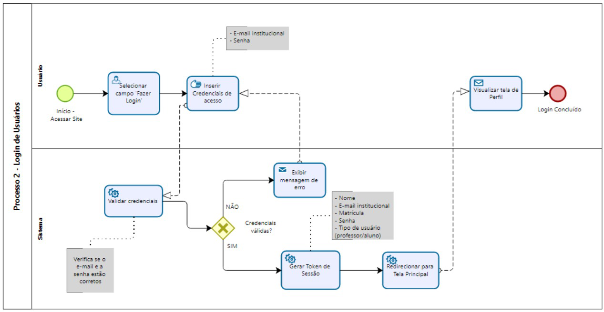

### 3.3.2 Processo 2 – Login de Usuários

O processo de login garante que apenas usuários cadastrados possam acessar a plataforma PUC Integra.  
Para isso, o usuário deve inserir seu **e-mail institucional** e **senha** previamente cadastrada.  
O sistema valida as credenciais e, em caso de sucesso, libera o acesso ao ambiente da plataforma.  

**Oportunidades de melhoria:**  
- Permitir autenticação multifator (MFA) para maior segurança;  
- Implementar mensagens claras em caso de erro de login;  
- Otimizar o tempo de resposta da autenticação.  

---

# Detalhamento das atividades  

## Atividade 1 – Selecionar campo "Fazer Login" (Usuário)

| **Campo**           | **Tipo**      | **Restrições**          | **Valor** |
|-------------------- |---------------|-------------------------|-----------|
| Botão "Fazer Login" | Botão         | Único, visível          | Default   |

| **Comandos**       | **Destino**            | **Tipo**   |
|--------------------|------------------------|------------|
| Clicar             | Exibe formulário login | Usuário (interação)  |

---

## Atividade 2 – Inserir Credenciais de acesso (Usuário)

| **Campo**           | **Tipo**        | **Restrições**                               | **Valor** |
|---------------------|-----------------|----------------------------------------------|-------------------|
|Campos: E-mail institucional, Senha    | Formulário  | campos obrigatórios: e-mail com domínio institucional; e senha |  Default    |

| **Comandos**       | **Destino**                 | **Tipo**   |
|--------------------|-----------------------------|------------|
| Preencher login e submeter | Validar credenciais | Usuário (entrada de dados)    |

---

## Atividade 3 – Validar credenciais (Sistema)

| **Campo**     | **Tipo**        | **Restrições**                          | **Valor** |
|---------------|-----------------|-----------------------------------------|-------------------|
| Autenticação  | Serviço de autenticação  | Consulta à base de usuários;   | Válido / Inválido |

| **Comandos**       | **Destino**                   | **Tipo**  |
|--------------------|-------------------------------|-----------|
| Verificar credenciais e políticas | Decisão "Credenciais válidas?" | Sistema (autenticação) |

---

### Gateway - Credenciais válidas?
| **Campo**           | **Tipo**    | **Restrições**                                | **Valor** |
|-------------------- |-------------|-----------------------------------------------|-----------|
| Resultado da autenticação| Booleano   | Resultado da validação do sistema         | True / False |

| **Comandos**       | **Destino**                      | **Tipo**   |
|--------------------|----------------------------------|------------|
| Branching          | SIM → Gerar token; NÃO → Exibir mensagem de erro | Sistema (decisão)   |

#### Atividade (NÃO): Exibir mensagem de erro (Sistema → Usuário)

| **Campo**          | **Tipo**    | **Restrições**                | **Valor** |
|--------------------|-------------|-------------------------------|------------|
| Feedback de erro   | Mensagem UI | Mensagem apresentando o erro  | Texto      |

| **Comandos**       | **Destino**                      | **Tipo**   |
|--------------------|----------------------------------|------------|
| Apresentar o erro ao usuário e permitir correção| Formulário de Login | Sistema (feedback)  |

#### Atividade (SIM): Armazenar dados cadastrados (Sistema → Usuário)

| **Campo**          | **Tipo**    | **Restrições**                | **Valor** |
|--------------------|-------------|-------------------------------|------------|
| Emissão de token   | Serviço     | Validação prévia obrigatória  | Token de sessão válido |

| **Comandos**       | **Destino**                      | **Tipo**   |
|--------------------|----------------------------------|------------|
|Criar token e armazenar sessão| Redirecionar para Tela Principal  | Sistema (autenticação) |

---

#### Atividade 4 – Redirecionar para Tela Principal (Sistema → Usuário)

| **Campo**             | **Tipo**     | **Restrições**                        | **Valor** |
|-----------------------|--------------|---------------------------------------|------------|
| Navegação pós-login   | Navegação    | Necessita token válido                | Tela Principal com dados do usuário |

| **Comandos**         | **Destino**                   | **Tipo**   |
|----------------------|-------------------------------|------------|
| Redirecionar automaticamente | Visualizar tela de Perfil | Sistema (navegação)|

---

#### Atividade 5 – Visualizar tela de Perfil (Usuário)

| **Campo**        | **Tipo**      | **Restrições**                       | **Valor** |
|------------------|---------------|--------------------------------------|------------|
| Perfil do usuário autenticado    | Página UI         | Exibe informações pessoais e opções  | Dados |

| **Comandos**       | **Destino**            | **Tipo**   |
|--------------------|------------------------|------------|
| Visualizar / Editar| Não se aplica          | Usuário (visualização) |

---

_Tipos de dados utilizados:_  

* **Área de texto** - campo texto de múltiplas linhas  
* **Caixa de texto** - campo texto de uma linha  
* **Número** - campo numérico  
* **Data** - campo do tipo data (dd-mm-aaaa)  
* **Hora** - campo do tipo hora (hh:mm:ss)  
* **Data e Hora** - campo do tipo data e hora (dd-mm-aaaa, hh:mm:ss)  
* **Imagem** - campo contendo uma imagem  
* **Seleção única** - campo com várias opções de valores que são mutuamente exclusivas (radio button ou combobox)  
* **Seleção múltipla** - campo com várias opções que podem ser selecionadas mutuamente (checkbox ou listbox)  
* **Arquivo** - campo de upload de documento  
* **Link** - campo que armazena uma URL  
* **Tabela** - campo formado por uma matriz de valores  
