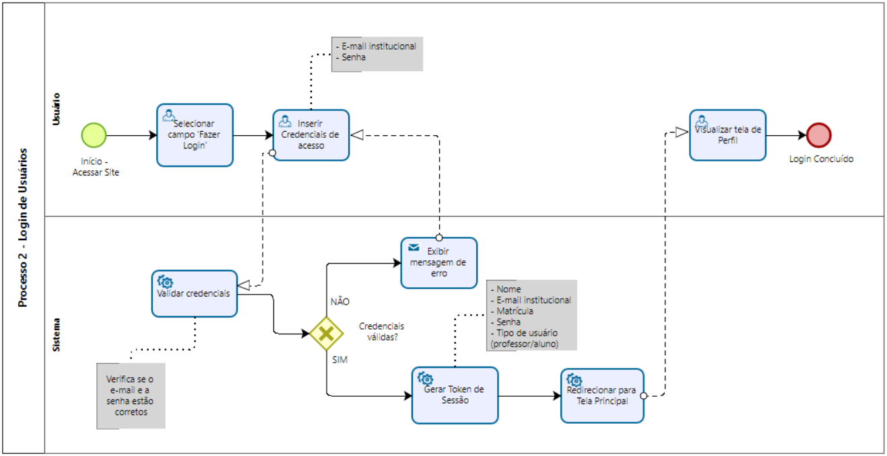
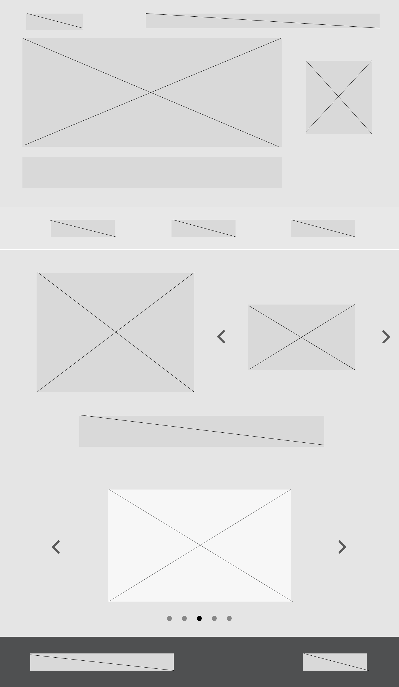
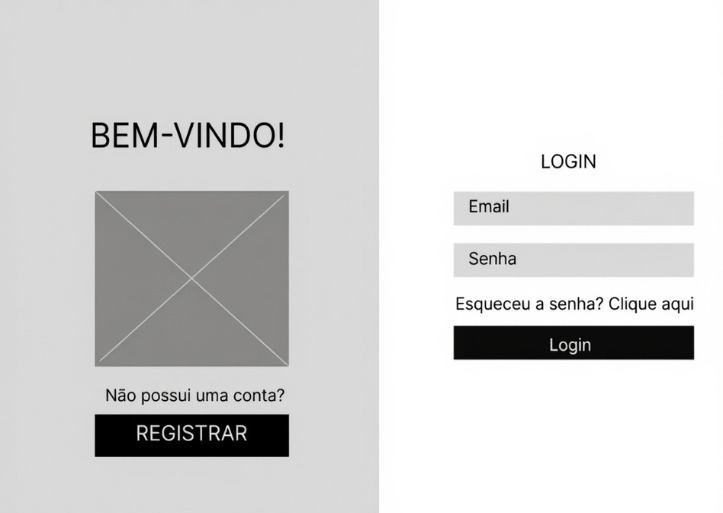

### 3.3.2 Processo 2 – Login de Usuários

O processo de login garante que apenas usuários cadastrados possam acessar a plataforma PUC Integra.  
Para isso, o usuário deve inserir seu **e-mail institucional** e **senha** previamente cadastrada.  
O sistema valida as credenciais e, em caso de sucesso, libera o acesso ao ambiente da plataforma.  

**Oportunidades de melhoria:**  
- Permitir autenticação multifator (MFA) para maior segurança;  
- Implementar mensagens claras em caso de erro de login;  
- Otimizar o tempo de resposta da autenticação.  

---

## Detalhamento das atividades  

### Atividade 1 – Selecionar campo "Entrar"

| **Campo**           | **Tipo**      | **Restrições**          | **Valor Default** |
|-------------------- |---------------|-------------------------|-------------------|
| Botão "Entrar" | Botão         | Único, visível          |      Default      |

| **Comandos**       | **Destino**            | **Tipo**             |
|--------------------|------------------------|----------------------|
| Clicar             | Exibe formulário login | Entrada no sistema   |

---

### Atividade 2 – Inserir Credenciais de acesso 

| **Campo**           | **Tipo**        | **Restrições**                     | **Valor Default**|
|---------------------|-----------------|------------------------------------|------------------|
|E-mail institucional | Caixa de Texto  | E-mail com domínio institucional   |                  |
|Senha                | Caixa de Texto  | Min. 8 caracteres                  |                  |

| **Comandos**       | **Destino**                 | **Tipo**            |
|--------------------|-----------------------------|---------------------|
| Preencher login e submeter | Validar credenciais | Entrada de dados    |

---

### Atividade 3 – Visualizar tela de Perfil 

| **Campo**        | **Tipo**      | **Restrições**                       | **Valor Default** |
|------------------|---------------|--------------------------------------|-------------------|
| Perfil do usuário autenticado    | Página UI         | Exibe informações pessoais e opções  |  |

| **Comandos**       | **Destino**            | **Tipo**     |
|--------------------|------------------------|--------------|
| Visualizar / Editar| Não se aplica          | Visualização do Perfil|

---

_Tipos de dados utilizados:_  

* **Área de texto** - campo texto de múltiplas linhas  
* **Caixa de texto** - campo texto de uma linha  
* **Número** - campo numérico  
* **Data** - campo do tipo data (dd-mm-aaaa)  
* **Hora** - campo do tipo hora (hh:mm:ss)  
* **Data e Hora** - campo do tipo data e hora (dd-mm-aaaa, hh:mm:ss)  
* **Imagem** - campo contendo uma imagem  
* **Seleção única** - campo com várias opções de valores que são mutuamente exclusivas (radio button ou combobox)  
* **Seleção múltipla** - campo com várias opções que podem ser selecionadas mutuamente (checkbox ou listbox)  
* **Arquivo** - campo de upload de documento  
* **Link** - campo que armazena uma URL  
* **Tabela** - campo formado por uma matriz de valores  

---
## Wireframe - Tela Inicial

---

## Wireframe - Login de usuários

