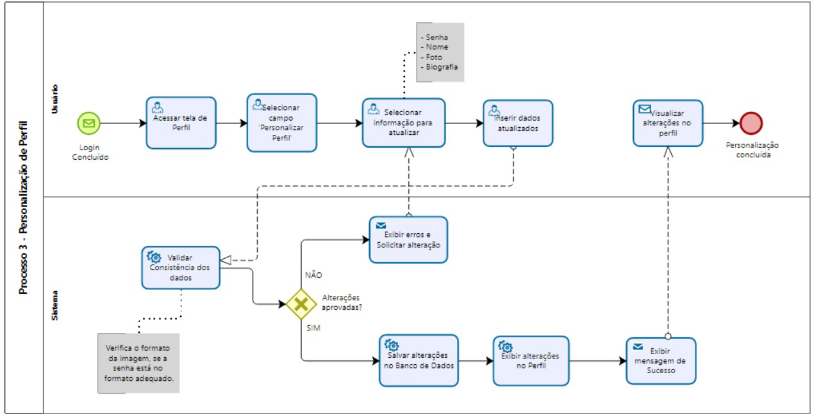

### 3.3.3 Processo 3 – Personalização de Perfil

O processo de personalização de perfil permite que o usuário configure e edite suas informações pessoais e acadêmicas após o login.  
Essa etapa é importante para adaptar a experiência de uso às necessidades de cada membro da comunidade acadêmica, permitindo atualizações de dados, inserção de foto, definição de preferências e atualização de informações institucionais.  

**Fluxo principal:**  
1. Usuário acessa a área de perfil.  
2. Sistema exibe formulário de personalização.  
3. Usuário atualiza informações desejadas.  
4. Sistema valida os dados fornecidos.  
5. Sistema salva as alterações no banco de dados.  
6. Perfil atualizado é exibido ao usuário.  

---

## Detalhamento das atividades  

### Atividade 1 – Acessar tela de Perfil 

| **Campo**         | **Tipo**       | **Restrições**                 | **Valor Default**  |
|-------------------|----------------|--------------------------------|------------|
| Ícone perfil      | Navegação UI   | Usuário deve estar autenticado |  Default   |

| **Comandos**      | **Destino**            | **Tipo**   |
|-------------------|------------------------|------------|
| Clicar para abrir perfil| Opções de personalização | Interação do usuário |

---

### Atividade 2 – Selecionar campo "Personalizar Perfil" 

| **Campo**             | **Tipo**        | **Restrições**    | **Valor Default** |
|-----------------------|-----------------|-------------------|-------------------|
| Botão "Personalizar Perfil" | Botão     | Único e visível   |    Default        |

| **Comandos**          | **Destino**               | **Tipo**             |
|-----------------------|---------------------------|----------------------|
| Clicar no botão       | Lista de campos editáveis | Interação do usuário |

---

### Atividade 3 – Selecionar informação para atualizar 

| Campo | Tipo | Restrições |  **Valor Default** |
|-------|------|------------|------------|
| Senha | Caixa de Texto | Min. 8 caracteres| |
| Nome  | Caixa de Texto | Limite de 100 caracteres | | |
| Foto  | Imagem         | JPG ou PNG | | |
| Biografia | Caixa de Texto |  Limite de caracteres | |

| **Comandos**       | **Destino**                | **Tipo**   |
|--------------------|----------------------------|------------|
| Selecionar campo desejado| Inserção dos dados atualizados    | Interação do usuário |

---

### Atividade 4 – Inserir dados atualizados

| Campo | Tipo | Restrições |  **Valor Default** |
|-------|------|------------|------------|
| Senha | Caixa de Texto | Min. 8 caracteres| |
| Nome  | Caixa de Texto | Limite de 100 caracteres | | |
| Foto  | Imagem         | JPG ou PNG | | |
| Biografia | Caixa de Texto |  Limite de caracteres | |

| **Comandos**       | **Destino**                | **Tipo**   |
|--------------------|----------------------------|------------|
| Submeter alteração | Visualizar alterações no perfil | Interação do usuário |

---

### Atividade 5 – Visualizar alterações no perfil 

| **Campo**            | **Tipo**    | **Restrições**                         | **Valor Default** |
|----------------------|-------------|----------------------------------------|-------------------|
| Tela de perfil       | Página UI   | Carregar dados do usuário recém-criado |                   |

| **Comandos**       | **Destino**          | **Tipo**   |
|--------------------|----------------------|------------|
| Navegar no perfil  | Não se aplica        | Visualização do usuário |

---

_Tipos de dados utilizados:_  

* **Área de texto** - campo texto de múltiplas linhas  
* **Caixa de texto** - campo texto de uma linha  
* **Número** - campo numérico  
* **Data** - campo do tipo data (dd-mm-aaaa)  
* **Hora** - campo do tipo hora (hh:mm:ss)  
* **Data e Hora** - campo do tipo data e hora (dd-mm-aaaa, hh:mm:ss)  
* **Imagem** - campo contendo uma imagem  
* **Seleção única** - campo com várias opções de valores que são mutuamente exclusivas (radio button ou combobox)  
* **Seleção múltipla** - campo com várias opções que podem ser selecionadas mutuamente (checkbox ou listbox)  
* **Arquivo** - campo de upload de documento  
* **Link** - campo que armazena uma URL  
* **Tabela** - campo formado por uma matriz de valores  

---

## Wireframe - Personalização do perfil

