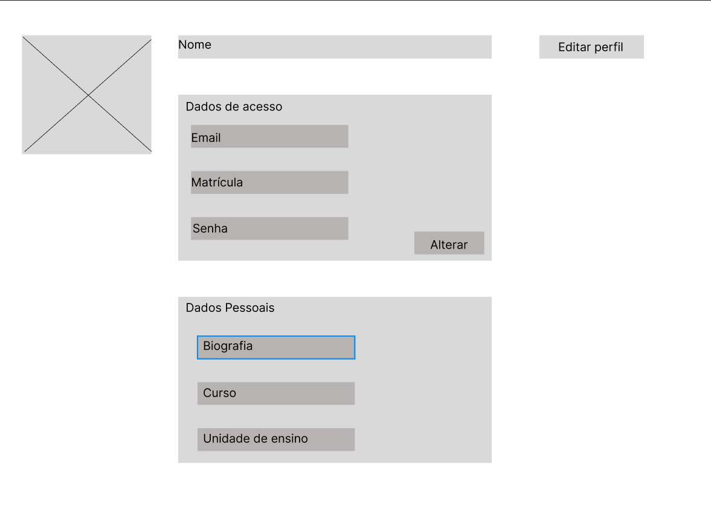

### 3.3.3 Processo 3 – Personalização de Perfil

O processo de personalização de perfil permite que o usuário configure e edite suas informações pessoais e acadêmicas após o login.  
Essa etapa é importante para adaptar a experiência de uso às necessidades de cada membro da comunidade acadêmica, permitindo atualizações de dados, inserção de foto, definição de preferências e atualização de informações institucionais.  

**Fluxo principal:**  
1. Usuário acessa a área de perfil.  
2. Sistema exibe formulário de personalização.  
3. Usuário atualiza informações desejadas.  
4. Sistema valida os dados fornecidos.  
5. Sistema salva as alterações no banco de dados.  
6. Perfil atualizado é exibido ao usuário.  

---

## Detalhamento das atividades  

### Atividade 1 – Acessar tela de Perfil (Usuário)

| **Campo**         | **Tipo**       | **Restrições**              | **Valor**         |
|-------------------|----------------|-----------------------------|-------------------|
| Ícone perfil      | Navegação UI   | Usuário deve estar autentuicado |  Default      |

| **Comandos**      | **Destino**            | **Tipo**   |
|-------------------|------------------------|------------|
| Clicar para abrir perfil| Opções de personalização| Usuário (interação) |

---

### Atividade 2 – Selecionar campo "Personalizar Perfil" (Usuário)

| **Campo**             | **Tipo**        | **Restrições**    | **Valor** |
|-----------------------|-----------------|-------------------|-----------|
| Botão "Personalizar Perfil" | Botão     | Único e visível   |  Default  |

| **Comandos**          | **Destino**                    | **Tipo**   |
|-----------------------|--------------------------------|------------|
| Clicar no botão | Lista de campos editáveis | Usuário (interação)   |

---

### Atividade 3 – Selecionar informação para atualizar (Usuário)

| Campo | Tipo | Restrições |  **Valor** |
|-------|------|------------|------------|
| Campos possíveis: Senha, Nome, Foto, Biografia | Seleção de campo | Tipo de dado deve respeitar formato (foto: jpg/png; biografia: limite de caracteres) | Atual / Novo |

| **Comandos**       | **Destino**                | **Tipo**   |
|--------------------|----------------------------|------------|
| Selecionar campo desejado| Inserção dos dados atualizados    | Usuário (seleção) |

---

### Atividade 4 – Inserir dados atualizados (Usuário)

| Campo | Tipo | Restrições |  **Valor** |
|-------|------|------------|------------|
|Entrada de novos valores   | Form | Validação de formato (imagem), tamanho, políticas de senha | Novos valores |

| **Comandos**       | **Destino**                | **Tipo**   |
|--------------------|----------------------------|------------|
| Submeter alteração | Validação de consistência dos dados (Sistema)  | Usuário (entrada) |

---

### Atividade 5 – Validar Consistência dos dados (Sistema)

| Campo | Tipo | Restrições |  **Valor** |
|-------|------|------------|------------|
| Verificar formatos e regras| Automático | Verifica: formato de imagem, tamanho, senha, campos obrigatórios | Aprovação ou lista de erros|

| **Comandos**       | **Destino**                | **Tipo**   |
|--------------------|----------------------------|------------|
| Validar e retornar resultado | Decisão "Alterações aprovadas?"  | Sistema (validação) |

---

### Gateway - Dados válidos?
| **Campo**          | **Tipo**    | **Restrições**                                | **Valor** |
|--------------------|-------------|-----------------------------------------------|-----------|
| Resultado da validação | Decisão | Se NÃO → informar erros; se SIM → salvar alterações  | SIM / NÃO |

| **Comandos**       | **Destino**                      | **Tipo**   |
|--------------------|----------------------------------|------------|
| Branching          | SIM → Salvar alterações; NÃO → Exibir erros   | Sistema (decisão) |

#### Atividade (NÃO): Exibir mensagem de erro (Sistema → Usuário)

| **Campo**          | **Tipo**    | **Restrições**                | **Valor** |
|--------------------|-------------|-------------------------------|------------|
| Feedback de erro   | Mensagem UI | Mensagem apresentando o que deve ser corrigido | Texto |

| **Comandos**       | **Destino**                      | **Tipo**   |
|--------------------|----------------------------------|------------|
| Apresentar o erro ao usuário e permitir correção| Formulário de personalização | Sistema (feedback) |

#### Atividade (SIM): Salvar alterações no Banco de Dados (Sistema)

| **Campo**          | **Tipo**    | **Restrições**                | **Valor** |
|--------------------|-------------|-------------------------------|------------|
| Persistência das mudanças | Serviço | Validação prévia obrigatória   | Registro atualizado |

| **Comandos**       | **Destino**                      | **Tipo**   |
|--------------------|----------------------------------|------------|
|Atualizar registros |Exibir alterações no Perfil e Exibir mensagem de sucesso | Sistema |

---

### Atividade 6 – Exibir alterações no Perfil (Sistema → Usuário)

| **Campo**               | **Tipo**    | **Restrições**                         | **Valor** |
|-------------------------|-------------|----------------------------------------|------------|
| Atualização visual do perfil  | UI refresh  | Cache invalidation se necessário    | Novos dados exibidos |

| **Comandos**       | **Destino**                                   | **Tipo**  |
|--------------------|-----------------------------------------------|-----------|
|Atualizar interface | Mensagem de sucesso  | Sistema (apresentação) |

---

### Atividade 7 – Exibir mensagem de Sucesso (Sistema → Usuário)
 
| **Campo**         | **Tipo**        | **Restrições**          | **Valor** |
|-------------------|-----------------|-------------------------|-------------------|
| Mensagem de sucesso | Mensagem UI   | Mensagem curta e clara  |  Texto            |

| **Comandos**       | **Destino**                 | **Tipo**   |
|--------------------|-----------------------------|------------|
| Apresentar página de confirmação |Visualizar alterações no perfil| Sistema (feedback) |

---

### Atividade 8 – Visualizar alterações no perfil (Usuário)

| **Campo**            | **Tipo**    | **Restrições**                         | **Valor** |
|----------------------|-------------|----------------------------------------|------------|
| Tela de perfil       | Página UI   | Carregar dados do usuário recém-criado | Dados      |

| **Comandos**       | **Destino**          | **Tipo**   |
|--------------------|----------------------|------------|
| Navegar no perfil  | Não se aplica        | Usuário (visualização)    |

---
## Wireframe - Personalização

---

_Tipos de dados utilizados:_  

* **Área de texto** - campo texto de múltiplas linhas  
* **Caixa de texto** - campo texto de uma linha  
* **Número** - campo numérico  
* **Data** - campo do tipo data (dd-mm-aaaa)  
* **Hora** - campo do tipo hora (hh:mm:ss)  
* **Data e Hora** - campo do tipo data e hora (dd-mm-aaaa, hh:mm:ss)  
* **Imagem** - campo contendo uma imagem  
* **Seleção única** - campo com várias opções de valores que são mutuamente exclusivas (radio button ou combobox)  
* **Seleção múltipla** - campo com várias opções que podem ser selecionadas mutuamente (checkbox ou listbox)  
* **Arquivo** - campo de upload de documento  
* **Link** - campo que armazena uma URL  
* **Tabela** - campo formado por uma matriz de valores  
