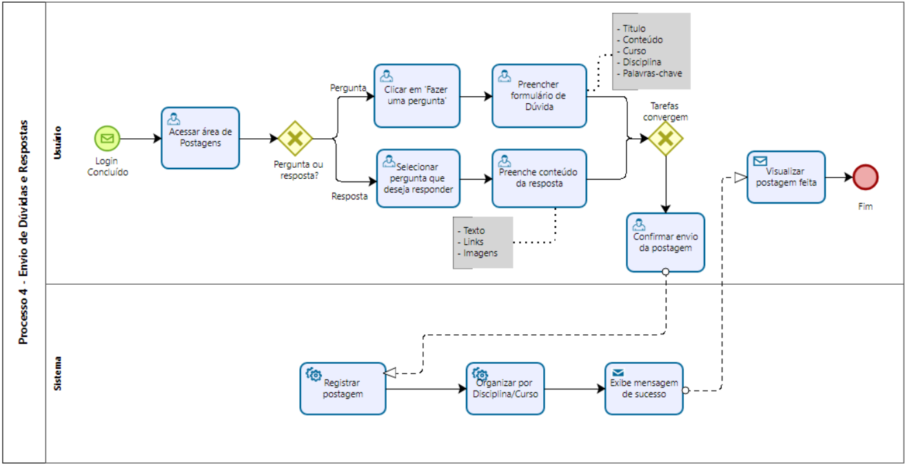

# Processo 4 – Envio de Perguntas e Respostas

O Processo 4 descreve o fluxo pelo qual um usuário publica uma **pergunta** ou envia uma **resposta** na plataforma acadêmica (feed de interação). O objetivo é permitir a criação de dúvidas ligadas às disciplinas institucionais e respostas colaborativas, garantindo validações (formato, disciplina, moderação) e armazenamento no banco de dados para posterior consulta, curadoria e exibição. O diagrama fornecido (p4_PerguntaResposta.png) serviu como base visual para o fluxo (usuário ↔ sistema).

---

## Fluxo principal
1. Usuário acessa o **feed de interação**.  
2. Usuário escolhe se vai **criar uma pergunta** ou **responder** (gateway "Pergunta ou resposta?").  
3. **Se pergunta:** usuário clica em *Fazer uma pergunta*, preenche formulário e envia.  
4. **Se resposta:** usuário seleciona a pergunta que deseja responder, preenche o campo de resposta e envia.  
5. Sistema recebe os dados (endpoint/queue).  
6. Sistema valida/filtra (validações básicas, antispam, associação à disciplina).  
7. Sistema armazena a pergunta/resposta no banco de dados e atualiza metadados da thread.  
8. Sistema retorna confirmação ao usuário e (opcional) notifica envolvidos.

---

---

# Detalhamento das atividades  

### Atividade 1 – Acessar área de Postagens 

| **Campo**         | **Tipo**       | **Restrições**              | **Valor**         |
|-------------------|----------------|-----------------------------|-------------------|
| "Postagens"       | Navegação UI   | Requer login concluído      |  Default          |

| **Comandos**      | **Destino**            | **Tipo**   |
|-------------------|------------------------|------------|
| Clicar na seção   | Listagem de postagens e opções (perguntar/responder) | Usuário (navegação) |

---

### Gateway - Pergunta ou Resposta?
| **Campo**          | **Tipo**    | **Restrições**                                | **Valor** |
|--------------------|-------------|-----------------------------------------------|-----------|
| Escolha do usuário | Decisão     | Usuário escolhe fluxo | Pergunta / Resposta               |

| **Comandos**       | **Destino**                      | **Tipo**   |
|--------------------|----------------------------------|------------|
| Branching          | Pergunta → Fazer pergunta        |Usuário (decisão)|
| Branching          | Resposta → Selecionar pergunta para responder | Usuário (decisão) |

### Fluxo Pergunta:

Atividade 1: Clicar em "Fazer uma pergunta" 

| **Campo**          | **Tipo**    | **Restrições**                | **Valor** |
|--------------------|-------------|-------------------------------|-----------|
| Botão "Fazer uma pergunta" | Botão | Único e visível  | Default  |

| **Comandos**       | **Destino**                      | **Tipo**   |
|--------------------|----------------------------------|------------|
| Clicar no botão    | Formulário de dúvida | Usuário (interação)    |

Atividade 2: Preencher formulário de dúvida

| **Campo**          | **Tipo**    | **Restrições**                | **Valor** |
|--------------------|-------------|-------------------------------|------------|
| Título   | Caixa de Texto | Obrigatório | | 
| Conteúdo | Seleção única | Min. X caracteres | |
| Curso | Seleção única | Válido| | |
| Disciplina | Seleção única | Válido| | |
| Palavras-chave |Caixa de Texto  | Min. 50 caracteres | |

| **Comandos**       | **Destino**                      | **Tipo**   |
|--------------------|----------------------------------|------------|
| Preecher e submeter| Convergência para confirmar envio | Usuário (entrada) |

### Fluxo Resposta:
Atividade 1: Selecionar pergunta que deseja responder 

| **Campo**          | **Tipo**        | **Restrições**               |**Valor**|
|--------------------|-----------------|------------------------------|------------|
| Lista de perguntas | Lista interativa| Perguntas visíveis por disciplina/curso; acesso permitido  | Pergunta selecionada |

| **Comandos**       | **Destino**                      | **Tipo**   |
|--------------------|----------------------------------|------------|
| Clicar na pergunta | Abrir campo de resposta | Usuário (seleção)   |

Atividade 2: Preencher conteúdo da resposta 

| **Campo**          | **Tipo**    | **Restrições**                |**Valor** |
|--------------------|-------------|-------------------------------|----------|
| Texto   | Caixa de Texto | Max. 500 caracteres |
| Links   | Link | Links sanitizados | |
| Imagens | Imagem | JPG ou PNG |  |

| **Comandos**       | **Destino**                      | **Tipo**   |
|--------------------|----------------------------------|------------|
| Preecher e submeter| Convergência para confirmar envio| Usuário (entrada) |

### Gateway - Tarefas convergem (confirmação)
| **Campo**          | **Tipo**    | **Restrições**                                |**Valor** |
|--------------------|-------------|-----------------------------------------------|-----------|
|Confirmação de envio| Decisão     | Usuário confirma revisar antes de enviar      | Confirmar / Cancelar|

| **Comandos**       | **Destino**                      | **Tipo**   |
|--------------------|----------------------------------|------------|
| Branching          | Confirmar envio da postagem      | Usuário (decisão) |

### Atividade 2 - Confirmar envio da postagem 

| **Campo**          | **Tipo**    | **Restrições**                |**Valor** |
|--------------------|-------------|-------------------------------|------------|
| Botão de envio     | Botão       | Somente após preencher campos obrigatórios | Default  |

| **Comandos**       | **Destino**                      | **Tipo**   |
|--------------------|----------------------------------|------------|
|Clicar para enviar  | Registrar postagem               | Usuário (ação) |

---

### Atividade 3 – Visualizar postagem feita 
 
| **Campo**         | **Tipo**        | **Restrições**                              |**Valor** |
|-------------------|-----------------|---------------------------------------------|-------------------|
| Página da postagem| Página UI       | Exibe título, conteúdo, autor, data, feedbacks |Conteúdo publicado |

| **Comandos**       | **Destino**                 | **Tipo**   |
|--------------------|-----------------------------|------------|
| Visualizar postagem| Não se aplica               | Usuário (visualização)|

---

## Tipos de dados utilizados
- **Área de texto** – conteúdo da pergunta/resposta;  
- **Caixa de texto** – título, referência;  
- **Seleção única** – disciplina;  
- **Seleção múltipla** – tags;  
- **Arquivo** – anexos (pdf, imagens, etc.);  
- **Booleano** – marcar como solução, anonimato;  
- **Data/Hora** – created_at, updated_at.

---

# Wireframe - Perguntas e Respostas

